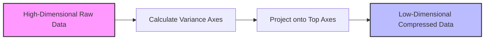

# Deep Dive into Principal Component Analysis (PCA)

---

## 1. THE CORE THEORY

### The Shadow Analogy
Imagine holding a complex **3D wire sculpture** of a dragon in front of a white wall. If you shine a flashlight directly at it, you project a **2D shadow** onto the wall. If you hold the flashlight at a random, awkward angle, the shadow becomes a messy, unrecognizable blob where all the structural details overlap and vanish. 

However, if you carefully **rotate the dragon** until its most expansive side faces the wall, the resulting 2D shadow captures the maximum possible spread, length, and shape of the dragon. You have successfully compressed **3D information into a 2D space** while retaining its most recognizable characteristics. 

**Principal Component Analysis (PCA)** is the mathematical method for finding that exact "best flashlight angle" for massive, multi-dimensional AI datasets.

### Technical Definition
PCA is a **linear dimensionality reduction technique** that transforms a dataset containing highly correlated variables into a new coordinate system of uncorrelated variables called **Principal Components (PCs)**. 

It accomplishes this by identifying the directions—called **eigenvectors**—along which the variance (spread) of the data is maximized. The first principal component accounts for the absolute highest variance in the data, the second component accounts for the next highest variance (while remaining perfectly perpendicular to the first), and so on.



### Why PCA is Essential for AI
* **Defeating the Curse of Dimensionality:** As features increase, data points grow sparse, causing AI models to overfit. PCA concentrates the dataset's informational density into fewer dimensions.
* **Feature Elimination Without Information Loss:** Instead of blindly dropping columns (which destroys data), PCA blends features together to preserve their collective patterns.
* **Drastic Computational Speedups:** Training a Deep Learning network or a Support Vector Machine on 50 principal components rather than 10,000 raw pixels reduces training times from hours to minutes.
* **Multicollinearity Removal:** Many ML algorithms fail if input features are highly correlated. PCA guarantees that all output components are completely independent (90° orthogonal) to each other.

---

## 2. THE MATHEMATICAL FORMULA

PCA relies on computing the structural matrix of your dataset and decomposing it into its structural vectors. The core operations are governed by the following mathematical framework:

$$\mathbf{\Sigma} = rac{1}{n} \mathbf{X}_{c}^T \mathbf{X}_{c}$$

$$\mathbf{\Sigma} \mathbf{v} = \lambda \mathbf{v}$$

$$\mathbf{Z} = \mathbf{X}_{c} \mathbf{V}_k$$

### Variable Breakdown
* $\mathbf{X}_{c}$: The **Mean-Centered Data Matrix** of size $n 	imes d$ (where $n$ is the number of samples and $d$ is the number of raw features). It is created by subtracting the mean of each column from every value in that column.
* $\mathbf{\Sigma}$: The $d 	imes d$ **Covariance Matrix**. It measures how much each feature varies both by itself and in tandem with every other feature.
* $n$: The **Total Number of Samples** in your dataset.
* $\mathbf{v}$: An **Eigenvector** of the covariance matrix. This represents the spatial direction of a principal component axis.
* $\lambda$: An **Eigenvalue** corresponding to the eigenvector $\mathbf{v}$. This scalar value explicitly measures the amount of variance absolute to that axis.
* $\mathbf{V}_k$: The **Feature Matrix** containing the top $k$ chosen eigenvectors ($d 	imes k$).
* $\mathbf{Z}$: The final $n 	imes k$ **Projected Low-Dimensional Data Matrix**.

### Logical Intuition of the Structure
1. **Mean Centering ($\mathbf{X}_c$):** Shifts the origin of the dataset's coordinate system to its geometric center $(0,0,\dots,0)$. Without this, the first principal component would mistakenly point from the physical origin $(0,0)$ to the center of the data cluster, rather than along the axis of maximum variance.
2. **The Covariance Matrix ($\mathbf{\Sigma}$):** Multiplying $\mathbf{X}_{c}^T$ by $\mathbf{X}_{c}$ calculates the dot product between all feature columns. Diagonal positions reflect individual feature variances, while off-diagonal slots reveal cross-feature dependencies. 
3. **The Characteristic Equation ($\mathbf{\Sigma}\mathbf{v} = \lambda\mathbf{v}$):** This tells us that passing our data's covariance matrix through a specific directional vector $\mathbf{v}$ only scales the vector by a magnitude of $\lambda$ without bending its direction. The vector that undergoes the largest scaling ($\lambda$) naturally points along the line of maximum data variance.

---

## 3. CAUSATION & BEHAVIOR

### Mathematical Dynamics
* **When Off-Diagonal Covariances Increase:** If the values inside $\mathbf{\Sigma}$ (where $i 
eq j$) skyrocket, it means features are highly redundant. Consequently, the primary eigenvalue ($\lambda_1$) grows massively dominant, allowing a single principal component to capture almost $100\%$ of the dataset's total information.
* **When an Eigenvalue ($\lambda_i$) Approaches Zero:** This dictates that there is virtually no variation along that specific eigenvector's path. In an AI pipeline, this component can be discarded instantly without losing predictive accuracy.
* **Sensitivity to Scale:** If **Feature A** ranges from $0$ to $1,000,000$ and **Feature B** ranges from $0$ to $1$, the variance of Feature A will completely dominate the covariance matrix. PCA will blindly align PC1 along Feature A simply because of its units, completely ignoring patterns in Feature B.

### Technical Edge Cases & Limitations
* **Strict Linearity Constraint:** PCA only finds straight lines or flat planes of variance. If your data patterns form a complex curve, spiral, or Swiss-roll shape, standard linear PCA will fail to compress it cleanly. 
* **Orthogonality Requirement:** Because all principal components must be exactly $90^\circ$ apart, PCA is structurally unable to model underlying hidden features that happen to be non-orthogonal.
* **Total Absence of Class Labels:** PCA is completely **unsupervised**. It only looks at the structural spread of inputs, not class boundaries. If the variance of your data runs perpendicular to the boundary separating Class 0 from Class 1, PCA will completely smash the two classes together during reduction.

---

## 4. MERMAID PLOT DIAGRAM

The diagram below represents a two-dimensional dataset $(X_1, X_2)$ compressed into a one-dimensional space via its dominant Principal Component axis ($PC_1$), modeled geometrically via a quadrant grid environment.

```mermaid
quadrantChart
    title PCA Geometric Variance Decomposition
    x-axis Feature 1 (Low Variance) --> Feature 1 (High Variance)
    y-axis Feature 2 (Low Variance) --> Feature 2 (High Variance)
    quadrant-1 Low Variance Noise Outliers
    quadrant-2 Primary Data Cluster Extent
    quadrant-3 Data Core Origin Center
    quadrant-4 PC1 Dominant Variance Vector Direction
    Sample A: [0.7, 0.8]
    Sample B: [0.3, 0.4]
    Geometric Origin Center: [0.5, 0.5]
```

### What to Visualize in a Python Environment (like Matplotlib)
1. **The Raw Scatter:** Plotting `plt.scatter(X[:,0], X[:,1])` displays your raw data points slanting diagonally upward.
2. **The Centered Grid:** Subtracting the column means repositions the entire cluster so it centers perfectly over the coordinate origin $(0,0)$.
3. **The Component Vectors:** Drawing the calculated eigenvectors using `plt.arrow()` plots two straight arrows extending out from $(0,0)$. The longest arrow ($PC_1$) stretches directly along the core length of the cluster. The second arrow ($PC_2$) extends outward at a perfectly perpendicular $90^\circ$ angle to the first.
4. **The Lower-Dimensional Drop:** Projecting the points down onto $PC_1$ slides every scatter point along a $90^\circ$ trajectory until it lands directly on the $PC_1$ line, successfully flattening the 2D plane into a 1D line.

---

## 5. AI EXAMPLE WITH STEP-BY-STEP CALCULATION

### The Use Case
We are building a computer vision model to recognize shapes. Our preprocessing step requires reducing a small 2-pixel image dataset down to a **1-pixel representation** ($k=1$) using PCA to minimize network training costs.

### The Toy Dataset
Our dataset consists of $n=3$ image samples, each containing $d=2$ features (Pixel 1, Pixel 2):

$$\mathbf{X} = egin{bmatrix} 1 & 1 \ 2 & 3 \ 3 & 5 \end{bmatrix}$$

---

### Step 1: Compute Feature Means
Find the mean value for both columns:
* $\mu_{	ext{Pixel 1}} = rac{1 + 2 + 3}{3} = 2$
* $\mu_{	ext{Pixel 2}} = rac{1 + 3 + 5}{3} = 3$

$$\mathbf{\mu} = egin{bmatrix} 2 & 3 \end{bmatrix}$$

---

### Step 2: Calculate the Mean-Centered Matrix ($\mathbf{X}_c$)
Subtract the column means from every individual row value:

$$\mathbf{X}_c = egin{bmatrix} 1-2 & 1-3 \ 2-2 & 3-3 \ 3-2 & 5-3 \end{bmatrix} = egin{bmatrix} -1 & -2 \ 0 & 0 \ 1 & 2 \end{bmatrix}$$

---

### Step 3: Compute the Covariance Matrix ($\mathbf{\Sigma}$) using $rac{1}{n}\mathbf{X}_c^T\mathbf{X}_c$
First, calculate the matrix transpose $\mathbf{X}_c^T$:

$$\mathbf{X}_c^T = egin{bmatrix} -1 & 0 & 1 \ -2 & 0 & 2 \end{bmatrix}$$

Now, multiply $\mathbf{X}_c^T$ by $\mathbf{X}_c$:

$$\mathbf{X}_c^T \mathbf{X}_c = egin{bmatrix} (-1)(-1) + (0)(0) + (1)(1) & (-1)(-2) + (0)(0) + (1)(2) \ (-2)(-1) + (0)(0) + (2)(1) & (-2)(-2) + (0)(0) + (2)(2) \end{bmatrix}$$

$$\mathbf{X}_c^T \mathbf{X}_c = egin{bmatrix} 1+0+1 & 2+0+2 \ 2+0+2 & 4+0+4 \end{bmatrix} = egin{bmatrix} 2 & 4 \ 4 & 8 \end{bmatrix}$$

Divide by $n=3$ to finalize the population covariance matrix:

$$\mathbf{\Sigma} = egin{bmatrix} rac{2}{3} & rac{4}{3} \ rac{4}{3} & rac{8}{3} \end{bmatrix}$$

---

### Step 4: Calculate Eigenvalues ($\lambda$)
To extract the eigenvalues, solve the characteristic determinant equation $\det(\mathbf{\Sigma} - \lambda\mathbf{I}) = 0$:

$$\det egin{bmatrix} rac{2}{3} - \lambda & rac{4}{3} \ rac{4}{3} & rac{8}{3} - \lambda \end{bmatrix} = 0$$

$$\left(rac{2}{3} - \lambda
ight)\left(rac{8}{3} - \lambda
ight) - \left(rac{4}{3}
ight)\left(rac{4}{3}
ight) = 0$$

$$rac{16}{9} - rac{2}{3}\lambda - rac{8}{3}\lambda + \lambda^2 - rac{16}{9} = 0$$

$$\lambda^2 - rac{10}{3}\lambda = 0 \implies \lambda\left(\lambda - rac{10}{3}
ight) = 0$$

Our two resulting eigenvalues are:
* $\lambda_1 = rac{10}{3} pprox 3.333$ (Accounts for 100% of the variance)
* $\lambda_2 = 0$ (Accounts for 0% of the variance)

---

### Step 5: Compute the Principal Eigenvector ($\mathbf{v}_1$)
Using the highest eigenvalue ($\lambda_1 = rac{10}{3}$), solve $(\mathbf{\Sigma} - \lambda_1\mathbf{I})\mathbf{v}_1 = 0$:

$$egin{bmatrix} rac{2}{3} - rac{10}{3} & rac{4}{3} \ rac{4}{3} & rac{8}{3} - rac{10}{3} \end{bmatrix} egin{bmatrix} x_1 \ x_2 \end{bmatrix} = egin{bmatrix} 0 \ 0 \end{bmatrix}$$

$$egin{bmatrix} -rac{8}{3} & rac{4}{3} \ rac{4}{3} & -rac{2}{3} \end{bmatrix} egin{bmatrix} x_1 \ x_2 \end{bmatrix} = egin{bmatrix} 0 \ 0 \end{bmatrix}$$

This yields the linear relationship row: $-rac{8}{3}x_1 + rac{4}{3}x_2 = 0 \implies 4x_2 = 8x_1 \implies x_2 = 2x_1$.
Setting $x_1 = 1$ gives an unnormalized vector of $egin{bmatrix} 1 \ 2 \end{bmatrix}$.

Normalize the vector to unit length ($\Vert{}\mathbf{v}\Vert{} = \sqrt{1^2 + 2^2} = \sqrt{5}$):

$$\mathbf{v}_1 = egin{bmatrix} rac{1}{\sqrt{5}} \ rac{2}{\sqrt{5}} \end{bmatrix} pprox egin{bmatrix} 0.447 \ 0.894 \end{bmatrix}$$

---

### Step 6: Project the Data Onto the New 1D Space ($\mathbf{Z}$)
Multiply our mean-centered data matrix $\mathbf{X}_c$ by the principal eigenvector $\mathbf{v}_1$:

$$\mathbf{Z} = \mathbf{X}_c \mathbf{v}_1 = egin{bmatrix} -1 & -2 \ 0 & 0 \ 1 & 2 \end{bmatrix} egin{bmatrix} rac{1}{\sqrt{5}} \ rac{2}{\sqrt{5}} \end{bmatrix}$$

* **Row 1 Projection:** $(-1)(rac{1}{\sqrt{5}}) + (-2)(rac{2}{\sqrt{5}}) = -rac{5}{\sqrt{5}} = -\sqrt{5} pprox -2.236$
* **Row 2 Projection:** $(0)(rac{1}{\sqrt{5}}) + (0)(rac{2}{\sqrt{5}}) = 0$
* **Row 3 Projection:** $(1)(rac{1}{\sqrt{5}}) + (2)(rac{2}{\sqrt{5}}) = rac{5}{\sqrt{5}} = \sqrt{5} pprox 2.236$

### Final Output
Our transformed, **1-dimensional compressed AI dataset** is:

$$\mathbf{Z} = egin{bmatrix} -2.236 \ 0.000 \ 2.236 \end{bmatrix}$$