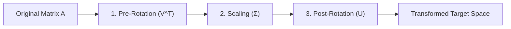

# Singular Value Decomposition (SVD): A Comprehensive Guide for AI & Machine Learning

## 1. THE CORE THEORY

### The Graphic Designer Analogy
Imagine you are a graphic designer creating an intricate illustration of a house. Instead of saving it as a massive, uneditable flat image file, you break it down cleanly into three distinct transparent layers:
1. **Layer 1 (The Rotation/Base Perspectives):** A foundational grid map that rotates the house to perfectly line up with your canvas coordinate axes.
2. **Layer 2 (The Scale Sliders):** A set of master scale sliders that control the overall width, height, and depth of the illustration independently.
3. **Layer 3 (The Style/Projection Filters):** A final overlay that projects, shears, or maps those styled coordinates onto the viewer's screen space.

**Singular Value Decomposition (SVD)** is the ultimate mathematical filter. It proves that *any* data transformation matrix—no matter how messy, skewed, or rectangular—can be cleanly broken down into a sequence of three geometric steps: **Rotate, Scale, and Rotate again**.



### Technical Definition
SVD is a matrix factorization method that generalizes the concept of eigendecomposition to non-square matrices. Mathematically, it states that any real $m 	imes n$ matrix $\mathbf{A}$ can be factorized into three matrices:

$$\mathbf{A} = \mathbf{U} \mathbf{\Sigma} \mathbf{V}^T$$

Where $\mathbf{U}$ and $\mathbf{V}$ are **orthogonal matrices** (meaning their columns are mutually perpendicular unit vectors that perform rigid rotations), and $\mathbf{\Sigma}$ is a **diagonal matrix** containing non-negative scaling factors sorted from largest to smallest.

### Why SVD is Absolutely Necessary for AI
* **Low-Rank Approximation (Truncated SVD):** Large AI architectures (like LLMs or Vision Transformers) utilize millions of parameters. SVD identifies the structural bottleneck of a weight matrix, allowing engineers to keep only the top $k$ scaling values and discard the rest. This shrinks models by up to 80% with minimal loss in accuracy.
* **Matrix Inversion for Pseudo-Inverses:** In algorithms like linear regression or recommendation engines, computing a standard matrix inverse fails if features are collinear or the matrix is not square. SVD elegantly constructs the Moore-Penrose pseudo-inverse ($\mathbf{A}^+$) ensuring stable convergence.
* **Latent Factor Extraction:** In recommendation setups (such as collaborative filtering), SVD distills raw user-movie interaction grids into hidden, dense dimensions representing underlying taste concepts (e.g., sci-fi preference or director affinity).

---

## 2. THE MATHEMATICAL FORMULA

The mathematical definition of Singular Value Decomposition is structured as follows:

$$\mathbf{A}_{m 	imes n} = \mathbf{U}_{m 	imes m} \mathbf{\Sigma}_{m 	imes n} \mathbf{V}^T_{n 	imes n}$$

### Variable Breakdown
* $\mathbf{A}$: The **Original Data Matrix** of size $m 	imes n$ representing $m$ samples and $n$ features.
* $\mathbf{U}$: The **Left Singular Vectors** matrix ($m 	imes m$). Its columns are eigenvectors of $\mathbf{A}\mathbf{A}^T$, forming an orthonormal basis for the output space.
* $\mathbf{\Sigma}$: The **Singular Values Matrix** ($m 	imes n$). It is zero everywhere except along its main diagonal. The non-zero elements, $\sigma_1 \ge \sigma_2 \ge \dots \ge \sigma_r > 0$, quantify the operational energy or variance captured along each axis.
* $\mathbf{V}^T$: The **Transposed Right Singular Vectors** matrix ($n 	imes n$). Its rows are eigenvectors of $\mathbf{A}^T\mathbf{A}$, forming an orthonormal basis for the input space.

### Logical Intuition Behind the Structure
Matrix transformations usually alter vectors by stretching and turning them at the same time, making them difficult to track. SVD decouples these operations completely:

1. **$\mathbf{V}^T$ (The Pre-Rotation):** Maps vectors from the raw coordinate system into a new perpendicular space without changing their lengths.
2. **$\mathbf{\Sigma}$ (The Independent Scaling):** Stretches or squeezes the newly rotated dimensions independently along the main coordinate axes. Because $\mathbf{\Sigma}$ is purely diagonal, there is zero cross-talk between dimensions.
3. **$\mathbf{U}$ (The Post-Rotation):** Rotates the independently scaled dimensions one final time to align them with the output distribution space.

---

## 3. CAUSATION & BEHAVIOR

### Mathematical Dynamics
* **When Top Singular Values ($\sigma_1, \sigma_2$) Dominate:** If the first few diagonal entries in $\mathbf{\Sigma}$ are massive while the remaining entries are tiny, it signifies that the data has a **low intrinsic rank**. The matrix acts like a tight, linear pipe where signals are heavily funneled along the dominant directions represented by the matching vectors in $\mathbf{U}$ and $\mathbf{V}$.
* **When a Singular Value ($\sigma_i$) Approaches Zero:** The transformation entirely flattens or collapses any information moving along that dimension. In Deep Learning, if the singular values of a neural network's weight matrix fall close to zero, it causes a severe drop in structural rank, directly leading to the **vanishing gradient problem**.
* **Matrix Conditioning Sensitivity:** The ratio of the largest singular value to the smallest non-zero singular value ($\kappa = \sigma_{\max} / \sigma_{\min}$) defines the **condition number**. If $\kappa$ is excessively large, the matrix is ill-conditioned. A tiny tweak to input vectors will cause explosive, unpredictable spikes in output layers.

### Technical Edge Cases & Limitations
* **Computational Cost:** Computing standard exact SVD for a large matrix scales at $\mathcal{O}(\min(m^2n, mn^2))$. This makes it computationally heavy to calculate iteratively on massive online datasets without using randomized approximation variants.
* **Sign Ambiguity:** Eigenvectors can point in opposite directions while solving the same characteristic equation. If $\mathbf{A} = \mathbf{U}\mathbf{\Sigma}\mathbf{V}^T$, then flipping the sign of a column in $\mathbf{U}$ and the matching row in $\mathbf{V}^T$ returns the exact same matrix $\mathbf{A}$.

---

## 4. MERMAID VISUALIZATION GRID

Below is a visualization mapping how an initial unit boundary circle transforms geometrically into an elongated ellipse under the multi-stage scaling and rotation forces of SVD matrices.

```mermaid
quadrantChart
    title SVD Transformation Space Matrix Scaling Effects
    x-axis Left Singular Space (u1 Direction) --> Right Singular Space
    y-axis Minor Axis Extension (u2 Direction) --> Major Axis Extension
    quadrant-1 Elongated Ellipse Boundary
    quadrant-2 Major Vector Focus u1 (Length = σ1)
    quadrant-3 Original Unit Square Reference Context
    quadrant-4 Minor Vector Focus u2 (Length = σ2)
```

### What to Look for in a Dynamic Python Plot (e.g., Matplotlib)
1. **The Grid Space:** Plot a grid of unit vector points forming a perfect circle with radius $r=1$.
2. **Applying $\mathbf{V}^T$:** Applying the rotation matrix leaves the circle looking visually identical, but rotates the internal baseline axes.
3. **Applying $\mathbf{\Sigma}$:** Multiplying by the diagonal matrix stretches the unit circle along its axes, turning it into a distinct ellipse. The length of the primary axis equals $\sigma_1$, and the length of the secondary axis equals $\sigma_2$.
4. **Applying $\mathbf{U}$:** Rotates the final ellipse to its terminal orientation on screen.

---

## 5. AI EXAMPLE WITH STEP-BY-STEP CALCULATION

### The Use Case
We want to extract hidden latent relationships from a simple $2 	imes 2$ user-feature matrix representing a tiny embedding layer inside a machine learning model:

$$\mathbf{A} = egin{bmatrix} 1 & 2 \ 2 & 1 \end{bmatrix}$$

We will decompose this using explicit, step-by-step arithmetic.

---

### Step 1: Compute $\mathbf{A}^T\mathbf{A}$ to Find Right Singular Vectors ($\mathbf{V}$)
First, compute the dot product of the transposed matrix and itself:

$$\mathbf{A}^T\mathbf{A} = egin{bmatrix} 1 & 2 \ 2 & 1 \end{bmatrix} egin{bmatrix} 1 & 2 \ 2 & 1 \end{bmatrix} = egin{bmatrix} (1\cdot1 + 2\cdot2) & (1\cdot2 + 2\cdot1) \ (2\cdot1 + 1\cdot2) & (2\cdot2 + 1\cdot1) \end{bmatrix} = egin{bmatrix} 5 & 4 \ 4 & 5 \end{bmatrix}$$

---

### Step 2: Extract Eigenvalues ($\lambda$) for Singular Value Scales
Set up the characteristic determinant equation $\det(\mathbf{A}^T\mathbf{A} - \lambda\mathbf{I}) = 0$:

$$\det egin{bmatrix} 5 - \lambda & 4 \ 4 & 5 - \lambda \end{bmatrix} = 0$$

$$(5 - \lambda)(5 - \lambda) - (4)(4) = 0$$

$$\lambda^2 - 10\lambda + 25 - 16 = 0 \implies \lambda^2 - 10\lambda + 9 = 0$$

Factoring the polynomial: $(\lambda - 9)(\lambda - 1) = 0$. This yields our eigenvalues:
* $\lambda_1 = 9$
* $\lambda_2 = 1$

Singular values ($\sigma$) are the square roots of these eigenvalues:
* $\sigma_1 = \sqrt{9} = 3$
* $\sigma_2 = \sqrt{1} = 1$

$$\mathbf{\Sigma} = egin{bmatrix} 3 & 0 \ 0 & 1 \end{bmatrix}$$

---

### Step 3: Compute Right Singular Vectors Matrix ($\mathbf{V}$)
Find the normalized eigenvectors of $\mathbf{A}^T\mathbf{A}$.

**For $\lambda_1 = 9$:**
$$egin{bmatrix} 5 - 9 & 4 \ 4 & 5 - 9 \end{bmatrix} egin{bmatrix} x_1 \ x_2 \end{bmatrix} = egin{bmatrix} 0 \ 0 \end{bmatrix} \implies egin{bmatrix} -4 & 4 \ 4 & -4 \end{bmatrix} egin{bmatrix} x_1 \ x_2 \end{bmatrix} = egin{bmatrix} 0 \ 0 \end{bmatrix}$$
This means $-4x_1 + 4x_2 = 0 \implies x_1 = x_2$. Normalizing to unit length:

$$\mathbf{v}_1 = egin{bmatrix} rac{1}{\sqrt{2}} \ rac{1}{\sqrt{2}} \end{bmatrix}$$

**For $\lambda_2 = 1$:**
$$egin{bmatrix} 5 - 1 & 4 \ 4 & 5 - 1 \end{bmatrix} egin{bmatrix} x_1 \ x_2 \end{bmatrix} = egin{bmatrix} 0 \ 0 \end{bmatrix} \implies egin{bmatrix} 4 & 4 \ 4 & 4 \end{bmatrix} egin{bmatrix} x_1 \ x_2 \end{bmatrix} = egin{bmatrix} 0 \ 0 \end{bmatrix}$$
This means $4x_1 + 4x_2 = 0 \implies x_1 = -x_2$. Normalizing to unit length:

$$\mathbf{v}_2 = egin{bmatrix} rac{1}{\sqrt{2}} \ -rac{1}{\sqrt{2}} \end{bmatrix}$$

Assemble $\mathbf{V}$ and transpose to get $\mathbf{V}^T$:
$$\mathbf{V} = egin{bmatrix} rac{1}{\sqrt{2}} & rac{1}{\sqrt{2}} \ rac{1}{\sqrt{2}} & -rac{1}{\sqrt{2}} \end{bmatrix} \implies \mathbf{V}^T = egin{bmatrix} rac{1}{\sqrt{2}} & rac{1}{\sqrt{2}} \ rac{1}{\sqrt{2}} & -rac{1}{\sqrt{2}} \end{bmatrix}$$

---

### Step 4: Compute Left Singular Vectors Matrix ($\mathbf{U}$)
Use the relationship formula $\mathbf{u}_i = rac{1}{\sigma_i} \mathbf{A} \mathbf{v}_i$:

**For $\mathbf{u}_1$:**
$$\mathbf{u}_1 = rac{1}{3} egin{bmatrix} 1 & 2 \ 2 & 1 \end{bmatrix} egin{bmatrix} rac{1}{\sqrt{2}} \ rac{1}{\sqrt{2}} \end{bmatrix} = rac{1}{3} egin{bmatrix} rac{3}{\sqrt{2}} \ rac{3}{\sqrt{2}} \end{bmatrix} = egin{bmatrix} rac{1}{\sqrt{2}} \ rac{1}{\sqrt{2}} \end{bmatrix}$$

**For $\mathbf{u}_2$:**
$$\mathbf{u}_2 = rac{1}{1} egin{bmatrix} 1 & 2 \ 2 & 1 \end{bmatrix} egin{bmatrix} rac{1}{\sqrt{2}} \ -rac{1}{\sqrt{2}} \end{bmatrix} = egin{bmatrix} rac{1 - 2}{\sqrt{2}} \ rac{2 - 1}{\sqrt{2}} \end{bmatrix} = egin{bmatrix} -rac{1}{\sqrt{2}} \ rac{1}{\sqrt{2}} \end{bmatrix}$$

Assemble the left singular vectors matrix $\mathbf{U}$:
$$\mathbf{U} = egin{bmatrix} rac{1}{\sqrt{2}} & -rac{1}{\sqrt{2}} \ rac{1}{\sqrt{2}} & rac{1}{\sqrt{2}} \end{bmatrix}$$

---

### Verification Checkout
Let's multiply our decomposed matrices back together ($\mathbf{U} \mathbf{\Sigma} \mathbf{V}^T$) to verify correctness:

$$\mathbf{U}\mathbf{\Sigma} = egin{bmatrix} rac{1}{\sqrt{2}} & -rac{1}{\sqrt{2}} \ rac{1}{\sqrt{2}} & rac{1}{\sqrt{2}} \end{bmatrix} egin{bmatrix} 3 & 0 \ 0 & 1 \end{bmatrix} = egin{bmatrix} rac{3}{\sqrt{2}} & -rac{1}{\sqrt{2}} \ rac{3}{\sqrt{2}} & rac{1}{\sqrt{2}} \end{bmatrix}$$

Now multiply by $\mathbf{V}^T$:
$$\mathbf{A} = (\mathbf{U}\mathbf{\Sigma})\mathbf{V}^T = egin{bmatrix} rac{3}{\sqrt{2}} & -rac{1}{\sqrt{2}} \ rac{3}{\sqrt{2}} & rac{1}{\sqrt{2}} \end{bmatrix} egin{bmatrix} rac{1}{\sqrt{2}} & rac{1}{\sqrt{2}} \ rac{1}{\sqrt{2}} & -rac{1}{\sqrt{2}} \end{bmatrix}$$

$$\mathbf{A} = egin{bmatrix} (rac{3}{2} - rac{1}{2}) & (rac{3}{2} + rac{1}{2}) \ (rac{3}{2} + rac{1}{2}) & (rac{3}{2} - rac{1}{2}) \end{bmatrix} = egin{bmatrix} 1 & 2 \ 2 & 1 \end{bmatrix}$$

The math resolves perfectly back to our raw input matrix $\mathbf{A}$.