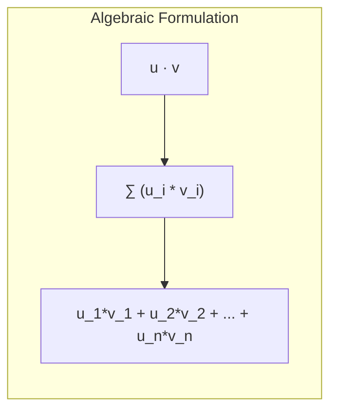
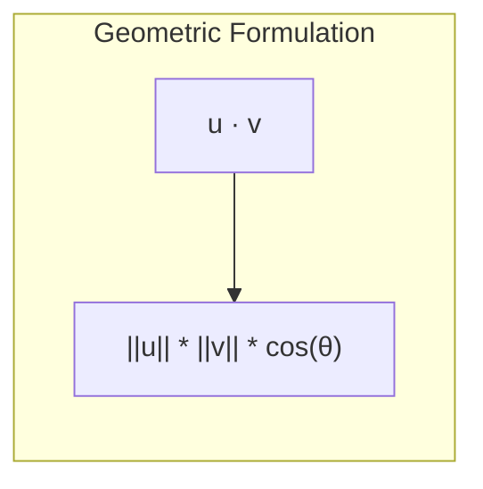

# Deep Dive: The Dot Product in Artificial Intelligence

This document provides a comprehensive overview of the dot product, its mathematical formulations, behaviors, geometric representations, and concrete applications in Machine Learning and Deep Learning.

---

## 1. THE CORE THEORY

### The Analogy: The "Shared Direction" Spotlight
Imagine you and a friend are pushing a heavy box. If you both push in the exact same direction, your combined effort is maximized. If your friend pushes at a right angle (perpendicular) to you, their effort contributes exactly zero to moving the box in your direction. If they push directly against you, their effort actively subtracts from yours.

The **dot product is a mathematical spotlight** that measures this alignment. It takes two arrows (vectors) and outputs a single number showing how much they are "working together" or pointing in the same direction.

### The Technical Definition
The **dot product** (also called the scalar product) is an algebraic operation that takes two equal-length sequences of numbers (vectors) and returns a **single scalar number**. It combines the spatial components of both vectors into a unified measure of similarity, capturing both their lengths and the angle between them.

### Why It Is Necessary for AI
Without the dot product, modern AI would collapse. It is the fundamental building block for:
* **The "Thinking" of a Neuron:** Every artificial neuron computes a dot product between its incoming inputs and its learned weights to determine if it should activate.
* **Semantic Similarity (LLMs):** Text embeddings turn words or sentences into vectors. The dot product (and its cousin, Cosine Similarity) checks how closely aligned two vectors are in meaning.
* **The Attention Mechanism (Transformers):** Models like GPT-4 use dot products to calculate "Attention Scores," allowing the network to decide which words in a long sentence relate to each other.

---

## 2. THE MATHEMATICAL FORMULA

The dot product can be calculated in two ways: **Algebraically** (using coordinates) and **Geometrically** (using angles).

### Algebraic Formula


### Geometric Formula


### Variable Definitions
* **`u`, `v`**: The two vectors being multiplied.
* **`·`**: The dot product operator symbol.
* **`n`**: The dimensionality of the vectors (the number of elements they contain).
* **`u_i`, `v_i`**: The specific $i$-th components of vectors `u` and `v`.
* **`||u||`, `||v||`**: The magnitudes (lengths) of vectors `u` and `v`.
* **`θ` (Theta)**: The angle between the two vectors in space.
* **`cos`**: The trigonometric cosine function.

### Logical Intuition
The algebraic formula multiplies corresponding elements because it asks: *"How much intensity do these two vectors share along this specific axis?"* By summing these products across all axes ($1$ through $n$), it accumulates the total shared strength across all dimensions.

The geometric formula reveals what this sum actually means: it multiplies the lengths of both vectors ($||u|| ||v||$) and scales the result by their directional alignment ($\cos(	heta)$).

---

## 3. CAUSATION & BEHAVIOR

### Cause-and-Effect Relationships
* **Increasing Component Magnitudes:** If any positive element $u_i$ or $v_i$ increases, the final dot product increases linearly. In AI, stronger inputs or heavier weights result in a more powerful neuron activation.
* **Approaching Zero:** If one vector approaches the zero vector ($u 
ightarrow 0$), the dot product collapses to **exactly zero**, regardless of how large the other vector is. In machine learning, a weight of zero completely silences an incoming feature.
* **Changing the Angle (θ):**
  * **θ = 0° (Perfect Alignment):** $\cos(0^\circ) = 1$. The dot product is maximally positive ($||u||||v||$).
  * **θ = 90° (Orthogonality):** $\cos(90^\circ) = 0$. The dot product becomes **zero**. The vectors are completely independent; one contains no information about the other.
  * **θ = 180° (Perfect Opposition):** $\cos(180^\circ) = -1$. The dot product is maximally negative ($-||u||||v||$).

### Edge Cases and Constraints
* **Dimensionality Constraint:** The dot product is strictly undefined if vectors `u` and `v` do not have the exact same number of dimensions ($n$). Attempting this causes shape mismatch errors in libraries like NumPy or PyTorch.
* **The Magnitude Bias:** The dot product is highly sensitive to the scale of the numbers. A poorly aligned pair of long vectors can yield a higher dot product than a perfectly aligned pair of short vectors. AI models often use *normalized* dot products (Cosine Similarity) to fix this bias.

---

## 4. TEXT-BASED INTERACTIVE PLOT DIAGRAM

Below is a 2D geometric visualization of a dot product where vector `v` is projected onto vector `u`.

```text
    y-axis
      ^
      |         . Vector v (4, 5)
      |        /|
      |       / | 
      |      /  | 
      |     /   | 
      |    /    |  
      |   /     |   
      |  / θ    |    
      +---------+--------------------> x-axis
     (0,0)      |        Vector u (6, 0)
                |
         [Projected Length]
         v's shadow on u = ||v||*cos(θ)
```

### What to Visualize in Python (Matplotlib)
If you were to animate this dynamically in a script:
1. **The Vectors:** You would see two arrows originating from the center $(0,0)$.
2. **The Shadow (Projection):** Dropping a perpendicular dashed line from the tip of Vector `v` down to Vector `u` creates a "shadow" along `u`. The length of this shadow multiplied by the length of `u` is your dot product.
3. **Dynamic Motion:** If you rotate `v` clockwise toward `u` (decreasing `θ`), you will see the shadow grow longer, causing the dot product value displayed on your screen to climb until they overlap perfectly.

---

## 5. AI EXAMPLE WITH STEP-BY-STEP CALCULATION

### Use Case: Forward Pass of an Artificial Neuron
We want to calculate the raw, pre-activation output ($z$) of a single hidden neuron in a deep neural network. The neuron receives **3 input features** from a processed image and applies its **learned weights**.

### Toy Dataset
* **Input Vector (x):** `[2.0, 0.5, 1.5]` (e.g., values representing pixel intensity, edge detection, and texture).
* **Weight Vector (w):** `[1.2, -2.0, 0.4]` (the importance coefficients learned by the network).
* **Bias (b):** `+0.15` (a constant baseline scalar added to the final result).

The mathematical operation is: $z = (w \cdot x) + b$

### Step-by-Step Arithmetic

**Step 1: Pair up the corresponding elements of the vectors.**
* Pair 1: $w_1 = 1.2$, $x_1 = 2.0$
* Pair 2: $w_2 = -2.0$, $x_2 = 0.5$
* Pair 3: $w_3 = 0.4$, $x_3 = 1.5$

**Step 2: Multiply each pair together.**
* Element 1: $1.2 	imes 2.0 = 2.4$
* Element 2: $-2.0 	imes 0.5 = -1.0$
* Element 3: $0.4 	imes 1.5 = 0.6$

**Step 3: Sum the products to find the Dot Product (w · x).**
* $w \cdot x = 2.4 + (-1.0) + 0.6$
* $w \cdot x = 1.4 + 0.6$
* $w \cdot x = 2.0$

**Step 4: Add the bias scalar (b) to compute the final neuron score (z).**
* $z = 2.0 + 0.15$
* $z = 2.15$

**Conclusion:** The dot product is `2.0`. Because the result is positive, it tells the network that the inputs align well with what the weights are looking for, pushing the neuron closer to firing.
