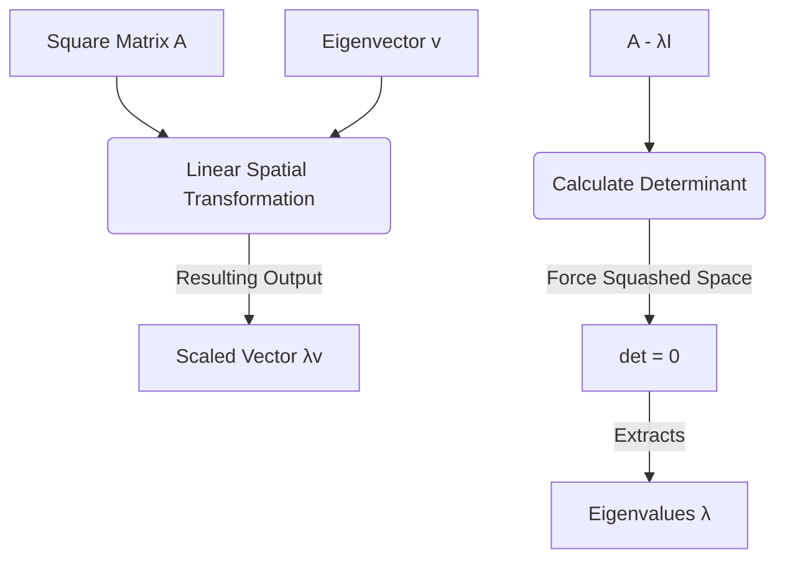

# Deep Dive: Eigenvalues and Eigenvectors in Artificial Intelligence

---

### 1. THE CORE THEORY

#### The Analogy: The "Wind Tunnel" and "Stubborn Arrows"
Imagine a wind tunnel testing the aerodynamics of a car. When you blast wind through the tunnel, most loose objects get pushed, turned, and spun around wildly. However, if you place a perfectly streamlined arrow directly aligned with the airflow, it won't rotate at all; it will stay pointing in its original direction. The only thing that might happen is that the force of the wind stretches it or compresses it. 

In linear algebra, a **matrix is like that blast of wind**—it warps, rotates, and transforms geometric space. Most vectors get violently knocked off their original path when multiplied by a matrix. But a few special, stubborn vectors do not change their directional path at all. They are merely scaled (stretched, shrunk, or flipped). These stubborn vectors are **eigenvectors**, and the factor by which they stretch or shrink is their corresponding **eigenvalue**.

#### The Technical Definition
Given a square matrix $\mathbf{A}$, an **eigenvector** is a non-zero vector $\mathbf{v}$ that, when multiplied by $\mathbf{A}$, yields a scalar multiple of itself. This means the matrix transformation behaves exactly like simple scalar multiplication for that specific vector. An **eigenvalue** $\lambda$ is the scalar factor by which the eigenvector's length is scaled during this transformation.

#### Why It Is Necessary for AI
Without eigenvalues and eigenvectors, processing massive datasets or training stable deep networks would be computationally impossible. They serve as foundational pillars for:
* **Principal Component Analysis (PCA):** High-dimensional AI datasets (like thousands of user features) are condensed down by finding the eigenvectors of the dataset's covariance matrix. The eigenvectors pointing along the directions of highest variance (largest eigenvalues) become the new principal features, drastically saving memory.
* **Spectral Clustering:** Graphs representing social networks or image pixels are segmented by computing the eigenvalues of a graph Laplacian matrix to reveal hidden clusters.
* **Stability in Recurrent Neural Networks (RNNs):** If the eigenvalues of an RNN's hidden-to-hidden weight matrix are greater than 1.0, gradients explode exponentially during backpropagation. If they are less than 1.0, gradients vanish. AI engineers track the maximum eigenvalue (spectral radius) to keep training stable.

---

### 2. THE MATHEMATICAL FORMULA

The relationship defining eigenvalues and eigenvectors is encapsulated in the foundational formula:

$$\mathbf{A}\mathbf{v} = \lambda\mathbf{v}$$

To solve for $\lambda$ without knowing $\mathbf{v}$ beforehand, the equation is rearranged by introducing an identity matrix ($\mathbf{I}$) and setting the determinant to zero:

$$(\mathbf{A} - \lambda\mathbf{I})\mathbf{v} = \mathbf{0} \implies \det(\mathbf{A} - \lambda\mathbf{I}) = 0$$

#### Variable Definitions
* $\mathbf{A}$: A square ($n \times n$) matrix representing a linear transformation or a dataset's covariance matrix.
* $\mathbf{v}$: The eigenvector—a non-zero ($n \times 1$) column vector whose spatial direction remains invariant under $\mathbf{A}$.
* $\lambda$ (Lambda): The eigenvalue—a scalar constant that scales the length of $\mathbf{v}$.
* $\mathbf{I}$: The ($n \times n$) Identity Matrix (the matrix equivalent of the number 1, with 1s on the diagonal and 0s elsewhere).
* $\det$: The determinant operator, which measures the factor by which linear transformations scale spatial volumes.
* $\mathbf{0}$: The zero vector.

#### Logical Intuition



The equation $\mathbf{A}\mathbf{v} = \lambda\mathbf{v}$ sets up a profound equivalence: matrix multiplication (which is computationally expensive and changes directions) becomes perfectly identical to scalar multiplication (which is cheap and preserves direction). 

When we rearrange it to $\det(\mathbf{A} - \lambda\mathbf{I}) = 0$, we are looking to subtract a specific amount of mass ($\lambda$) from the diagonal of $\mathbf{A}$ such that the matrix collapses in dimension. Forcing the determinant to zero means the transformation squashes space flat into a lower dimension, guaranteeing that a non-trivial, stubborn vector $\mathbf{v}$ exists along the squashed axis.

---

### 3. CAUSATION & BEHAVIOR

#### Cause-and-Effect Relationships
* **Increasing an Eigenvalue ($\lambda \gg 1$):** If an eigenvalue grows exceptionally large, any vector aligned with its corresponding eigenvector will explode in magnitude after repeated matrix transformations. In deep learning, this causes activation outputs or exploding gradients to crash the model.
* **Eigenvalue Approaching Zero ($\lambda \rightarrow 0$):** If an eigenvalue drops to zero, the matrix completely annihilates any information along its corresponding eigenvector's direction, squashing it down into the origin. In PCA, directions with eigenvalues near zero represent meaningless noise or redundancy and are discarded.
* **Negative Eigenvalues ($\lambda < 0$):** The eigenvector retains its strict spatial line but points in the *exact opposite direction* (flipped 180°) across the origin.

#### Edge Cases and Constraints
* **The Square Matrix Rule:** Eigenvalues and eigenvectors can strictly only be computed for square matrices ($n \times n$). For non-square datasets (like an $m \times n$ image matrix), AI relies on a broader generalization called **Singular Value Decomposition (SVD)**.
* **Complex/Imaginary Numbers:** If a matrix causes space to purely rotate (like a wheel turning 90°), no real vector can maintain its direction. In these cases, eigenvalues become complex numbers containing imaginary units ($i$). 
* **Defective Matrices:** An $n \times n$ matrix might fail to produce $n$ distinct, independent eigenvectors. If eigenvectors overlap, the matrix cannot be fully diagonalized, creating bottlenecks in optimization.

---

### 4. TEXT-BASED INTERACTIVE PLOT DIAGRAM

Below is a geometric mapping of space being warped by a matrix. Notice how an arbitrary vector $\mathbf{x}$ changes its angle entirely, while the eigenvector $\mathbf{v}$ stays locked to its directional axis line.

```text
       y-axis
         ^
         |                    . Transformed Vector Ax  (Angle changed!)
         |                   / 
         |                  /     . Transformed Eigenvector Av = λv
         |      Vector x   /     /  (Stretched along its own axis!)
         |        .       /     /
         |       /       /     /
         |      /       /     / 
         |     /       /     /  
         |    /       /     /   
         |   /       /     / Eigenvector v Axis
         +--/-------/-----/---------------------------> x-axis
       (0,0)
```

#### What to Visualize in Python (Matplotlib)
If you were to create an interactive plotting script:
1. **The Grid Lines:** You would render a uniform, square 2D coordinate grid with a unit circle.
2. **The Animation:** Apply a matrix transformation to the grid. You will see the circle warp into an elongated ellipse.
3. **The Reveal:** If you plot a standard vector $\mathbf{x}$, you will watch it rotate as the grid warps. However, if you plot the true eigenvector vector $\mathbf{v}$, it will stay pinned to its trajectory like an unshakeable rail, sliding outward or inward smoothly as the transformation settles.

---

### 5. AI EXAMPLE WITH STEP-BY-STEP CALCULATION

#### Use Case: Computing Principal Components (PCA) from a Covariance Matrix
We are engineering a computer vision model. We have computed the highly simplified $2 \times 2$ **Covariance Matrix ($\mathbf{A}$)** of a two-feature dataset (representing pixel contrast vs. brightness). To compress the data from 2D down to 1D, we must find the principal eigenvector corresponding to the maximum eigenvalue.

#### Toy Dataset
Let the symmetric covariance matrix be:
$$\mathbf{A} = \begin{bmatrix} 4 & 2 \\ 2 & 7 \end{bmatrix}$$

We will calculate the eigenvalues ($\lambda$) and the primary eigenvector ($\mathbf{v}$).

#### Step-by-Step Arithmetic

**Step 1: Set up the Characteristic Equation to solve for $\lambda$.**
$$\det(\mathbf{A} - \lambda\mathbf{I}) = 0$$
$$\det\left( \begin{bmatrix} 4 & 2 \\ 2 & 7 \end{bmatrix} - \begin{bmatrix} \lambda & 0 \\ 0 & \lambda \end{bmatrix} \right) = 0$$
$$\det \begin{bmatrix} 4 - \lambda & 2 \\ 2 & 7 - \lambda \end{bmatrix} = 0$$

**Step 2: Expand the determinant equation (ad - bc) into a quadratic polynomial.**
$$(4 - \lambda)(7 - \lambda) - (2 \times 2) = 0$$
$$28 - 4\lambda - 7\lambda + \lambda^2 - 4 = 0$$
$$\lambda^2 - 11\lambda + 24 = 0$$

**Step 3: Factor the quadratic equation to find the two eigenvalues.**
$$(\lambda - 3)(\lambda - 8) = 0$$
* $\lambda_1 = 8$ (This represents the axis of **maximum variance**—our primary component)
* $\lambda_2 = 3$ (Secondary variance)

**Step 4: Solve for the primary Eigenvector ($\mathbf{v}$) using the dominant eigenvalue ($\lambda_1 = 8$).**
Substitute $\lambda = 8$ back into $(\mathbf{A} - \lambda\mathbf{I})\mathbf{v} = \mathbf{0}$:
$$\begin{bmatrix} 4 - 8 & 2 \\ 2 & 7 - 8 \end{bmatrix} \begin{bmatrix} v_1 \\ v_2 \end{bmatrix} = \begin{bmatrix} 0 \\ 0 \end{bmatrix}$$
$$\begin{bmatrix} -4 & 2 \\ 2 & -1 \end{bmatrix} \begin{bmatrix} v_1 \\ v_2 \end{bmatrix} = \begin{bmatrix} 0 \\ 0 \end{bmatrix}$$

This gives us a system of dependent linear equations:
1) $-4v_1 + 2v_2 = 0 \implies 2v_2 = 4v_1 \implies v_2 = 2v_1$
2) $2v_1 - 1v_2 = 0 \implies v_2 = 2v_1$

**Step 5: Pick a base value to define the eigenvector and normalize it.**
Setting $v_1 = 1$ yields $v_2 = 2$. Thus, our unnormalized eigenvector is:
$$\mathbf{v} = \begin{bmatrix} 1 \\ 2 \end{bmatrix}$$

To finalize it for standard AI software (unit length norm of 1.0):
$$\Vert\mathbf{v}\Vert = \sqrt{1^2 + 2^2} = \sqrt{5}$$
$$\mathbf{v}_{\text{normalized}} = \begin{bmatrix} \frac{1}{\sqrt{5}} \\ \frac{2}{\sqrt{5}} \end{bmatrix} \approx \begin{bmatrix} 0.447 \\ 0.894 \end{bmatrix}$$

**Conclusion:** The direction vector `[0.447, 0.894]` captures the core structural lineage of our data variance. Our AI compression system will discard the orthogonal axis ($\lambda_2 = 3$) and project the entire dataset directly onto this line, successfully compressing the dimensional footprint by half while retaining maximum information.