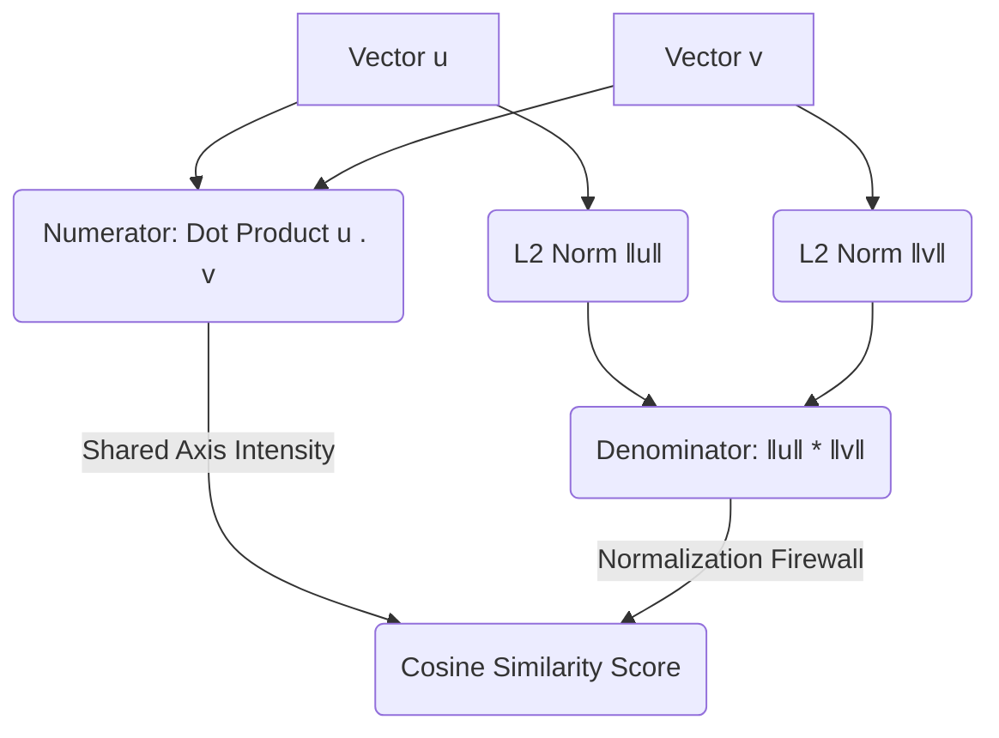
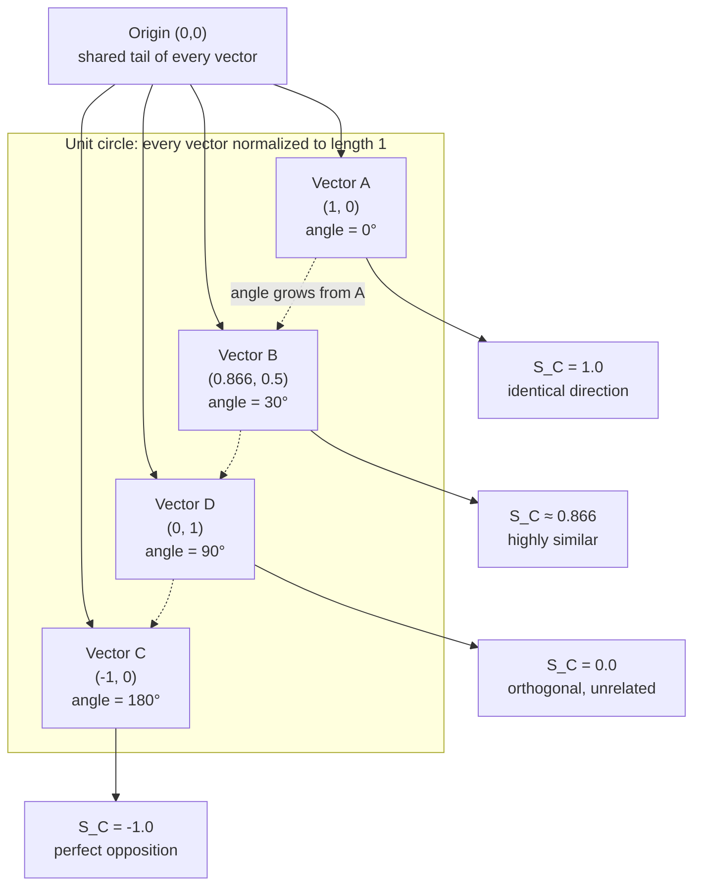

# Comprehensive Guide to Cosine Similarity in AI

---

### 1. THE CORE THEORY

#### The Analogy: The "Taste Profile" vs. "Portion Size"
Imagine two people ordering at a restaurant. Customer A orders **1 slice of pepperoni pizza**. Customer B orders **4 whole pepperoni pizzas**. If you look at the raw volume or amount of food they consume, they look completely different. However, if you look at *what* they like to eat, their taste profiles are identical—100% pizza.

**Cosine similarity ignores the portion size (magnitude) and focuses entirely on the taste profile (direction).** It measures the angle between two arrows, telling you how similarly they point, regardless of how long the arrows are.

#### The Technical Definition
**Cosine similarity** is a metric used to measure how similar two vectors are in an inner product space. Mathematically, it calculates the **cosine of the angle between two multi-dimensional vectors**. It scales the dot product of the vectors by the product of their individual lengths (norms), constraining the final output to a strict range between **-1 and 1**.

#### Why It Is Necessary for AI
Cosine similarity is the operational backbone for systems that handle high-dimensional unstructured data:
* **Large Language Models & Embeddings:** When an LLM converts sentences like *"The cat sat on the mat"* and *"A feline rested on the rug"* into vectors, cosine similarity identifies that they point in virtually the same direction semantically, even if the words differ.
* **Vector Databases (RAG Systems):** Retrieval-Augmented Generation relies on finding the top-K most similar document vectors to a user query vector instantly using this metric.
* **Recommendation Engines:** Recommendation systems match users to items (e.g., movies on Netflix) by checking the directional alignment of their preference vectors, preventing heavy users (high magnitude) from distorting the similarity profile of casual users.

---

### 2. THE MATHEMATICAL FORMULA

The mathematical definition of cosine similarity scales a standard dot product by stripping away vector magnitudes:

$$S_C(\mathbf{u}, \mathbf{v}) = \cos(\theta) = \frac{\mathbf{u} \cdot \mathbf{v}}{\Vert\mathbf{u}\Vert \Vert\mathbf{v}\Vert} = \frac{\sum_{i=1}^{n} u_i v_i}{\sqrt{\sum_{i=1}^{n} u_i^2} \sqrt{\sum_{i=1}^{n} v_i^2}}$$

#### Variable Definitions
* $S_C(\mathbf{u}, \mathbf{v})$: The calculated cosine similarity score between vectors $\mathbf{u}$ and $\mathbf{v}$.
* $\cos(\theta)$: The cosine of the angle θ between the two vectors.
* $\mathbf{u} \cdot \mathbf{v}$: The algebraic dot product of the two vectors.
* $\Vert\mathbf{u}\Vert, \Vert\mathbf{v}\Vert$: The Euclidean (L₂) norms (lengths) of vectors $\mathbf{u}$ and $\mathbf{v}$ respectively.
* $u_i, v_i$: The numerical values at the i-th index of each vector.
* n: The total number of dimensions (features) in the vector space.

#### Logical Intuition
The formula is a direct rearrangement of the geometric dot product formula. Start from the angle form, then divide both sides by the product of the two norms:

$$\frac{\mathbf{u} \cdot \mathbf{v}}{\Vert\mathbf{u}\Vert \Vert\mathbf{v}\Vert} = \frac{\Vert\mathbf{u}\Vert \Vert\mathbf{v}\Vert \cos(\theta)}{\Vert\mathbf{u}\Vert \Vert\mathbf{v}\Vert} = \cos(\theta)$$

What remains is $\cos(\theta)$, which is exactly $S_C(\mathbf{u}, \mathbf{v})$.

The numerator ($\mathbf{u} \cdot \mathbf{v}$) acts as the engine, capturing how much the two vectors interact and scale together. The denominator ($\Vert\mathbf{u}\Vert \Vert\mathbf{v}\Vert$) acts as a **normalization firewall**. By dividing the shared interaction by the absolute lengths of both vectors, it shrinks the vectors down to unit length (1.0). This guarantees that the final score is purely a reflection of **angular alignment**, neutralizing any distortion caused by massive raw values.

---

### 3. CAUSATION & BEHAVIOR

#### Cause-and-Effect Relationships
* **Scaling an Input Vector:** If you take vector $\mathbf{u}$ and multiply all its components by 10 ($10\mathbf{u}$), the **cosine similarity remains exactly the same**. The numerator increases by a factor of 10, but the denominator norm also increases by a factor of 10, perfectly canceling the effect out.
* **Rotating Towards Convergence (θ → 0°):** As the angle between vectors closes, $\cos(\theta)$ approaches **1.0**. This signifies perfect directional similarity.
* **Rotating Towards Independence (θ → 90°):** As vectors become orthogonal (perpendicular), $\cos(90^\circ)$ drops to **0.0**. In AI embeddings, this means the two concepts share no relationship.
* **Rotating Towards Opposition (θ → 180°):** As vectors point in completely opposite directions, $\cos(180^\circ)$ drops to **-1.0**.

#### Edge Cases and Constraints
* **The Zero-Vector Trap:** If either input vector is a zero vector ($\mathbf{u} = \mathbf{0}$), its length $\Vert\mathbf{u}\Vert$ is 0. The denominator evaluates to 0, resulting in a mathematically undefined **Division-by-Zero error**. In practice, ML libraries add a tiny epsilon value (10⁻⁷) to prevent crashes.
* **Positive-Only Vector Spaces:** In many AI applications (like TF-IDF text counts or ReLU-activated embeddings), all vector elements are ≥ 0. In these positive spaces, the angle can never exceed 90°, constraining the effective output range between **0.0 and 1.0**.

---

### 4. MERMAID PLOT DIAGRAM

Below is a visual representation of how cosine similarity behaves across different vector arrangements inside a normalized space. Mermaid has no true coordinate-plane renderer, so the unit circle, the reference vector, and the resulting score at each key angle are modeled as a construction flowchart.

**Reading the diagram**

| Element | Meaning |
|---|---|
| `ORIGIN` → `A`, `B`, `D`, `C` | All four vectors share the same tail at the origin; only their direction differs |
| `CIRCLE` | Because every vector is normalized to length 1, the tips of these vectors all sit on the unit circle |
| `A` | The reference vector along the x-axis at 0°. Compared with itself, the angle is 0° |
| `B` | Rotated 30° from `A`; the score has already fallen from 1.0 to about 0.866 |
| `D` | Rotated 90° from `A` (perpendicular); the score is exactly 0.0 |
| `C` | Rotated 180° from `A` (directly opposite); the score bottoms out at -1.0 |
| Dashed edges | The angle growing from `A` toward `C`, sweeping through every intermediate value |

Note the monotonic descent: as the angle widens from 0° to 180°, the score falls smoothly from **1.0** through **0.0** to **-1.0**. Normalizing to the unit circle removes magnitude, so *only* the angle decides the score — this is what makes cosine similarity scale-invariant.

#### What to Visualize in Python (Matplotlib)
If you were to create a dynamic visual tool in a Jupyter notebook:
1. **Unit Circle:** Draw a permanent light-gray circle of radius 1.0 centered at (0,0).
2. **Fixed Vector:** Plot a static blue arrow starting at (0,0) and pointing along the x-axis to (1,0).
3. **Dynamic Interactivity:** As you move a slider to rotate a second red arrow around the circle:
   * At (1,0), the output display flashes green showing **`1.0`**.
   * At (0,1), the output turns neutral showing **`0.0`**.
   * At (-1,0), the output turns red showing **`-1.0`**.

---

### 5. AI EXAMPLE WITH STEP-BY-STEP CALCULATION

#### Use Case: Semantic Search in a Vector Database
A user types a search query into an AI-powered documentation engine. We want to find which of two text chunks stored in our vector database is the closest semantic match to the query.

#### Toy Dataset
Let's assume our embedding model outputs vectors in a 3-dimensional space representing keywords/concepts: `[AI, Math, Code]`.

* **Query Vector ($\mathbf{q}$):** `[1.0, 2.0, 0.0]` (The user's search intent)
* **Document Vector ($\mathbf{d}$):** `[3.0, 6.0, 0.0]` (A stored documentation paragraph)

**Note:** Notice that Document $\mathbf{d}$ is exactly 3 times longer than Query $\mathbf{q}$ because it repeats similar terms. We will watch the math normalize this scaling discrepancy.

#### Step-by-Step Arithmetic

**Step 1: Calculate the algebraic Dot Product ($\mathbf{q} \cdot \mathbf{d}$) in the numerator.**
$$\mathbf{q} \cdot \mathbf{d} = (q_1 \times d_1) + (q_2 \times d_2) + (q_3 \times d_3)$$
$$\mathbf{q} \cdot \mathbf{d} = (1.0 \times 3.0) + (2.0 \times 6.0) + (0.0 \times 0.0)$$
$$\mathbf{q} \cdot \mathbf{d} = 3.0 + 12.0 + 0.0$$
$$\mathbf{q} \cdot \mathbf{d} = 15.0$$

**Step 2: Calculate the Euclidean Norm (L₂) of the Query Vector ($\Vert\mathbf{q}\Vert_2$).**
$$\Vert\mathbf{q}\Vert_2 = \sqrt{1.0^2 + 2.0^2 + 0.0^2}$$
$$\Vert\mathbf{q}\Vert_2 = \sqrt{1.0 + 4.0 + 0.0}$$
$$\Vert\mathbf{q}\Vert_2 = \sqrt{5.0} \approx 2.236068$$

**Step 3: Calculate the Euclidean Norm (L₂) of the Document Vector ($\Vert\mathbf{d}\Vert_2$).**
$$\Vert\mathbf{d}\Vert_2 = \sqrt{3.0^2 + 6.0^2 + 0.0^2}$$
$$\Vert\mathbf{d}\Vert_2 = \sqrt{9.0 + 36.0 + 0.0}$$
$$\Vert\mathbf{d}\Vert_2 = \sqrt{45.0} \approx 6.708204$$

**Step 4: Multiply the two norms together to construct the denominator.**
$$\Vert\mathbf{q}\Vert_2 \times \Vert\mathbf{d}\Vert_2 = \sqrt{5.0} \times \sqrt{45.0}$$
$$\Vert\mathbf{q}\Vert_2 \times \Vert\mathbf{d}\Vert_2 = \sqrt{5.0 \times 45.0} = \sqrt{225.0}$$
$$\Vert\mathbf{q}\Vert_2 \times \Vert\mathbf{d}\Vert_2 = 15.0$$

**Step 5: Divide the dot product by the multiplied norms.**
$$S_C(\mathbf{q}, \mathbf{d}) = \frac{15.0}{15.0} = 1.0$$

**Conclusion:** The cosine similarity is exactly **`1.0`**. Even though the document vector was physically much longer and had larger numerical coordinates due to document length, the cosine similarity successfully recognized that their underlying paths are perfectly parallel. The database returns this document as an exact semantic match.
