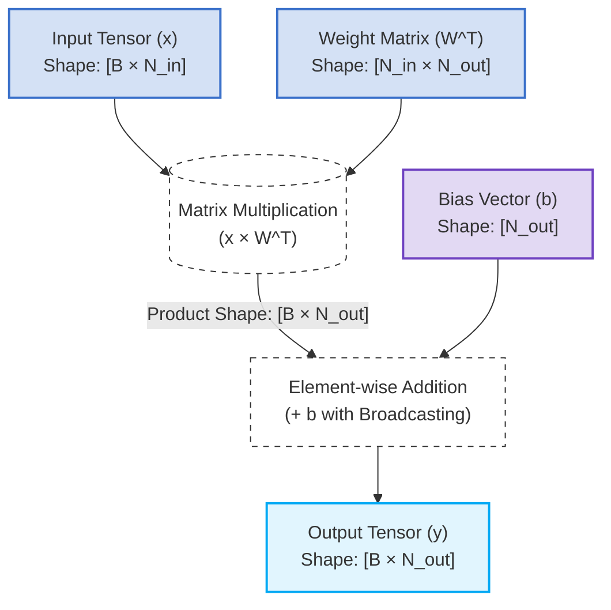

# Deep Dive: The Mathematical Formula of a Linear Layer

This document isolates and breaks down the core mathematical equation governing a **Linear Layer** (also known as a Fully Connected or Dense Layer) within modern Deep Learning architectures.

---

## 1. The Foundational Formula

In modern deep learning frameworks like [PyTorch](https://pytorch.org/), the forward pass of a linear layer is mathematically defined as:

$$y = x W^T + b$$

### Alternative Notation
In classic linear algebra and standard textbooks, you will often see it written from a column-vector perspective:
$$y = Wx + b$$

Both equations perform the exact same underlying transformation, but the transposed version ($x W^T$) is optimized for batch processing in computing hardware.

---

## 2. Structural & Computational Mapping

Below is the computational routing and shape conversion map for a standard forward pass through a linear layer, visualized via **Mermaid.js**:

---

## 3. Variable & Symbol Definitions

* **$x$**: The incoming feature or input tensor. Its shape is $(B 	imes N_{in})$, where $B$ represents the batch size (number of parallel samples processed simultaneously) and $N_{in}$ represents the number of input dimensions or features.
* **$W$**: The learnable weight matrix of shape $(N_{out} 	imes N_{in})$. Each element in this matrix represents the connection strength between an input feature and a target output feature.
* **$W^T$**: The transposed weight matrix of shape $(N_{in} 	imes N_{out})$, realigned to perfectly match the column dimensions of the input tensor $x$.
* **$b$**: The learnable bias vector of shape $(N_{out})$. This acts as a translation offset. During calculation, it uses **broadcasting** to automatically duplicate its values across the entire batch dimension $B$.
* **$y$**: The final output tensor of shape $(B 	imes N_{out})$. It contains the newly synthesized features mapped into the target spatial dimension ($N_{out}$).

---

## 4. The Logical Intuition

The formula splits geometric space manipulation into two clean, distinct parts:

1. **Linear Scaling & Rotation ($x W^T$):** The matrix multiplication combines, rotates, scales, or squashes the input coordinates. This step acts like an audio mixing console, where every input is weighted and blended together. Crucially, without a bias, this operation is locked to the origin: if the input $x$ is entirely zeros, the product $x W^T$ is unconditionally zero.
2. **Translation ($+ b$):** Adding the bias vector shifts the entire geometric plane away from the origin point. This gives the neural network the flexibility to shift its baseline predictions up or down, allowing it to output meaningful values even when the incoming feature indicators are dead silent.
