# Deep Dive: The Linear Layer in Artificial Intelligence

This document provides a comprehensive exploration of the **linear layer** (also called a fully-connected or dense layer) and its foundational role in Artificial Intelligence (AI), Machine Learning (ML), and Deep Learning (DL).

$$
y = Wx + b \quad\text{(textbook, column vectors)} \qquad\Longleftrightarrow\qquad y = xW^T + b \quad\text{(frameworks, row vectors)}
$$

**Notation used here:** $x \in \mathbb{R}^{N_{in}}$ is one sample, $W \in \mathbb{R}^{N_{out} \times N_{in}}$ is the weight matrix, $b \in \mathbb{R}^{N_{out}}$ is the bias. For batches, $X \in \mathbb{R}^{B \times N_{in}}$ stacks $B$ samples as rows, and $Y \in \mathbb{R}^{B \times N_{out}}$ holds the outputs.

---

## 1. THE CORE THEORY

### 1.1 What a linear layer computes

Two steps, in order: **(1)** each output is a weighted sum of the inputs (a dot product against one row of $W$), **(2)** a learned bias shifts the result. Without the matrix there is no mixing of features; without the bias every output is forced through the origin, which cripples fitting (it makes the map purely linear instead of affine).

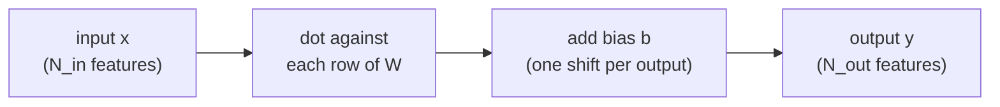
```mermaid
graph LR
    X["input x<br/>(N_in features)"] --> DOT["dot against<br/>each row of W"]
    DOT --> SHIFT["add bias b<br/>(one shift per output)"]
    SHIFT --> Y["output y<br/>(N_out features)"]
```

### 1.2 The two notations at a glance

Textbooks write a sample as a vertical column multiplied on the **left** by $W$. Frameworks store a sample as a horizontal row multiplied on the **right** by $W^T$, so that whole batches stack into one matrix multiply:

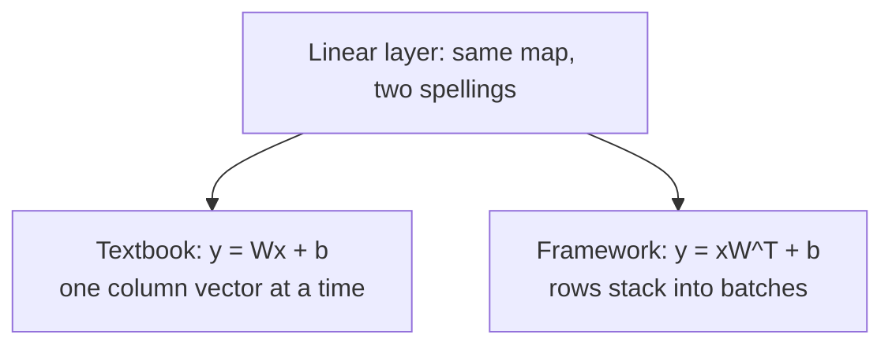
```mermaid
graph TD
    A[Linear layer: same map, two spellings] --> B["Textbook: y = Wx + b<br/>one column vector at a time"]
    A --> C["Framework: y = xW^T + b<br/>rows stack into batches"]
```

### 1.3 Textbook notation: one column at a time

Classical texts write a sample as a vertical **column vector** and apply the weights from the left:

$$y = Wx + b$$

Geometrically, each row of $W$ is a detector: output $i$ is the dot product of row $i$ with $x$, shifted by $b_i$. This is the natural notation for proving things about a single vector.

### 1.4 Framework notation: rows that stack into batches

Frameworks (PyTorch, TensorFlow, JAX) store a sample as a horizontal **row vector** and multiply from the right:

$$y = xW^T + b$$

The $W^T$ is only skin-deep: the weight *tensor* is still stored as $W$ with shape `(out_features, in_features)` — the transpose just re-orients the multiply so rows can stack (see §3 and §5).

### 1.5 Structural comparison

| Feature | Standard Notation ($y = Wx + b$) | Framework Notation ($y = xW^T + b$) |
|---|---|---|
| **Data perspective** | Column vector ($x$ is $N_{in} \times 1$) | Row vector ($x$ is $1 \times N_{in}$) |
| **Operation order** | $W$ acts from the left ($Wx$) | $x$ acts from the left ($xW^T$) |
| **Stored weight shape** | $(N_{out}, N_{in})$ | $(N_{out}, N_{in})$ — the transpose is a view, not a copy |
| **Natural use** | Proofs, single-sample derivations | Batched code: $XW^T + b$ with $X$ shaped $(B, N_{in})$ |
| **Output shape** | $(N_{out}, 1)$ column | $(1, N_{out})$ row; batches give $(B, N_{out})$ |

### 1.6 Memory Ribbon: why rows win in real RAM

Physical RAM is a flat ribbon of cells, not a 2D grid. A $2 \times 2$ batch (rows = samples $A = [5,6]$, $B = [7,8]$; columns = features) must be *linearized* — and the order decides whether reads stream or hop.

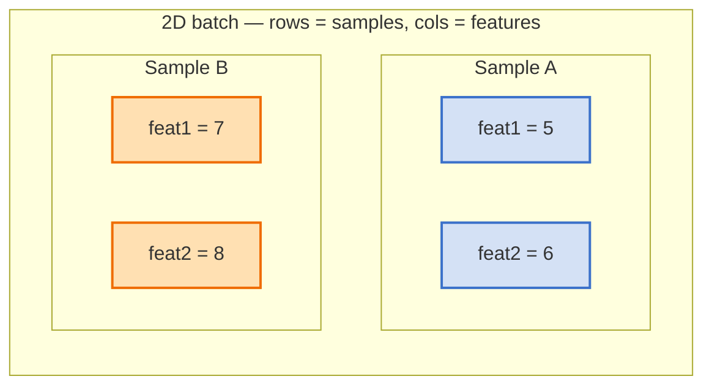
```mermaid
graph TB
    subgraph BATCH2D["2D batch — rows = samples, cols = features"]
        direction TB
        subgraph ROWA["Sample A"]
            direction LR
            b2dA1["feat1 = 5"]
            b2dA2["feat2 = 6"]
        end
        subgraph ROWB["Sample B"]
            direction LR
            b2dB1["feat1 = 7"]
            b2dB2["feat2 = 8"]
        end
    end

    classDef acell fill:#d4e1f5,stroke:#3b71ca,stroke-width:2px
    classDef bcell fill:#ffe0b2,stroke:#ef6c00,stroke-width:2px
    class b2dA1,b2dA2 acell
    class b2dB1,b2dB2 bcell
```

**How to read what follows** (the pattern borrowed from Eli Bendersky's [memory-layout diagrams](https://eli.thegreenplace.net/2015/memory-layout-of-multi-dimensional-arrays/)): the *layout* diagram shows where each 2D cell lands on the 1D ribbon; the separate *walk* diagram numbers the read head. Layout and walk are never mixed in one picture — that mixing was what made the old diagrams hard to read.

#### Case 1 — column-major: the strided walk

Column-major (Fortran-style) stores the **feat1 column first, then the feat2 column** — the row index changes fastest. Watch the colors: blue-orange-blue-orange, the samples interleave:

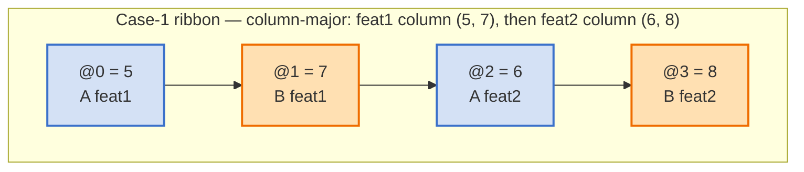
```mermaid
graph LR
    subgraph MR1LAY["Case-1 ribbon — column-major: feat1 column (5, 7), then feat2 column (6, 8)"]
        direction LR
        mr1c0["@0 = 5<br>A feat1"]
        mr1c1["@1 = 7<br>B feat1"]
        mr1c2["@2 = 6<br>A feat2"]
        mr1c3["@3 = 8<br>B feat2"]
    end

    mr1c0 --> mr1c1 --> mr1c2 --> mr1c3

    classDef acell fill:#d4e1f5,stroke:#3b71ca,stroke-width:2px
    classDef bcell fill:#ffe0b2,stroke:#ef6c00,stroke-width:2px
    class mr1c0,mr1c2 acell
    class mr1c1,mr1c3 bcell
```

Assembling sample A means a **stride-2 hop**: read @0, jump over @1, read @2. The walk, numbered:

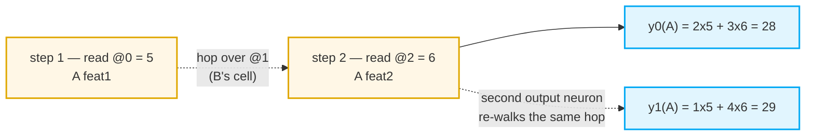
```mermaid
graph LR
    mr1s1["step 1 — read @0 = 5<br>A feat1"] -.->|"hop over @1<br>(B's cell)"| mr1s2["step 2 — read @2 = 6<br>A feat2"]
    mr1s2 --> mr1y0["y0(A) = 2x5 + 3x6 = 28"]
    mr1s2 -.->|"second output neuron<br>re-walks the same hop"| mr1y1["y1(A) = 1x5 + 4x6 = 29"]

    classDef hopcell fill:#fff7e6,stroke:#e0a800,stroke-width:2px
    classDef outcell fill:#e1f5fe,stroke:#03a9f4,stroke-width:2px
    class mr1s1,mr1s2 hopcell
    class mr1y0,mr1y1 outcell
```

**Read trace for sample A:**

*   $y_0 = 2 \cdot 5 + 3 \cdot 6 = 28$ — read W row 0 $(2, 3)$, then hop across cell @1 to gather A's features from cells @0 and @2
*   $y_1 = 1 \cdot 5 + 4 \cdot 6 = 29$ — read W row 1 $(1, 4)$, then re-walk the same hop a second time

Every output neuron re-walks the same strided hop — exactly the strided-access cost Igor Ostrovsky demonstrates in his [Gallery of Processor Cache Effects](https://igoro.com/archive/gallery-of-processor-cache-effects/): you pay for the whole cache line but use only half of it.

#### Case 2 — row-major: the streaming walk

Row-major (C-style) stores **row A first, then row B** — the column index changes fastest. The colors now sit in solid blocks, and because each block is already contiguous, layout and walk collapse into one forward stream:

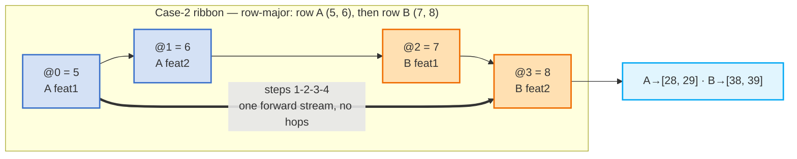
```mermaid
graph LR
    subgraph MR2LAY["Case-2 ribbon — row-major: row A (5, 6), then row B (7, 8)"]
        direction LR
        mr2c0["@0 = 5<br>A feat1"]
        mr2c1["@1 = 6<br>A feat2"]
        mr2c2["@2 = 7<br>B feat1"]
        mr2c3["@3 = 8<br>B feat2"]
    end

    mr2c0 --> mr2c1 --> mr2c2 --> mr2c3
    mr2c0 ==>|"steps 1-2-3-4<br>one forward stream, no hops"| mr2c3
    mr2c3 --> mr2y["A→[28, 29] · B→[38, 39]"]

    classDef acell fill:#d4e1f5,stroke:#3b71ca,stroke-width:2px
    classDef bcell fill:#ffe0b2,stroke:#ef6c00,stroke-width:2px
    classDef outcell fill:#e1f5fe,stroke:#03a9f4,stroke-width:2px
    class mr2c0,mr2c1 acell
    class mr2c2,mr2c3 bcell
    class mr2y outcell
```

**Read trace for the batch** — the read head simply walks forward, cell by cell:

*   Sample A (cells 0, 1): $y = [5 \cdot 2 + 6 \cdot 3,\; 5 \cdot 1 + 6 \cdot 4] = [28, 29]$
*   Sample B (cells 2, 3): $y = [7 \cdot 2 + 8 \cdot 3,\; 7 \cdot 1 + 8 \cdot 4] = [38, 39]$
*   Addresses visited in order: 0 → 1 → 2 → 3 — no hops, no re-reads; the small $W$ tile stays hot in cache across the whole batch.

#### Case 1 vs. Case 2 at a glance

| Feature | Case 1 — Standard ($y = Wx + b$) | Case 2 — Framework ($y = xW^T + b$) |
|---|---|---|
| **Ribbon order** | `[5, 7, 6, 8]` — feat1 column, then feat2 column; colors interleave blue-orange-blue-orange | `[5, 6, 7, 8]` — row A, then row B; colors block blue-blue-orange-orange |
| **Assembling one sample** | Hop with stride 2 (cells 0 → 2); each sample contributes its own disjoint hop pattern | One contiguous block; $B$ samples = one long streaming read |
| **Re-reads** | $x$ re-read once per output neuron, hopping each time | Each cell read exactly once per forward pass |
| **Hardware effect** | Strided access — poor cache locality, awkward for SIMD | Linear streaming — ideal for CPUs, GPUs, and tensor cores |

> **Memory takeaway:** Compare the two ribbons cell by cell — Case 1 interleaves the samples as `(5, 7, 6, 8)` while Case 2 keeps them as `(5, 6, 7, 8)`. That single layout choice is why PyTorch stores $W$ as `(out_features, in_features)` and computes $xW^T$: the batch becomes one forward-marching read head instead of $B$ strided hops. Side-by-side linearization pictures like these are the standard teaching tool — see the [row- vs. column-major illustration](https://en.wikipedia.org/wiki/Row-_and_column-major_order) on Wikipedia.

### 1.7 A 2D picture: slope ($w$) and intercept ($b$)

Strip a linear layer down to its smallest form — **one input feature, one output feature** — and it stops being a matrix at all: it becomes a single straight line. The weight collapses to a scalar $w$ (the **slope**) and the bias to a scalar $b$ (the **intercept**):

$$y = w\,x + b$$

> **Definition — slope ($w$):** the *constant rate of change* of the output with respect to the input, i.e. how much $y$ moves for each **one-unit increase** in $x$. Formally, for any two distinct points $(x_1, y_1)$ and $(x_2, y_2)$ on the line: $w = \dfrac{\Delta y}{\Delta x} = \dfrac{y_2 - y_1}{x_2 - x_1}$ (rise over run). A larger $|w|$ tilts the line more steeply; the sign of $w$ says whether the line rises ($w > 0$) or falls ($w < 0$).

> **Definition — intercept ($b$):** the value of the output when the input is **zero**, i.e. the $y$-value at which the line crosses the vertical axis, the point $(0, b)$. Formally $b = y(0)$ — setting $x = 0$ in $y = wx + b$ leaves $y = b$. Geometrically it is the line's **vertical offset**: changing $b$ translates the whole line up or down without altering its tilt.

| Symbol | Name | Definition | Role in the layer |
|---|---|---|---|
| $w$ | **slope** | $w = \dfrac{\Delta y}{\Delta x}$ — output change per unit input change | the **weight** (sets the tilt) |
| $b$ | **intercept** | $b = y(0)$ — output when the input is zero, at the point $(0, b)$ | the **bias** (vertical shift) |

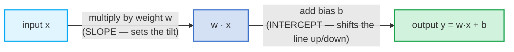
```mermaid
graph LR
    X["input x"] -->|"multiply by weight w<br/>(SLOPE — sets the tilt)"| MUL["w · x"]
    MUL -->|"add bias b<br/>(INTERCEPT — shifts the line up/down)"| Y["output y = w·x + b"]

    classDef slope fill:#d4e1f5,stroke:#3b71ca,stroke-width:2px
    classDef inter fill:#d1f2dd,stroke:#16a34a,stroke-width:2px
    classDef io fill:#e1f5fe,stroke:#03a9f4,stroke-width:2px
    class MUL slope
    class Y inter
    class X io
```

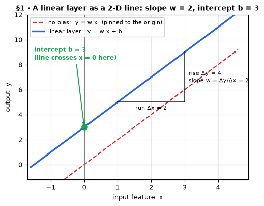

Reading the plot:

| Element | Meaning | Ties back to |
|---|---|---|
| Single blue line `y = w·x + b` | The affine map a linear layer computes | §1.1 — a weighted sum, then a shift |
| Slope triangle, `w = Δy / Δx` | How much the output moves per unit of input | The one weight row of $W$ (the tilt) |
| Green point at `(0, b)` | The output when the input feature is exactly zero | The bias $b$ |

The **slope** $w$ sets the tilt of the line (the weight's job) and the **intercept** $b$ slides the whole line up or down (the bias's job). Drop the bias and the line is forced through the origin — which is exactly why $b \neq 0$ matters. This is the 1-D shadow of the general rule from §2: the geometric work splits into a rotation/stretch ($xW^T$) plus a translation ($+b$).

---

## 2. THE MATHEMATICAL FORMULA

### Foundational Equation

In modern deep learning frameworks like [PyTorch](https://pytorch.org/), the forward pass of a linear layer is mathematically defined as:

$$y = xW^T + b$$

The transposed form keeps the stored weight matrix $W$ untouched and only re-orients the multiply so a whole batch fits one GEMM call; the classic column-vector form ($y = Wx + b$) from Section 1 is the same map written one sample at a time.

### Proof of Equivalence

We can formally prove that both systems yield isomorphic results using the transpose distribution identity **$(AB)^T = B^T A^T$**.

**Step 1 — Start with the classic textbook equation for an individual sample:**

$$y_{\text{classic}} = Wx$$

**Step 2 — Take the transpose of both sides to convert it into a row-vector space:**

$$(y_{\text{classic}})^T = (Wx)^T$$

**Step 3 — Apply the transpose property:**

$$y^T = x^T W^T$$

**Step 4 — Read $y^T = x^T W^T$ in framework conventions:** a framework row vector *is* the transposed column vector ($x^T$), so writing $y$ for $y^T$ and restoring the bias gives:

$$y = xW^T + b$$

### Structural & Computational Mapping

The same forward pass as a shape pipeline — watch the inner dimensions meet and the bias broadcast across the batch:

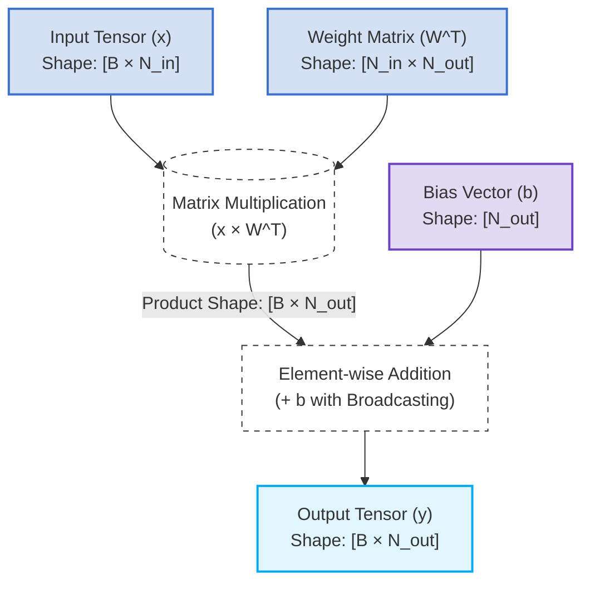
```mermaid
graph TD
    %% Input Tensors
    X["Input Tensor (x)<br>Shape: [B × N_in]"]
    W["Weight Matrix (W^T)<br>Shape: [N_in × N_out]"]
    B["Bias Vector (b)<br>Shape: [N_out]"]

    %% Operations
    MMUL[("Matrix Multiplication<br>(x × W^T)")]
    ADD["Element-wise Addition<br>(+ b with Broadcasting)"]

    %% Output
    Y["Output Tensor (y)<br>Shape: [B × N_out]"]

    %% Graph Connections
    X --> MMUL
    W --> MMUL
    MMUL --> |"Product Shape: [B × N_out]"| ADD
    B --> ADD
    ADD --> Y

    %% Style Classes
    style X fill:#d4e1f5,stroke:#3b71ca,stroke-width:2px
    style W fill:#d4e1f5,stroke:#3b71ca,stroke-width:2px
    style B fill:#e2d9f3,stroke:#6f42c1,stroke-width:2px
    style Y fill:#e1f5fe,stroke:#03a9f4,stroke-width:2px
    style MMUL fill:#fff,stroke:#333,stroke-dasharray: 5 5
    style ADD fill:#fff,stroke:#333,stroke-dasharray: 5 5
```

### Variable & Symbol Definitions

*   **$x$**: The incoming feature or input tensor. Its shape is $(B \times N_{in})$, where $B$ represents the batch size (number of parallel samples processed simultaneously) and $N_{in}$ represents the number of input dimensions or features.
*   **$W$**: The learnable weight matrix of shape $(N_{out} \times N_{in})$. Each element in this matrix represents the connection strength between an input feature and a target output feature.
*   **$W^T$**: The transposed weight matrix of shape $(N_{in} \times N_{out})$, realigned to perfectly match the column dimensions of the input tensor $x$.
*   **$b$**: The learnable bias vector of shape $(N_{out})$. This acts as a translation offset. During calculation, it uses **broadcasting** to automatically duplicate its values across the entire batch dimension $B$.
*   **$y$**: The final output tensor of shape $(B \times N_{out})$. It contains the newly synthesized features mapped into the target spatial dimension ($N_{out}$).

### Logical Intuition

The formula splits geometric space manipulation into two clean, distinct parts:

1. **Linear Scaling & Rotation ($xW^T$):** The matrix multiplication combines, rotates, scales, or squashes the input coordinates. This step acts like an audio mixing console, where every input is weighted and blended together. Crucially, without a bias, this operation is locked to the origin: if the input $x$ is entirely zeros, the product $xW^T$ is unconditionally zero.
2. **Translation ($+b$):** Adding the bias vector shifts the entire geometric plane away from the origin point. This gives the neural network the flexibility to shift its baseline predictions up or down, allowing it to output meaningful values even when the incoming feature indicators are dead silent.

The same two steps as a pipeline diagram:


```mermaid
graph LR
    X["input  x<br/>(shape at the origin)"] --> S1["① Scale<br/>stretch / squash per axis"]
    S1 --> S2["① Rotate<br/>tilt the whole shape"]
    S2 --> LOCK["still locked to the origin<br/>x = 0 ⇒ xWᵀ = 0"]
    LOCK --> T1["② Translate<br/>add the bias vector b"]
    T1 --> Y["output  y = xWᵀ + b<br/>slid off the origin"]

    classDef lin  fill:#fee2e2,stroke:#dc2626,stroke-width:2px,color:#7f1d1d
    classDef lock fill:#fef3c7,stroke:#f59e0b,stroke-width:1px,color:#78350f
    classDef tra  fill:#dcfce7,stroke:#16a34a,stroke-width:2px,color:#14532d
    classDef io   fill:#dbeafe,stroke:#2563eb,stroke-width:2px,color:#1e3a8a
    class S1,S2 lin
    class LOCK lock
    class T1 tra
    class X,Y io
```

And the same two steps drawn in 2-D coordinates:

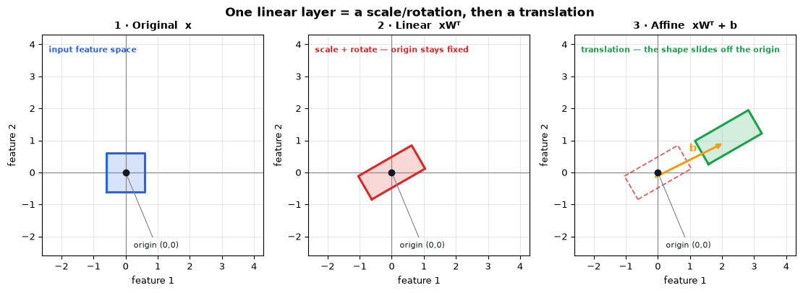

Reading the three panels:

| Panel | Operation | What the plot shows |
|---|---|---|
| 1 · Original $x$ | input | The square sits in feature space; the origin `(0,0)` is marked |
| 2 · Linear $xW^T$ | scale + rotate | The square is squashed (scaled per-axis) and tilted (rotated), but the origin **stays fixed** — a zero input would map to a zero output |
| 3 · Affine $xW^T + b$ | $+$ translation | The dashed red shadow is the pre-bias shape; the orange arrow is $b$, sliding the whole shape **off the origin** |

The key contrast is panel 2 vs. panel 3: the linear map can only scale, rotate, or squash while pinned to the origin, so without the bias the network's output is forced through zero. The bias $b$ supplies the missing **translation**, decoupling the output baseline from the input magnitude.

---

## 3. CAUSATION & BEHAVIOR

### Why the Row-Vector Perspective? (The Batch Processing Factor)

In deep learning, data is rarely processed one sample at a time. Instead, multiple samples are packed into a **batch** to leverage the massive parallel compute capabilities of graphics cards (GPUs). One batched multiply replaces $B$ separate matrix-vector products — exactly the workload BLAS GEMM kernels and their batched variants are tuned for.

### Memory Layout (Row-Major Storage)

C, C++, and Python (NumPy, PyTorch) store multidimensional arrays row-major by default: a row's elements sit next to each other, so element $(i, j)$ of a $B$-by-$N$ matrix lives at offset $i·N + j$. (Fortran and MATLAB do the opposite — column-major.)

*   In a dataset batch $X$, each row represents an independent sample (e.g., an individual image or token embedding).
*   Each column represents a distinct feature dimension — and because rows are contiguous, sample $A$ occupies offsets $0·2+0 = 0$ through $0·2+1 = 1$: one unbroken run.

By structuring the forward pass equation as $Y = XW^T + B$, the framework can pass the batched input matrix $X$ directly into compute kernels without wasting valuable clock cycles transposing the incoming data stream.

The batched dimensional check for every forward pass is:

$$(B \times N_{in}) \times (N_{in} \times N_{out}) = (B \times N_{out})$$

---

## 4. MERMAID PLOT DIAGRAM

The same row-major batch as a sample/feature grid — each row is one independent sample, each column one feature dimension, stored row after row:

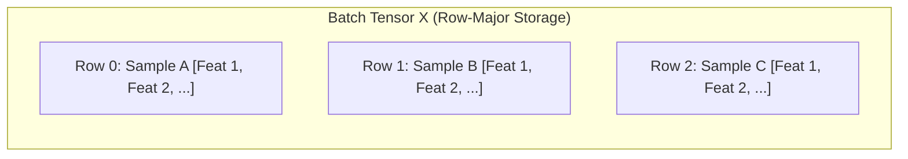
```mermaid
graph LR
    subgraph X ["Batch Tensor X (Row-Major Storage)"]
        direction TB
        Row1["Row 0: Sample A [Feat 1, Feat 2, ...]"]
        Row2["Row 1: Sample B [Feat 1, Feat 2, ...]"]
        Row3["Row 2: Sample C [Feat 1, Feat 2, ...]"]
    end
```

**Reading the diagram**

| Element | Meaning |
|---|---|
| `Row 0`, `Row 1`, `Row 2` | Independent samples stored contiguously in memory, one full row each |
| Columns (`Feat 1`, `Feat 2`, ...) | The distinct feature dimensions shared across every sample |
| Subgraph `X` | The full batched tensor of shape $(B \times N_{in})$ fed directly into $Y = XW^T + B$ |

---

## 5. AI EXAMPLE WITH STEP-BY-STEP CALCULATION

### Numerical Verification

Let us calculate a practical example using a layer configured with **2 input features** and **2 output features**. For clarity, the bias term is omitted ($b = 0$).

*   **Weight Tensor Structure ($W$):** 2 output features $\times$ 2 input features
*   **Input Elements ($x$):** Feature dimensions containing values $5$ and $6$.

$$W = \begin{bmatrix} 2 & 3 \\ 1 & 4 \end{bmatrix}$$

#### Textbook Execution ($y = Wx$)

$$x = \begin{bmatrix} 5 \\ 6 \end{bmatrix}$$

$$y = Wx = \begin{bmatrix} 2 & 3 \\ 1 & 4 \end{bmatrix} \begin{bmatrix} 5 \\ 6 \end{bmatrix} = \begin{bmatrix} (2 \cdot 5) + (3 \cdot 6) \\ (1 \cdot 5) + (4 \cdot 6) \end{bmatrix} = \begin{bmatrix} \mathbf{28} \\ \mathbf{29} \end{bmatrix}$$

#### Framework Execution ($y = xW^T$)

$$x = \begin{bmatrix} 5 & 6 \end{bmatrix}, \quad W^T = \begin{bmatrix} 2 & 1 \\ 3 & 4 \end{bmatrix}$$

$$y = xW^T = \begin{bmatrix} 5 & 6 \end{bmatrix} \begin{bmatrix} 2 & 1 \\ 3 & 4 \end{bmatrix} = \begin{bmatrix} (5 \cdot 2) + (6 \cdot 3) & (5 \cdot 1) + (6 \cdot 4) \end{bmatrix} = \begin{bmatrix} \mathbf{28} & \mathbf{29} \end{bmatrix}$$

Both execution paths evaluate to identical output maps (**28** and **29**).

### Concrete PyTorch Implementation

Per the [torch.nn.Linear docs](https://pytorch.org/docs/2.14/generated/torch.nn.Linear.html), the layer applies $y = xA^T + b$: `weight` has shape `(out_features, in_features)`, `bias` has shape `(out_features,)`, and both are initialized from the uniform distribution $U(-\sqrt{k}, \sqrt{k})$ with $k$ = 1 / in_features.

The script below pins the Section-5 weights into a custom layer and checks all three spellings (textbook math, module forward, `F.linear`) headlessly:

```python
import torch
import torch.nn as nn

class CustomLinear(nn.Module):
    def __init__(self, in_features, out_features):
        super().__init__()
        # Standard PyTorch structural weight initialization: (out_features, in_features)
        self.weight = nn.Parameter(torch.randn(out_features, in_features))
        self.bias = nn.Parameter(torch.zeros(out_features))

    def forward(self, x):
        # Implementation of the hardware-optimized framework formula: y = xW^T + b
        return torch.nn.functional.linear(x, self.weight, self.bias)

# Execution verification block
if __name__ == "__main__":
    torch.manual_seed(0)

    # Same two samples as Sections 1 and 5: A = [5, 6], B = [7, 8]
    batch_input = torch.tensor([[5.0, 6.0], [7.0, 8.0]])

    layer = CustomLinear(in_features=2, out_features=2)
    with torch.no_grad():
        layer.weight.copy_(torch.tensor([[2.0, 3.0], [1.0, 4.0]]))
        layer.bias.copy_(torch.tensor([1.0, -1.0]))

    output = layer(batch_input)
    expected = torch.tensor([[29.0, 28.0], [39.0, 38.0]])
    assert torch.allclose(output, expected), output

    print("----- PyTorch Verification -----")
    print("Input Tensor Shape: ", tuple(batch_input.shape))   # (2, 2): (batch, in_features)
    print("Weight Tensor Shape:", tuple(layer.weight.shape))  # (2, 2): (out_features, in_features)
    print("Output Tensor Shape:", tuple(output.shape))        # (2, 2): (batch, out_features)
    print("Output Values:", output.tolist())                  # [[29, 28], [39, 38]]
    print("F.linear match:", torch.allclose(torch.nn.functional.linear(batch_input, layer.weight, layer.bias), expected))
```
