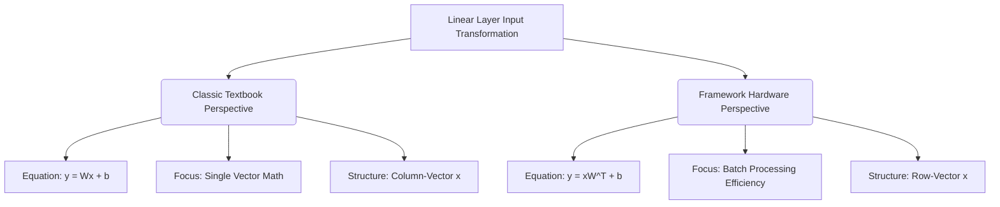
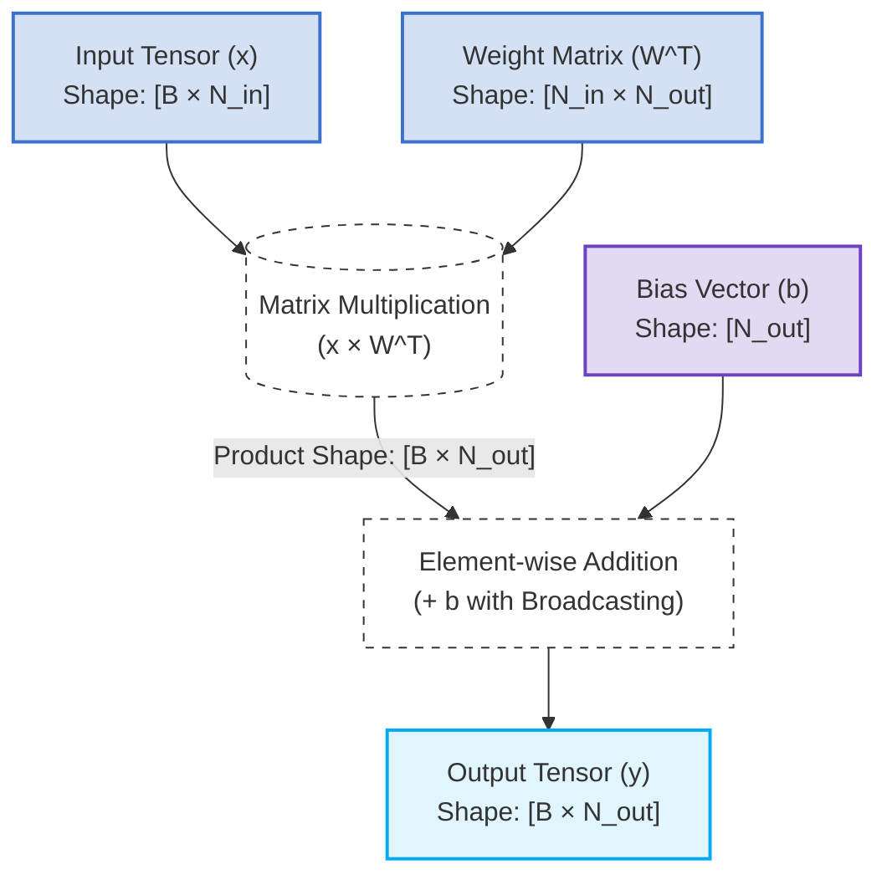
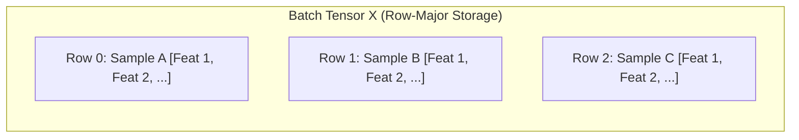

# Deep Dive: The Linear Layer — Formula & Matrix Orientations

This document isolates and breaks down the core mathematical equation governing a **Linear Layer** (also known as a Fully Connected or Dense Layer) within modern Deep Learning architectures, bridging the gap between academic linear algebra notation and the hardware-optimized implementations found in production frameworks like [PyTorch](https://pytorch.org/) and TensorFlow.

---

## 1. THE CORE THEORY

When working with linear layers you will encounter two primary mathematical notations depending on the context. Both perform the exact same underlying transformation, but their geometric perspectives differ:


```mermaid
graph TD
    A[Linear Layer Input Transformation] --> B(Classic Textbook Perspective)
    A --> C(Framework Hardware Perspective)

    B --> B1["Equation: y = Wx + b"]
    B --> B2["Focus: Single Vector Math"]
    B --> B3["Structure: Column-Vector x"]

    C --> C1["Equation: y = xW^T + b"]
    C --> C2["Focus: Batch Processing Efficiency"]
    C --> C3["Structure: Row-Vector x"]
```

### Textbook Notation (Column-Vector Perspective)

In standard mathematical literature, a data point is traditionally represented as a vertical **column vector** ($x$). The weight matrix ($W$) acts on the vector from the left:

$$y = Wx + b$$

### Framework Notation (Row-Vector Perspective)

In deep learning frameworks, data points are organized as horizontal **row vectors** ($x$) to allow batch stacking. The input multiplies the transposed weight matrix ($W^T$) from the left:

$$y = xW^T + b$$

### Structural Comparison

| Feature | Standard Notation ($y = Wx + b$) | Framework Notation ($y = xW^T + b$) |
|---|---|---|
| **Data Perspective** | Column vector ($x$ is a vertical column) | Row vector ($x$ is a horizontal row) |
| **Operation Sequence** | Matrix multiplies the vector from the left ($W \cdot x$) | Vector multiplies the matrix from the left ($x \cdot W^T$) |
| **Weight Tensor Dimensions** | `(out_features, in_features)` | `(out_features, in_features)` *prior to transpose* |
| **Primary Use Case** | Academic theory, math proofs, hand derivations | Production frameworks (PyTorch, TensorFlow, JAX) |

### Memory Ribbon Example

Physical RAM is not a 2D grid — it is a flat, addressable **ribbon** of contiguous cells. The "column vs. row" distinction is therefore an *interpretation layer* placed on top of the same serial ribbon of bytes. The two cases below walk the **same workload** — the Section-5 layer with weights $(2, 3)$ / $(1, 4)$ applied to two samples, $A = [5, 6]$ and $B = [7, 8]$ — and show how differently each notation traverses memory.

#### Case 1 — Standard Notation ($y = Wx + b$): column vectors, column-major storage

Each sample is a vertical column vector. Stacked as a batch in column-major (Fortran-style) order, all of feature 1 comes first, then all of feature 2 — so one sample's features land on **non-adjacent** cells:

```
Memory Address:   0     1     2     3     4     5     6     7
              ┌──────┬──────┬──────┬──────┬──────┬──────┬──────┬──────┐
Memory Ribbon │  2   │  3   │  1   │  4   │  5   │  7   │  6   │  8   │
              └──────┴──────┴──────┴──────┴──────┴──────┴──────┴──────┘
                 └── W row 0 ──┘└── W row 1 ──┘└─ feat 1: A,B ─┘└─ feat 2: A,B ─┘
```

**Read trace for sample A** (features live on cells 4 and 6 — a stride-2 hop):

*   $y_0 = 2 \cdot 5 + 3 \cdot 6 = 28$ — read W cells (0, 1), then hop across cell 5 to reach x cells (4, 6)
*   $y_1 = 1 \cdot 5 + 4 \cdot 6 = 29$ — read W cells (2, 3), then re-read x cells (4, 6) a second time

Every output neuron re-walks the same strided hop, and sample B (cells 5, 7) is interleaved between A's features rather than sitting in its own block.

#### Case 2 — Framework Notation ($y = xW^T + b$): row vectors, row-major storage

Each sample is a horizontal row vector. Stacked as a batch in row-major (C-style) order, every sample occupies one **contiguous** block:

```
Memory Address:   0     1     2     3     4     5     6     7
              ┌──────┬──────┬──────┬──────┬──────┬──────┬──────┬──────┐
Memory Ribbon │  2   │  3   │  1   │  4   │  5   │  6   │  7   │  8   │
              └──────┴──────┴──────┴──────┴──────┴──────┴──────┴──────┘
                 └── W row 0 ──┘└── W row 1 ──┘└── sample A ───┘└── sample B ───┘
```

**Read trace for the batch** — the read head simply walks forward, cell by cell:

*   Sample A (cells 4, 5): $y = [5 \cdot 2 + 6 \cdot 3,\; 5 \cdot 1 + 6 \cdot 4] = [28, 29]$
*   Sample B (cells 6, 7): $y = [7 \cdot 2 + 8 \cdot 3,\; 7 \cdot 1 + 8 \cdot 4] = [38, 39]$
*   Addresses visited in order: 4 → 5 → 6 → 7 — no hops, no re-reads; the small $W$ tile (cells 0–3) stays hot in cache across the whole batch.

#### Case 1 vs. Case 2 at a glance

| Feature | Case 1 — Standard ($y = Wx + b$) | Case 2 — Framework ($y = xW^T + b$) |
|---|---|---|
| **Ribbon order** | `[2, 3, 1, 4, 5, 7, 6, 8]` — features interleaved across samples | `[2, 3, 1, 4, 5, 6, 7, 8]` — samples stacked end-to-end |
| **Assembling one sample** | Hop with stride 2 (cells 4 → 6); $B$ samples = $B$ disjoint hop patterns | One contiguous block; $B$ samples = one long streaming read |
| **Re-reads** | $x$ re-read once per output neuron, hopping each time | Each cell read exactly once per forward pass |
| **Hardware effect** | Strided access — poor cache locality, awkward for SIMD | Linear streaming — ideal for CPUs, GPUs, and tensor cores |

> **Memory takeaway:** Compare the two ribbons cell by cell — Case 1 interleaves the samples as `(5, 7, 6, 8)` while Case 2 keeps them as `(5, 6, 7, 8)`. That single layout choice is why PyTorch stores $W$ as `(out_features, in_features)` and computes $xW^T$: the batch becomes one forward-marching read head instead of $B$ strided hops.

---

## 2. THE MATHEMATICAL FORMULA

### Foundational Equation

In modern deep learning frameworks like [PyTorch](https://pytorch.org/), the forward pass of a linear layer is mathematically defined as:

$$y = xW^T + b$$

The transposed form ($xW^T$) is optimized for batch processing in computing hardware; the classic column-vector form ($y = Wx + b$) is treated as the alternative notation throughout Section 1.

### Proof of Equivalence

We can formally prove that both systems yield isomorphic results using the transpose distribution identity **$(AB)^T = B^T A^T$**.

**Step 1 — Start with the classic textbook equation for an individual sample:**

$$y_{\text{classic}} = Wx$$

**Step 2 — Take the transpose of both sides to convert it into a row-vector space:**

$$(y_{\text{classic}})^T = (Wx)^T$$

**Step 3 — Apply the transpose property:**

$$y^T = x^T W^T$$

**Step 4 — Interpret the result in framework conventions:** deep learning frameworks inherently treat the input tensor $x$ as a row vector by default (so the explicit transpose notation on $x$ is dropped), and the bias term is restored:

$$y = xW^T + b$$

### Structural & Computational Mapping

Below is the computational routing and shape conversion map for a standard forward pass through a linear layer:


```mermaid
graph TD
    %% Input Tensors
    X["Input Tensor (x)<br>Shape: [B × N_in]"]
    W["Weight Matrix (W^T)<br>Shape: [N_in × N_out]"]
    B["Bias Vector (b)<br>Shape: [N_out]"]

    %% Operations
    MMUL[("Matrix Multiplication<br>(x × W^T)")]
    ADD["Element-wise Addition<br>(+ b with Broadcasting)"]

    %% Output
    Y["Output Tensor (y)<br>Shape: [B × N_out]"]

    %% Graph Connections
    X --> MMUL
    W --> MMUL
    MMUL --> |"Product Shape: [B × N_out]"| ADD
    B --> ADD
    ADD --> Y

    %% Style Classes
    style X fill:#d4e1f5,stroke:#3b71ca,stroke-width:2px
    style W fill:#d4e1f5,stroke:#3b71ca,stroke-width:2px
    style B fill:#e2d9f3,stroke:#6f42c1,stroke-width:2px
    style Y fill:#e1f5fe,stroke:#03a9f4,stroke-width:2px
    style MMUL fill:#fff,stroke:#333,stroke-dasharray: 5 5
    style ADD fill:#fff,stroke:#333,stroke-dasharray: 5 5
```

### Variable & Symbol Definitions

*   **$x$**: The incoming feature or input tensor. Its shape is $(B \times N_{in})$, where $B$ represents the batch size (number of parallel samples processed simultaneously) and $N_{in}$ represents the number of input dimensions or features.
*   **$W$**: The learnable weight matrix of shape $(N_{out} \times N_{in})$. Each element in this matrix represents the connection strength between an input feature and a target output feature.
*   **$W^T$**: The transposed weight matrix of shape $(N_{in} \times N_{out})$, realigned to perfectly match the column dimensions of the input tensor $x$.
*   **$b$**: The learnable bias vector of shape $(N_{out})$. This acts as a translation offset. During calculation, it uses **broadcasting** to automatically duplicate its values across the entire batch dimension $B$.
*   **$y$**: The final output tensor of shape $(B \times N_{out})$. It contains the newly synthesized features mapped into the target spatial dimension ($N_{out}$).

### Logical Intuition

The formula splits geometric space manipulation into two clean, distinct parts:

1. **Linear Scaling & Rotation ($xW^T$):** The matrix multiplication combines, rotates, scales, or squashes the input coordinates. This step acts like an audio mixing console, where every input is weighted and blended together. Crucially, without a bias, this operation is locked to the origin: if the input $x$ is entirely zeros, the product $xW^T$ is unconditionally zero.
2. **Translation ($+b$):** Adding the bias vector shifts the entire geometric plane away from the origin point. This gives the neural network the flexibility to shift its baseline predictions up or down, allowing it to output meaningful values even when the incoming feature indicators are dead silent.

---

## 3. CAUSATION & BEHAVIOR

### Why the Row-Vector Perspective? (The Batch Processing Factor)

In deep learning, data is rarely processed one sample at a time. Instead, multiple samples are packed into a **batch** to leverage the massive parallel compute capabilities of graphics cards (GPUs).

### Memory Layout (Row-Major Storage)

Modern computer architectures store multi-dimensional arrays in continuous blocks of physical memory sequentially along rows.

*   In a dataset batch $X$, each row represents an independent sample (e.g., an individual image or token embedding).
*   Each column represents a distinct feature dimension.

By structuring the forward pass equation as $Y = XW^T + B$, the framework can pass the batched input matrix $X$ directly into compute kernels without wasting valuable clock cycles transposing the incoming data stream.

The batched dimensional check for every forward pass is:

$$(B \times N_{in}) \times (N_{in} \times N_{out}) = (B \times N_{out})$$

---

## 4. MERMAID PLOT DIAGRAM

The row-major memory layout of a batched input tensor $X$ — each row is one independent sample, each column one distinct feature dimension:


```mermaid
graph LR
    subgraph X ["Batch Tensor X (Row-Major Storage)"]
        direction TB
        Row1["Row 0: Sample A [Feat 1, Feat 2, ...]"]
        Row2["Row 1: Sample B [Feat 1, Feat 2, ...]"]
        Row3["Row 2: Sample C [Feat 1, Feat 2, ...]"]
    end
```

**Reading the diagram**

| Element | Meaning |
|---|---|
| `Row 0`, `Row 1`, `Row 2` | Independent samples stored contiguously in memory, one full row each |
| Columns (`Feat 1`, `Feat 2`, ...) | The distinct feature dimensions shared across every sample |
| Subgraph `X` | The full batched tensor of shape $(B \times N_{in})$ fed directly into $Y = XW^T + B$ |

---

## 5. AI EXAMPLE WITH STEP-BY-STEP CALCULATION

### Numerical Verification

Let us calculate a practical example using a layer configured with **2 input features** and **2 output features**. For clarity, the bias term is omitted ($b = 0$).

*   **Weight Tensor Structure ($W$):** 2 output features $\times$ 2 input features
*   **Input Elements ($x$):** Feature dimensions containing values $5$ and $6$.

$$W = \begin{bmatrix} 2 & 3 \\ 1 & 4 \end{bmatrix}$$

#### Textbook Execution ($y = Wx$)

$$x = \begin{bmatrix} 5 \\ 6 \end{bmatrix}$$

$$y = Wx = \begin{bmatrix} 2 & 3 \\ 1 & 4 \end{bmatrix} \begin{bmatrix} 5 \\ 6 \end{bmatrix} = \begin{bmatrix} (2 \cdot 5) + (3 \cdot 6) \\ (1 \cdot 5) + (4 \cdot 6) \end{bmatrix} = \begin{bmatrix} \mathbf{28} \\ \mathbf{29} \end{bmatrix}$$

#### Framework Execution ($y = xW^T$)

$$x = \begin{bmatrix} 5 & 6 \end{bmatrix}, \quad W^T = \begin{bmatrix} 2 & 1 \\ 3 & 4 \end{bmatrix}$$

$$y = xW^T = \begin{bmatrix} 5 & 6 \end{bmatrix} \begin{bmatrix} 2 & 1 \\ 3 & 4 \end{bmatrix} = \begin{bmatrix} (5 \cdot 2) + (6 \cdot 3) & (5 \cdot 1) + (6 \cdot 4) \end{bmatrix} = \begin{bmatrix} \mathbf{28} & \mathbf{29} \end{bmatrix}$$

Both execution paths evaluate to identical output maps (**28** and **29**).

### Concrete PyTorch Implementation

Under the hood, PyTorch's `nn.Linear` instantiates weights matching the shape layout `(out_features, in_features)` but applies the transposed matrix operation during the computational graph execution.

Below is a complete script demonstrating this behavior inside a custom, modular network layer:

```python
import torch
import torch.nn as nn

class CustomLinear(nn.Module):
    def __init__(self, in_features, out_features):
        super().__init__()
        # Standard PyTorch structural weight initialization: (out_features, in_features)
        self.weight = nn.Parameter(torch.randn(out_features, in_features))
        self.bias = nn.Parameter(torch.zeros(out_features))

    def forward(self, x):
        # Implementation of the hardware-optimized framework formula: y = xW^T + b
        return torch.matmul(x, self.weight.t()) + self.bias

# Execution verification block
if __name__ == "__main__":
    # Create a batch of 3 independent samples, each containing 2 features
    batch_input = torch.randn(3, 2)

    # Initialize our custom structural layer
    layer = CustomLinear(in_features=2, out_features=2)

    # Calculate forward execution pass
    output = layer(batch_input)

    print("----- PyTorch Verification -----")
    print("Input Tensor Shape: ", batch_input.shape)   # Dimensions: (3, 2)
    print("Weight Tensor Shape:", layer.weight.shape)  # Dimensions: (2, 2)
    print("Output Tensor Shape:", output.shape)        # Dimensions: (3, 2)
```
