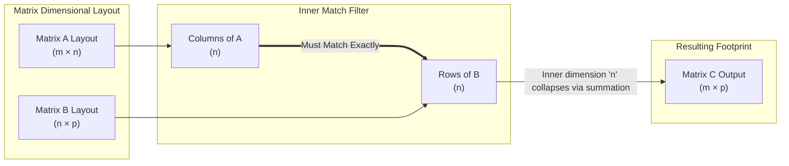

# Deep Dive: Matrix Multiplication in AI and Deep Learning

This document covers the core theory, formulas, behaviors, visual structures, and step-by-step calculations of matrix multiplication as applied to Artificial Intelligence, Machine Learning, and Deep Learning.

---

## 1. THE CORE THEORY

*   **Real-World Analogy:** Think of matrix multiplication as a **highly efficient, automated blending machine at a juice bar**. Imagine you have a menu of recipes (**Matrix A**) listing the ounces of apples, bananas, and carrots needed for different drinks. You also have a list of orders (**Matrix B**) showing how many of each drink different customers want. Instead of calculating the total ingredient list for each customer one by one, you load both spreadsheets into the machine. Matrix multiplication blends them together instantly, outputting exactly how much of each raw ingredient is needed per customer (**Matrix C**).
*   **Technical Definition:** **Matrix multiplication** (the dot product of matrices) is a structural geometric operation that combines two grids of numbers to produce a third grid. Rather than operating element-by-element, it computes the **dot product of each row from the first matrix with each column of the second matrix**. For this operation to be valid, the inner dimensions must match: the column count of the first matrix must exactly equal the row count of the second matrix.
*   **Why It Is Necessary for AI:** Matrix multiplication is the **undisputed computation engine of modern Artificial Intelligence**. Deep Neural Networks are fundamentally billions of linear combinations stacked together. Passing data through a layer (forward propagation), computing errors (loss calculation), and adjusting weights (backpropagation) are all massive matrix multiplications executed rapidly on specialized hardware like GPUs or TPUs. Without it, modern Large Language Models (LLMs) and computer vision systems would be computationally impossible to train or execute.

---

## 2. THE MATHEMATICAL FORMULA

### Foundational Equations
The mathematical representation of matrix multiplication for element $c_{ij}$ in the output matrix $\mathbf{C} = \mathbf{A} \mathbf{B}$ is:

$$c_{ij} = \sum_{k=1}^{n} a_{ik} b_{kj}$$

The global dimensional transformation properties follow the rule:

$$\mathbf{A}_{(m \times n)} \cdot \mathbf{B}_{(n \times p)} = \mathbf{C}_{(m \times p)}$$

### Mermaid Structural Flow Diagram
The structural dimension-matching pipeline and the reduction of the inner alignment space can be modeled as follows:



### Variable & Symbol Definitions
*   **$\mathbf{A}$**: The left input matrix (representing input data features, activation states, or token embeddings).
*   **$\mathbf{B}$**: The right input matrix (representing the learnable weight parameters of a neural network layer).
*   **$\mathbf{C}$**: The resulting output matrix (representing transformed hidden states or raw prediction logits).
*   **$c_{ij}$**: The individual scalar element located at row $i$ and column $j$ in the output matrix $\mathbf{C}$.
*   **$m$**: The outer-left dimension, representing the **Batch Size** of data samples processed concurrently.
*   **$n$**: The shared inner dimension, representing the number of input features or input channels.
*   **$p$**: The outer-right dimension, representing the number of **Hidden Units / Neurons** configured in the layer.
*   **$\sum_{k=1}^{n}$**: The summation operator, dictating that paired components are multiplied from index $1$ to $n$ and then aggregated.

### Logical Intuition of Structure
The formula is structured to execute a geometric **basis transformation**. Every row in matrix $\mathbf{A}$ is a data vector residing within an $n$-dimensional feature space. Every column in matrix $\mathbf{B}$ represents a vector defining a new coordinate direction (a neuron's specific geometric preference filter). By taking the dot product of a row from $\mathbf{A}$ and a column from $\mathbf{B}$, the formula calculates the projection or similarity score of that data point onto that neuron. The summation aggregates these individual coordinate components into a single value, filling out the new matrix representation $\mathbf{C}$.

---

## 3. CAUSATION & BEHAVIOR

*   **If Input A (Matrix Values) Increases:** The output values in matrix $\mathbf{C}$ will scale proportionally based on the weights in $\mathbf{B}$. In a neural network, stronger input features lead to larger activations, pushing the neurons closer to their activation thresholds.
*   **If Input B (Weights) Approaches Zero:** As elements in the weight matrix $\mathbf{B}$ approach zero, the corresponding output elements in $\mathbf{C}$ drop to zero. In AI, this is the foundation of **sparsity and pruning**, where uninformative connections are zeroed out to make models smaller and faster without losing accuracy.
*   **Edge Cases, Constraints, and Limitations:**
    *   **Strict Order Dependency (Non-Commutativity):** Unlike scalar numbers where $5 \times 3 = 3 \times 5$, matrix multiplication is highly sensitive to order: $\mathbf{A}\mathbf{B} \neq \mathbf{B}\mathbf{A}$. Swapping the order usually breaks the dimensional rule completely or alters the output entirely.
    *   **The Dimensional Bottleneck:** If the shared inner dimension $n$ is exceptionally small (e.g., compressing 100 features down to 2 in a hidden layer), you create a permanent information bottleneck. Information discarded during the summation step cannot be recovered by subsequent layers.

---

## 4. TEXT-BASED INTERACTIVE PLOT DIAGRAM

The following text-based layout visualizes the horizontal-to-vertical sweeping action that builds the output array elements:

```text
    MATRIX A (Data Batch)              MATRIX B (Weights)               MATRIX C (Outputs)
       Shape: (2 x 3)                    Shape: (3 x 2)                   Shape: (2 x 2)
       
     Col 1  Col 2  Col 3               Col 1  Col 2                    Col 1  Col 2
    ┌───────────────────┐             ┌───────────────┐               ┌───────────────┐
Row1│ a11    a12    a13 │  ═══════►   │ b11     b12   │       ====►   │  c11     c12  │ Row1
Row2│ a21    a22    a23 │   (Dot      │ b21     b22   │      (Result) │  c21     c22  │ Row2
    └───────────────────┘  Product)   │ b31     b32   │               └───────────────┘
                                      └───────────────┘
                                        ▲       ▲
                                        │       │
                                      Col 1   Col 2
```

### Dynamic Visualization Cues (e.g., Matplotlib / Seaborn)
If you were to plot this dynamically in Python using heatmaps via `plt.imshow()`:
1.  **Highlighter Sweep:** Picture a horizontal cursor scanning down Matrix $\mathbf{A}$ row by row, while a vertical cursor simultaneously scans Matrix $\mathbf{B}$ column by column.
2.  **Intersection Points:** Every time the two cursors complete a paired scan, they compute a single dot product value. This value lights up as a single colored pixel in the output grid of Matrix $\mathbf{C}$.
3.  **Shape Tracking:** Notice how the vertical height of Matrix $\mathbf{C}$ matches Matrix $\mathbf{A}$, while its horizontal width matches Matrix $\mathbf{B}$.

---

## 5. AI EXAMPLE WITH STEP-BY-STEP CALCULATION

### Use Case
Forward pass of data through a fully connected Neural Network layer without biases. We will pass a mini-batch of **2 data samples** (e.g., two user profiles) through a network layer containing **2 hidden neurons**. Each profile consists of **3 raw features**.

### Toy Dataset Setup
*   **Matrix $\mathbf{A}$ (Inputs):** 2 samples $\times$ 3 features
    $$\mathbf{A} = \begin{pmatrix} 2 & 0 & 1 \\ 1 & 3 & 2 \end{pmatrix}$$
*   **Matrix $\mathbf{B}$ (Weights):** 3 features $\times$ 2 neurons
    $$\mathbf{B} = \begin{pmatrix} 1 & 2 \\ 3 & 0 \\ -1 & 4 \end{pmatrix}$$

### Step-by-Step Arithmetic Calculations
The resulting matrix $\mathbf{C}$ will have a shape of $(2 \times 2)$. We calculate each component systematically:

#### 1. Calculate $c_{11}$ (Row 1 of $\mathbf{A}$ $\cdot$ Column 1 of $\mathbf{B}$)
$$c_{11} = (a_{11} \times b_{11}) + (a_{12} \times b_{21}) + (a_{13} \times b_{31})$$
$$c_{11} = (2 \times 1) + (0 \times 3) + (1 \times -1)$$
$$c_{11} = 2 + 0 - 1 = \mathbf{1}$$

#### 2. Calculate $c_{12}$ (Row 1 of $\mathbf{A}$ $\cdot$ Column 2 of $\mathbf{B}$)
$$c_{12} = (a_{11} \times b_{12}) + (a_{12} \times b_{22}) + (a_{13} \times b_{32})$$
$$c_{12} = (2 \times 2) + (0 \times 0) + (1 \times 4)$$
$$c_{12} = 4 + 0 + 4 = \mathbf{8}$$

#### 3. Calculate $c_{21}$ (Row 2 of $\mathbf{A}$ $\cdot$ Column 1 of $\mathbf{B}$)
$$c_{21} = (a_{21} \times b_{11}) + (a_{22} \times b_{21}) + (a_{23} \times b_{31})$$
$$c_{21} = (1 \times 1) + (3 \times 3) + (2 \times -1)$$
$$c_{21} = 1 + 9 - 2 = \mathbf{8}$$

#### 4. Calculate $c_{22}$ (Row 2 of $\mathbf{A}$ $\cdot$ Column 2 of $\mathbf{B}$)
$$c_{22} = (a_{21} \times b_{12}) + (a_{22} \times b_{22}) + (a_{23} \times b_{32})$$
$$c_{22} = (1 \times 2) + (3 \times 0) + (2 \times 4)$$
$$c_{22} = 2 + 0 + 8 = \mathbf{10}$$

### Final Output Array
$$\mathbf{C} = \begin{pmatrix} 1 & 8 \\ 8 & 10 \end{pmatrix}$$

The structural alignment rule resolved correctly ($3 = 3$), the inner dimension collapsed, and the network successfully produced an output representation matrix of size $(2 \times 2)$.