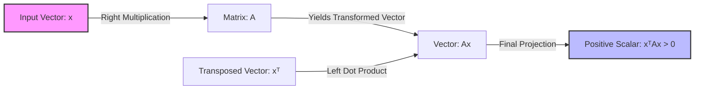
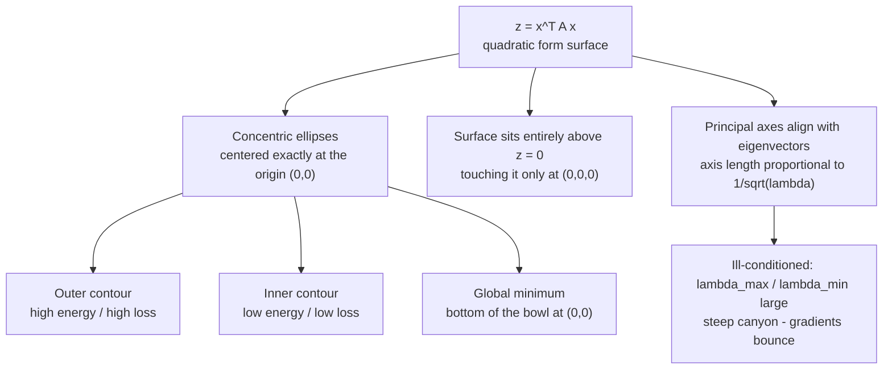

# Deep Dive: Positive-Definite Matrices in AI

This document outlines the core theory, mathematical foundations, and behavioral characteristics of positive-definite matrices, designed for applications in Artificial Intelligence, Machine Learning, and Deep Learning.

---

## 1. The Core Theory

### The Analogy: The "U-Shaped Valley"
Imagine you are standing at the bottom of a smooth, perfectly bowl-shaped valley. No matter which direction you decide to walk—north, south, east, or west—you will **always go uphill**. Your elevation will strictly increase. 

In mathematics, a **positive-definite matrix** acts exactly like this bowl. It represents a transformation or a geometric space where, if you move away from the origin in *any* direction, the resulting "height" or energy is guaranteed to be strictly positive. 

### Technical Definition in Plain Language
A square matrix is **positive-definite** if it is symmetric (a mirror image across its main diagonal) and has a unique property: when you multiply it on both sides by any non-zero vector, the resulting single number is **always strictly greater than zero**. 

Geometrically, this means the matrix never squishes, flips, or reverses a vector in a way that points it backwards or flattens it to zero. Another equivalent way to say this is that **all of its eigenvalues are strictly positive numbers**.

### Why It is Essential for AI
Without positive-definite matrices, modern Artificial Intelligence would collapse. They are the bedrock of three massive pillars:
1. **Optimization (Training Neural Networks):** The curvature of a model's loss landscape is defined by a matrix of second derivatives called the **Hessian matrix**. If the Hessian is positive-definite, it proves mathematically that the model has found a **true local minimum** (a stable optimal state) rather than a trap like a saddle point.
2. **Probability & Uncertainty (Gaussian Processes):** Covariance matrices measure how features vary together. A covariance matrix *must* be positive-definite to ensure that calculated probabilities remain valid and that visual spaces do not calculate physically impossible "negative variances."
3. **Kernel Methods (SVMs):** Support Vector Machines rely on kernels to project data into higher dimensions to make it separable. Mercer's Theorem states that these kernel matrices must be positive-definite to guarantee that the high-dimensional geometric space is mathematically stable and solvable.

---

## 2. The Mathematical Formula & Process Flow

The foundational quadratic form that defines a positive-definite matrix $A$ is:

$$x^T A x > 0 \quad 	ext{for all } x 
eq 0$$

### The Transformation Pipeline
Below is a Mermaid flowchart visualizing how a vector passes through the quadratic form mapping pipeline to yield a strictly positive scalar.

### Variable and Symbol Definitions
* **$A$**: A real, symmetric square matrix of size $n 	imes n$.
* **$x$**: A non-zero column vector of size $n 	imes 1$.
* **$x^T$**: The transpose of vector $x$, converting it into a row vector of size $1 	imes n$.
* **$> 0$**: Strictly greater than zero (positive).
* **$
eq 0$**: The vector $x$ cannot be the zero vector (since multiplying by all zeros trivially yields zero).

### The Logical Intuition
The structure $x^T A x$ is known as a **quadratic form**. It maps a multi-dimensional vector $x$ to a single, real scalar value. 

1. First, $Ax$ transforms the vector $x$ by rotating or scaling it based on the matrix $A$.
2. Next, multiplying that result by $x^T$ computes the **dot product** between the original vector $x$ and the transformed vector $Ax$.
3. The dot product measures alignment. Because $x^T (Ax) > 0$, the angle between the original vector $x$ and its transformed version $Ax$ is always less than 90 degrees ($\cos(	heta) > 0$). The matrix $A$ **never forces any vector to turn away from itself or oppose its original direction**.

---

## 3. Causation & Behavior

### Cause-and-Effect Relationships
* **Increasing the Magnitudes of $x$ (Input A):** If you scale the input vector $x$ by a factor of $k$ (changing it to $k \cdot x$), the scalar output scales quadratically by $k^2$ because $(kx)^T A (kx) = k^2 (x^T Ax)$. The output grows exponentially larger, but **never changes sign**.
* **Approaching an Eigenvalue of Zero (Input B):** The eigenvalues ($\lambda$) of $A$ dictate its minimum and maximum curvature. If the smallest eigenvalue of $A$ approaches zero, the matrix approaches a state called **positive semi-definite**. The output value $x^T Ax$ along that specific eigenvalue's vector direction drops toward zero, flattening out the U-shaped valley into a flat trough.

### Edge Cases, Constraints, and Limitations
* **The Zero Vector Constraint:** The formula *only* holds true for $x 
eq 0$. If $x = 0$, $x^T A x = 0$ instantly.
* **Symmetry Assumption:** In AI applications, we typically enforce that $A$ is symmetric ($A = A^T$). If a matrix is non-symmetric but satisfies $x^T Ax > 0$, its symmetric part $rac{A + A^T}{2}$ must be positive-definite.
* **Numerical Instability (Ill-conditioned Matrices):** If the ratio of the largest eigenvalue to the smallest eigenvalue is massive, the matrix becomes "ill-conditioned." In deep learning, this creates a steep canyon where gradients bounce violently back and forth, stalling gradient descent.

---

## 4. Text-Based Interactive Plot Diagram

When a matrix is positive-definite, visualizing $z = x^T A x$ creates a **3D paraboloid** (a perfect bowl). Below is a conceptual contour map slice looking directly down into the valley:

### What to Visualize in a Python Environment
If you plot this in Matplotlib using `plot_surface` or `contour`, look for:
1. **Concentric Ellipses:** The 2D contour lines will form perfect ellipses centered exactly at the origin $(0,0)$. 
2. **Strictly Positive Z-axis:** The 3D surface will sit entirely above the $Z=0$ plane, touching it *only* at the absolute origin point $(0,0,0)$.
3. **Eigenvector Alignment:** The principal axes (the long and short stretches) of the ellipses will align perfectly with the **eigenvectors** of the matrix $A$. The length of these axes is inversely proportional to the square root of the **eigenvalues**.

---

## 5. AI Example with Step-by-Step Calculation

### Use Case: Optimization & The Hessian Matrix
Let's look at a second-derivative Hessian matrix $H$ used during optimization to evaluate if our model has reached a secure local minimum.

### The Toy Dataset
Let's define a tiny $2 	imes 2$ symmetric matrix $H$ representing our Hessian, and a non-zero direction vector $x$:

$$H = egin{pmatrix} 2 & 1 \ 1 & 3 \end{pmatrix}, \quad x = egin{pmatrix} -1 \ 2 \end{pmatrix}$$

### Step-by-Step Algebraic Calculation
We must compute the quadratic form $x^T H x$ and prove that it results in a value $> 0$.

**Step 1: Write out the full matrix equation**
$$x^T H x = egin{pmatrix} -1 & 2 \end{pmatrix} egin{pmatrix} 2 & 1 \ 1 & 3 \end{pmatrix} egin{pmatrix} -1 \ 2 \end{pmatrix}$$

**Step 2: Multiply the matrix $H$ by the column vector $x$ (Right side first)**
Let's find the intermediate vector $v = Hx$:
$$v = egin{pmatrix} (2 \cdot -1) + (1 \cdot 2) \ (1 \cdot -1) + (3 \cdot 2) \end{pmatrix}$$
$$v = egin{pmatrix} -2 + 2 \ -1 + 6 \end{pmatrix} = egin{pmatrix} 0 \ 5 \end{pmatrix}$$

**Step 3: Multiply the row vector $x^T$ by our intermediate vector $v$**
$$x^T v = egin{pmatrix} -1 & 2 \end{pmatrix} egin{pmatrix} 0 \ 5 \end{pmatrix}$$
$$x^T v = (-1 \cdot 0) + (2 \cdot 5)$$
$$x^T v = 0 + 10 = 10$$

### Conclusion of the Math
Because our final scalar result is **10**, which is strictly **$> 0$**, the matrix passes the test for this specific vector. 

To prove it holds true universally, we calculate the eigenvalues of $H$ using the characteristic equation $\det(H - \lambda I) = 0$:
$$(2-\lambda)(3-\lambda) - (1)(1) = 0$$
$$\lambda^2 - 5\lambda + 5 = 0$$

Using the quadratic formula, the eigenvalues are:
$$\lambda_1 pprox 3.62, \quad \lambda_2 pprox 1.38$$

Because both eigenvalues are strictly positive ($\lambda_1, \lambda_2 > 0$), **the matrix $H$ is definitively positive-definite**, guaranteeing a stable minimum valley.
