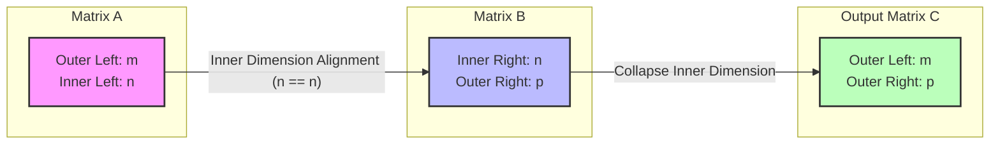

# Deep Dive: The Shape Rule in Artificial Intelligence

This document provides a comprehensive exploration of the **Shape Rule** and its fundamental role in Artificial Intelligence (AI), Machine Learning (ML), and Deep Learning (DL).

---

## 1. THE CORE THEORY

*   **Real-World Analogy:** Think of the **Shape Rule** as a **highly standardized industrial plug-and-socket assembly line**. Imagine you are building a modular water filtration system. The output pipe of Module A must have the exact same diameter as the intake valve of Module B for water to pass through. If Module A has a 3-inch pipe and Module B has a 4-inch valve, they cannot connect, and the system fails immediately. In this setup, the inner connection points must align perfectly, while the overall length of the first module and the width of the final module determine the total footprint of the combined system.
*   **Technical Definition:** In the context of Artificial Intelligence and Machine Learning, the **Shape Rule** refers to the **structural compatibility constraint governing matrix multiplication and tensor operations**. Formally, when multiplying two matrices or tensors, the **inner dimensions must match exactly**. If Matrix $\mathbf{A}$ has dimensions $m \times n$ (where $m$ is rows and $n$ is columns) and Matrix $\mathbf{B}$ has dimensions $n \times p$, the operation is valid because the inner dimension ($n$) is identical across both. The resulting output matrix collapses these inner dimensions, taking on the outer dimensions: $m \times p$.
*   **Why It Is Necessary for AI:** Deep learning models are essentially massive, stacked chains of linear geometric transformations. Every forward pass through a neural network (e.g., passing a batch of images through a layer), every backward pass (backpropagation), and every dimension reduction step (like PCA) relies entirely on matrix operations. If the shape rule is violated by even a single dimension mismatch, the geometric spaces cannot align. This triggers immediate code compilation errors (`ValueError: matmul core dimension mismatch`), rendering feature extraction, weight optimization, and inference mathematically impossible.

---

## 2. THE MATHEMATICAL FORMULA

Below is the architectural mapping of the Shape Rule visualized as a structured data pipeline using a Mermaid diagram.



### Foundational Equations

Standard 2D Matrix Multiplication:
$$\mathbf{A}_{(m \times n)} \cdot \mathbf{B}_{(n \times p)} = \mathbf{C}_{(m \times p)}$$

Multi-dimensional backpropagation gradient alignment:
$$\frac{\partial L}{\partial \mathbf{W}} = \mathbf{X}^T \cdot \frac{\partial L}{\partial \mathbf{Y}}$$

Where the dimensional alignment maps explicitly as:
$$(d \times B) \cdot (B \times h) \rightarrow (d \times h)$$

### Variable & Symbol Definitions
*   $\mathbf{A}, \mathbf{B}, \mathbf{C}$: Matrices containing data arrays.
*   $m$ (**Input A / Outer Left Dimension**): Represents the batch size ($B$) or the number of independent data instances being processed simultaneously.
*   $n$ (**Inner Alignment Dimension**): Represents the number of input features or the input dimensionality of a specific neural network layer.
*   $p$ (**Outer Right Dimension**): Represents the number of hidden units ($h$) or target output features defined within the network layer.
*   $\mathbf{W}$: The weight matrix of size $(d \times h)$ mapping input features to hidden units.
*   $\mathbf{X}$: The input feature tensor of size $(B \times d)$.
*   $\mathbf{Y}$: The layer's linear output tensor of size $(B \times h)$.
*   $(\cdot)^T$: The transposition operator, which flips a matrix's rows and columns to satisfy the inner shape alignment.

### Logical Intuition of Structure
The formula is structured this way because matrix multiplication evaluates the **dot product between every row of the left matrix and every column of the right matrix**. A dot product requires paired, element-wise multiplication. Therefore, the length of a row in Matrix $\mathbf{A}$ (which equals its column count, $n$) must perfectly equal the length of a column in Matrix $\mathbf{B}$ (which equals its row count, $n$). Because these inner elements are aggregated (summed up) during the dot product operation, they are effectively compressed away, causing the inner dimension $n$ to disappear and leaving an outer structural footprint of $m \times p$.

---

## 3. CAUSATION & BEHAVIOR

Within the mathematical framework of the shape rule, changes to the dimensional inputs produce deterministic, structural cause-and-effect relationships:

*   **If Input A ($m$, Batch Size) Increases:** The output matrix $\mathbf{C}$ expands vertically. If you change your model's batch size from 32 to 64 examples, the row dimension of your hidden states and final predictions will scale exactly from 32 to 64. The internal weights and structural compatibility remain entirely unaffected.
*   **If Input B ($n$, Inner Dimension) Approaches Zero / Minimizes:** In data structures, matrix dimensions are discrete integers ($n \in \mathbb{Z}^+$). If the inner feature dimension $n$ scales down to 1, the matrix operation behaves as a vector-outer-product or basic vector scaling. If $n$ becomes an empty or zero dimension ($n = 0$), the matrix product collapses entirely, producing an empty matrix with zero total elements since no dot-product pairings can be calculated.
*   **Edge Cases, Constraints, and Limitations:**
    *   **The Non-Commutative Constraint:** Unlike scalar multiplication ($2 \times 3 = 3 \times 2$), matrix multiplication is non-commutative ($\mathbf{A}\mathbf{B} \neq \mathbf{B}\mathbf{A}$). Reversing the order completely breaks the shape rule unless $m = p$. For instance, a $(2 \times 3)$ multiplied by a $(3 \times 5)$ is perfectly valid, but a $(3 \times 5)$ multiplied by a $(2 \times 3)$ triggers an immediate structural collision ($5 \neq 2$).
    *   **The Broadcast Edge Case:** In deep learning frameworks (PyTorch/TensorFlow), if a tensor has a trailing dimension of 1, the framework may auto-stretch it ("broadcasting") to match shapes implicitly. Relying on this blindly can mask silent bugs where operations succeed but yield unintended mathematical outputs.

---

## 4. TEXT-BASED INTERACTIVE PLOT DIAGRAM

```text
       INPUT MATRIX (X)                 WEIGHT MATRIX (W)                OUTPUT MATRIX (Y)
    [Batch Size x Features]          [Features x Hidden Units]        [Batch Size x Hidden Units]
        
        n Columns (Features)            p Columns (Hidden)               p Columns (Hidden)
         ◄───────────────►               ◄───────────────►                ◄───────────────►
     ┌───────────────────┐               ┌───────────────┐                ┌───────────────┐  ▲
  ▲  │  ·   ·   ·   ·   ·│            ▲  │  ·   ·   ·   ·│             ▲  │  ·   ·   ·   ·│  │
  │  │  ·   ·   ·   ·   ·│            │  │  ·   ·   ·   ·│             │  │  ·   ·   ·   ·│  │
m │  │  ·   ·   ·   ·   ·│   ███►   n │  │  ·   ·   ·   ·│    ====►  m │  │  ·   ·   ·   ·│  │ Rows
  │  │  ·   ·   ·   ·   ·│  MatMul    │  │  ·   ·   ·   ·│   Collapse  │  │  ·   ·   ·   ·│  │ (Batch)
  ▼  │  ·   ·   ·   ·   ·│            ▼  │  ·   ·   ·   ·│             ▼  │  ·   ·   ·   ·│  ▼
     └───────────────────┘               └───────────────┘                └────────────────┘
       Shape: (m x n)                      Shape: (n x p)                   Shape: (m x p)
                 │                                   ▲
                 └───────── INNER DIMS MUST ─────────┘
                            MATCH EXACTLY!
```

### What to Visualize in Python (e.g., Matplotlib)
If you were to plot this dynamically in a Python environment using `imshow()` or a heat map layout:
1.  **Grid Visualization:** Look for a mesh grid where Matrix X is a wide rectangle and Matrix W is a tall rectangle. 
2.  **The Matching Interface:** Focus directly on the column width of the first grid and the row height of the second grid. They must contain the exact same number of pixel rows/blocks.
3.  **The Output Footprint:** Notice how the horizontal length of the final output matrix matches the right matrix's width ($p$), while its vertical span matches the left matrix's height ($m$).

---

## 5. AI EXAMPLE WITH STEP-BY-STEP CALCULATION

### Use Case: Forward Pass through a Single Hidden Layer
We want to calculate the output features $\mathbf{Y}$ for a mini-batch of items passing through a fully connected layer in a Deep Neural Network.

### Toy Dataset Setup
*   **Batch Size ($m$)** = 2 (Two separate user data profiles)
*   **Input Features ($n$)** = 3 (Age, Income Tier, Credit Score)
*   **Hidden Units ($p$)** = 2 (Risk Propensity, Conversion Likelihood)

$$\mathbf{X}_{({2 \times 3})} = \begin{pmatrix} 1 & 2 & 0 \\ 0 & 3 & 4 \end{pmatrix}, \quad \mathbf{W}_{({3 \times 2})} = \begin{pmatrix} 2 & 1 \\ -1 & 0 \\ 3 & 2 \end{pmatrix}$$

*Check Shape Rule Compatibility:* Left Columns ($n=3$) == Right Rows ($n=3$). The rule is satisfied; output shape will be $2 \times 2$.

### Step-by-Step Matrix Arithmetic
The output cell at index $(i, j)$ is the dot product of Row $i$ from matrix $\mathbf{X}$ and Column $j$ from matrix $\mathbf{W}$:

$$\mathbf{Y} = \begin{pmatrix} \text{Row}_1 \cdot \text{Col}_1 & \text{Row}_1 \cdot \text{Col}_2 \\ \text{Row}_2 \cdot \text{Col}_1 & \text{Row}_2 \cdot \text{Col}_2 \end{pmatrix}$$

**Calculation for Cell $\mathbf{Y}_{11}$ (Row 1 $\cdot$ Column 1):**
$$\mathbf{Y}_{11} = (1 \times 2) + (2 \times -1) + (0 \times 3)$$
$$\mathbf{Y}_{11} = 2 - 2 + 0 = 0$$

**Calculation for Cell $\mathbf{Y}_{12}$ (Row 1 $\cdot$ Column 2):**
$$\mathbf{Y}_{12} = (1 \times 1) + (2 \times 0) + (0 \times 2)$$
$$\mathbf{Y}_{12} = 1 + 0 + 0 = 1$$

**Calculation for Cell $\mathbf{Y}_{21}$ (Row 2 $\cdot$ Column 1):**
$$\mathbf{Y}_{21} = (0 \times 2) + (3 \times -1) + (4 \times 3)$$
$$\mathbf{Y}_{21} = 0 - 3 + 12 = 9$$

**Calculation for Cell $\mathbf{Y}_{22}$ (Row 2 $\cdot$ Column 2):**
$$\mathbf{Y}_{22} = (0 \times 1) + (3 \times 0) + (4 \times 2)$$
$$\mathbf{Y}_{22} = 0 + 0 + 8 = 8$$

### Final Structural Output
$$\mathbf{Y}_{({2 \times 2})} = \begin{pmatrix} 0 & 1 \\ 9 & 8 \end{pmatrix}$$

The operations matched up perfectly, the inner dimension of 3 collapsed, and we achieved a structurally sound, valid network hidden state matrix.
