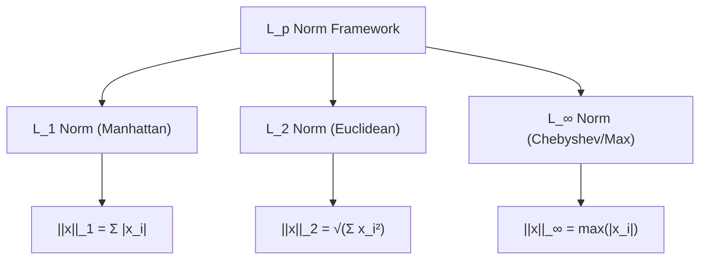
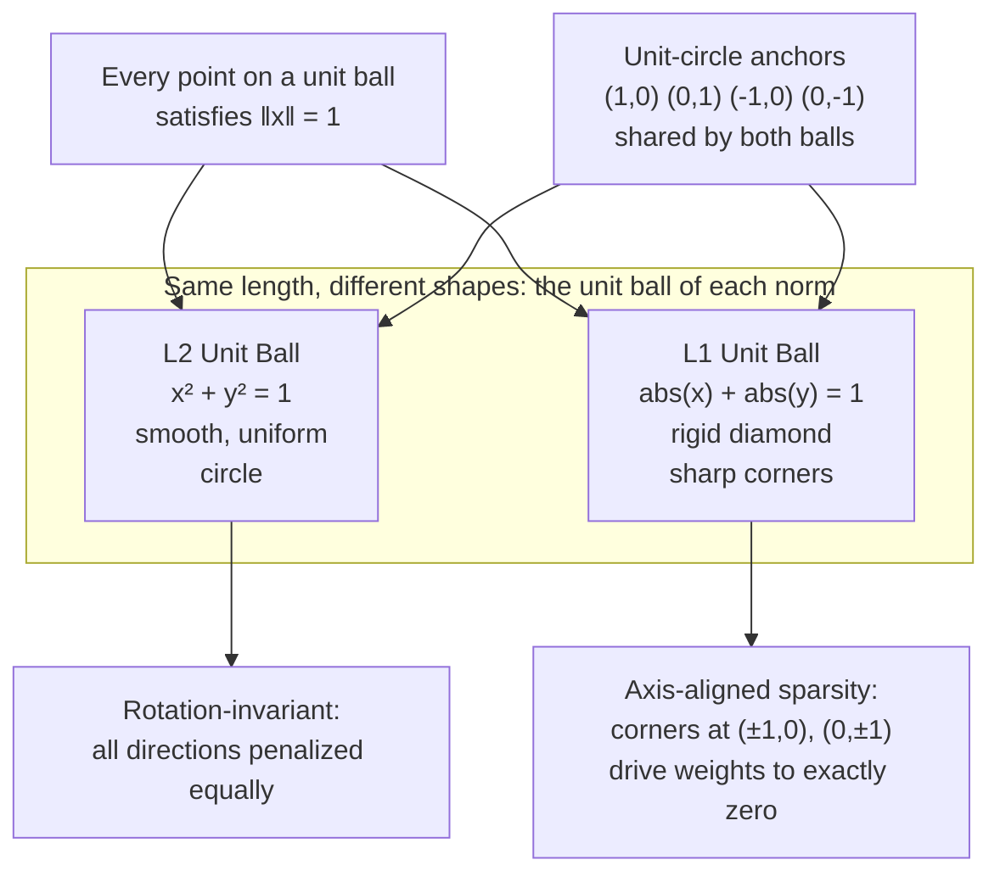
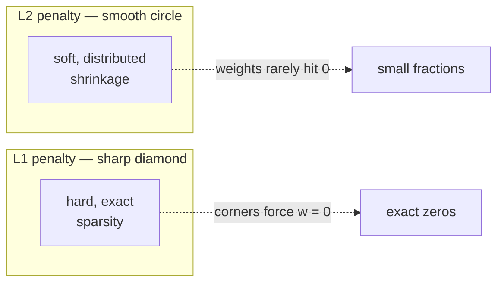

# Deep Dive: Mathematical Concept of Vector Length (Norm) in AI

This document provides a rigorous breakdown of vector norms, exploring their underlying theory, formulas, behaviors, geometric interpretations, and precise calculations within Artificial Intelligence, Machine Learning, and Deep Learning.

---

## 1. The Core Theory

### The Analogy: The "Distance Tracker" and "Budget Constraint"
Imagine navigating a city laid out in a perfect grid, like Manhattan. If you want to know the absolute shortest straight-line distance from point A to point B "as the crow flies," you are measuring the **Euclidean distance ($L_2$ norm)**. If you are a taxi driver who can only travel along the perpendicular streets and avenues, the distance you actually drive is the **Manhattan distance ($L_1$ norm)**. 

In AI, vector length acts as a **size, penalty, or confidence score**. It tells us how far a data point is from "nothing" (the origin), or how massive a neural network's weights have grown.

### The Technical Definition
In linear algebra, the **length of a vector is called its norm**. A norm is a function that maps a vector to a non-negative **scalar value**, representing the vector's total magnitude or size. For a norm to be valid, it must satisfy three structural rules:
1. **Non-negativity:** $\Vert\mathbf{x}\Vert \ge 0$, and $\Vert\mathbf{x}\Vert = 0$ if and only if $\mathbf{x} = \mathbf{0}$.
2. **Absolute Homogeneity:** $\Vert\alpha\mathbf{x}\Vert = |\alpha| \cdot \Vert\mathbf{x}\Vert$ for any scalar $\alpha$.
3. **Triangle Inequality:** $\Vert\mathbf{x} + \mathbf{y}\Vert \le \Vert\mathbf{x}\Vert + \Vert\mathbf{y}\Vert$.

### Why It Is Necessary for AI
Without vector norms, machine learning models would overfit, explode, or fail to optimize. Vector length is crucial for:
* **Regularization ($L_1$ and $L_2$):** Prevents neural networks from memorizing noise by penalizing overly large weights, forcing the model to keep its weight vectors short and simple.
* **Error Measurement (Loss Functions):** Mean Absolute Error (MAE) uses the $L_1$ norm, while Mean Squared Error (MSE) relies on the squared $L_2$ norm to measure how far predictions are from ground truth.
* **Gradient Clipping:** Prevents deep neural networks from crashing due to "exploding gradients" by capping the maximum length of the gradient vector during training.

---

## 2. The Mathematical Formula

The general framework for measuring vector length is the **$L_p$ norm**. Below is the structural hierarchy of how these calculations flow, represented via Mermaid:

### Foundations in Standard Notation

$$\text{General } L_p \text{ Norm: } \Vert\mathbf{x}\Vert_p = \left( \sum_{i=1}^{n} |x_i|^p \right)^{\frac{1}{p}}$$

$$	ext{Manhattan } L_1 	ext{ Norm: } \Vert\mathbf{x}\Vert_1 = \sum_{i=1}^{n} |x_i|$$

$$	ext{Euclidean } L_2 	ext{ Norm: } \Vert\mathbf{x}\Vert_2 = \sqrt{\sum_{i=1}^{n} x_i^2}$$

### Variable Definitions
* $\mathbf{x}$: The vector whose length is being calculated.
* $\Vert\cdot\Vert_p$: The standard mathematical boundary notation representing the $L_p$ norm.
* $p$: The order parameter of the norm (determines the calculation style/geometry).
* $n$: The dimensionality of the vector (number of elements).
* $x_i$: The individual coordinate component at the $i$-th dimension of vector $\mathbf{x}$.
* $|\cdot|$: The absolute value operator, ensuring all negative directional signs are stripped.

### Logical Intuition
The structure of a norm is built to strip away directional information and isolate **pure magnitude**. 

The **$L_1$ norm** treats every dimension with equal, linear weight by summing absolute distances along each axis. It asks: *"What is the total absolute traversal required across all independent tracks?"*

The **$L_2$ norm** squares each component before summing them, which is a direct multi-dimensional extension of the **Pythagorean Theorem** ($a^2 + b^2 = c^2$). Squaring the components disproportionately amplifies the impact of larger numbers, making the $L_2$ norm highly sensitive to outliers or large values.

---

## 3. Causation & Behavior

### Cause-and-Effect Relationships
* **Increasing Component Magnitudes:** If any single element $x_i$ increases in magnitude (further from zero in either a positive or negative direction), the output norm **must increase**.
* **Approaching Zero:** As all elements approach zero ($\mathbf{x} \rightarrow \mathbf{0}$), the length collapses to **exactly zero**. The only vector with a length of zero is the zero vector itself.
* **Varying the $p$ Parameter:** As $p$ increases, the norm places **heavier emphasis on the single largest element** in the vector. If $p \rightarrow \infty$ (the Infinity Norm $\Vert\mathbf{x}\Vert_{\infty}$), the formula completely ignores all elements except the one with the maximum absolute value.

### Edge Cases and Constraints
* **The Sparsity Effect ($L_1$ vs $L_2$):** When used to penalize weights, the $L_1$ norm drives weights to **exactly zero**, creating sparse models (feature selection). The $L_2$ norm drives weights to **small fractions** but rarely exactly zero, spreading the influence across features.
* **High-Dimensional Geometry (Curse of Dimensionality):** In massive vector spaces (e.g., LLM embeddings with thousands of dimensions), random vectors tend to have almost identical $L_2$ lengths. This concentration effect can make distance metrics less distinct as dimensionality surges.

---

## 4. Text-Based Interactive Plot Diagram

Below is a visualization of **Unit Balls**—the geometric shapes formed by mapping out every possible vector that has a length of exactly $1.0$ under different norms.

### What to Visualize in Python (Matplotlib)
If you were to plot this dynamically using a grid of points:
1. **The L2 Circle:** Plotting all vectors where $\sqrt{x^2 + y^2} = 1$ generates a smooth, uniform **circle**. This shows that the Euclidean norm treats all directional shifts evenly.
2. **The L1 Diamond:** Plotting all vectors where $|x| + |y| = 1$ creates a rigid **diamond**. Notice the sharp corners at $(1,0)$, $(0,1)$, $(-1,0)$, and $(0,-1)$. In optimization, a regularization line hitting these sharp corners is exactly what causes weights to drop to absolute zero.

---

## 5. AI Example with Step-by-Step Calculation

### Use Case: Weight Regularization Penalty ($L_2$ Norm)
During the backward training pass of a deep neural network, we calculate the $L_2$ weight regularization penalty (often called **Ridge Regularization** or **Weight Decay**). This penalty is added to the loss function to discourage the network's weights from growing too large.

### Toy Dataset
Imagine a single layer with a small **Weight Vector ($\mathbf{w}$)** containing 4 learned values:

$$\mathbf{w} = [0.4, -1.2, 0.0, 0.6]$$

We need to calculate the standard Euclidean length ($\Vert\mathbf{w}\Vert_2$) of this network weight vector.

### Step-by-Step Calculation Workflow

```mermaid
gantt
    title L2 Norm Execution Steps
    dateFormat X
    axisFormat %s
    section Core Math
    Square Components :active, 0, 2
    Sum Squared Values :active, 2, 4
    Compute Square Root :active, 4, 6
```

#### Step 1: Isolate the square of each individual component.
* Component 1: $(0.4)^2 = 0.4 	imes 0.4 = 0.16$
* Component 2: $(-1.2)^2 = (-1.2) 	imes (-1.2) = 1.44$
* Component 3: $(0.0)^2 = 0.0 	imes 0.0 = 0.00$
* Component 4: $(0.6)^2 = 0.6 	imes 0.6 = 0.36$

#### Step 2: Sum all of the squared component outputs together.
$$\sum_{i=1}^{4} w_i^2 = 0.16 + 1.44 + 0.00 + 0.36$$
$$\sum_{i=1}^{4} w_i^2 = 1.60 + 0.00 + 0.36$$
$$\sum_{i=1}^{4} w_i^2 = 1.96$$

#### Step 3: Take the principal square root of the summed values to determine the final $L_2$ norm.
$$\Vert\mathbf{w}\Vert_2 = \sqrt{1.96}$$
$$\Vert\mathbf{w}\Vert_2 = 1.4$$

### Conclusion
The absolute geometric length of this weight vector in 4-dimensional space is **$1.4$**. During training, if the optimization algorithm attempts to push this value higher, the network will incur a higher cost penalty, keeping the system stable and generalized.