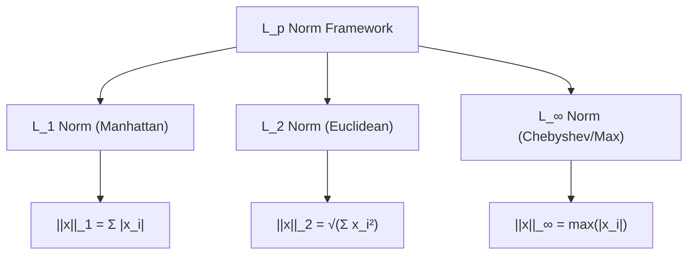
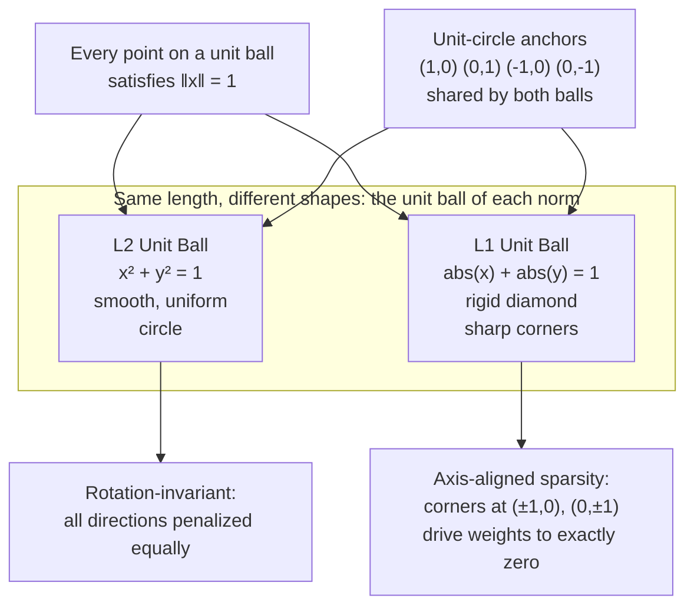
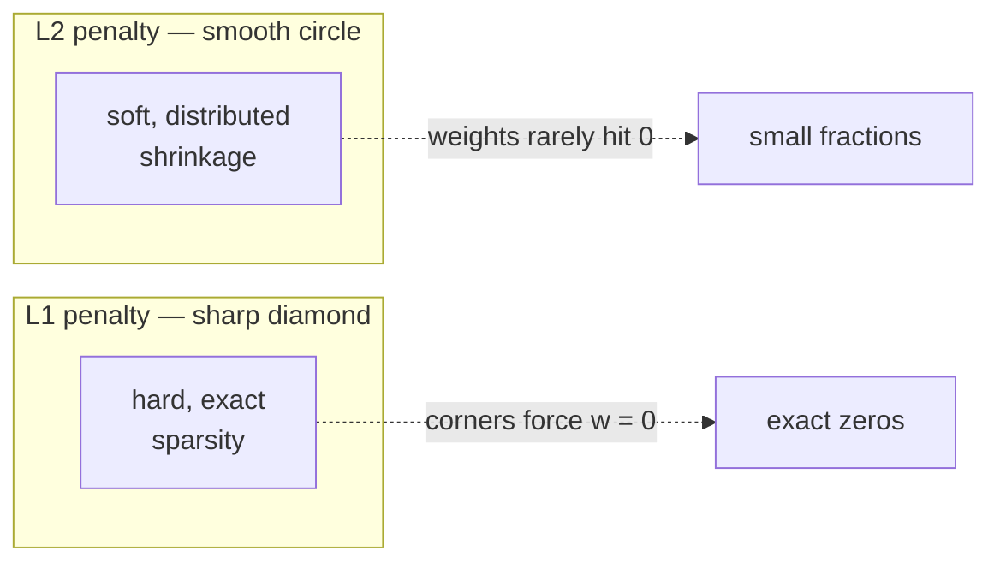
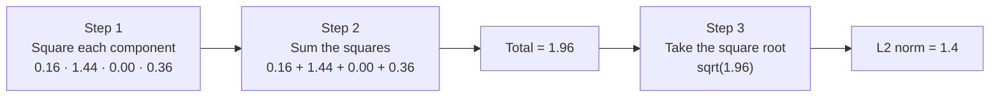

# Deep Dive: Mathematical Concept of Vector Length (Norm) in AI

This document provides a rigorous breakdown of vector norms, exploring their underlying theory, formulas, behaviors, geometric interpretations, and precise calculations within Artificial Intelligence, Machine Learning, and Deep Learning.

---

## 1. The Core Theory

### The Analogy: The "Distance Tracker" and "Budget Constraint"
Imagine navigating a city laid out in a perfect grid, like Manhattan. If you want to know the absolute shortest straight-line distance from point A to point B "as the crow flies," you are measuring the **Euclidean distance ($L_2$ norm)**. If you are a taxi driver who can only travel along the perpendicular streets and avenues, the distance you actually drive is the **Manhattan distance ($L_1$ norm)**. 

In AI, vector length acts as a **size, penalty, or confidence score**. It tells us how far a data point is from "nothing" (the origin), or how massive a neural network's weights have grown.

### The Technical Definition
In linear algebra, the **length of a vector is called its norm**. A norm is a function that maps a vector to a non-negative **scalar value**, representing the vector's total magnitude or size. For a norm to be valid, it must satisfy three structural rules:
1. **Non-negativity:** $\Vert\mathbf{x}\Vert \ge 0$, and $\Vert\mathbf{x}\Vert = 0$ if and only if $\mathbf{x} = \mathbf{0}$.
2. **Absolute Homogeneity:** $\Vert\alpha\mathbf{x}\Vert = |\alpha| \cdot \Vert\mathbf{x}\Vert$ for any scalar $\alpha$.
3. **Triangle Inequality:** $\Vert\mathbf{x} + \mathbf{y}\Vert \le \Vert\mathbf{x}\Vert + \Vert\mathbf{y}\Vert$.

### Why It Is Necessary for AI
Without vector norms, machine learning models would overfit, explode, or fail to optimize. Vector length is crucial for:
* **Regularization ($L_1$ and $L_2$):** Prevents neural networks from memorizing noise by penalizing overly large weights, forcing the model to keep its weight vectors short and simple.
* **Error Measurement (Loss Functions):** Mean Absolute Error (MAE) uses the $L_1$ norm, while Mean Squared Error (MSE) relies on the squared $L_2$ norm to measure how far predictions are from ground truth.
The choice between $L_1$ and $L_2$ is one of the most consequential decisions in model design. This guide covers the shared theory first, then compares the two directly across **regularization**, **loss functions**, and **gradient clipping** (see [Section 5](#5-l1-vs-l2--choosing-the-right-norm)).

* **Gradient Clipping:** Prevents deep neural networks from crashing due to "exploding gradients" by capping the maximum length of the gradient vector during training.

---

## 2. The Mathematical Formula

The general framework for measuring vector length is the **$L_p$ norm**. Below is the structural hierarchy of how these calculations flow, represented via Mermaid:

### Foundations in Standard Notation

$$\text{General } L_p \text{ Norm: } \Vert\mathbf{x}\Vert_p = \left( \sum_{i=1}^{n} |x_i|^p \right)^{\frac{1}{p}}$$

$$\text{Manhattan } L_1 \text{ Norm: } \Vert\mathbf{x}\Vert_1 = \sum_{i=1}^{n} |x_i|$$

$$\text{Euclidean } L_2 \text{ Norm: } \Vert\mathbf{x}\Vert_2 = \sqrt{\sum_{i=1}^{n} x_i^2}$$

$$\text{Chebyshev } L_\infty \text{ Norm: } \Vert\mathbf{x}\Vert_\infty = \max_{1 \le i \le n} |x_i| = \lim_{p \to \infty} \left( \sum_{i=1}^{n} |x_i|^p \right)^{\frac{1}{p}}$$

### Variable Definitions
* $\mathbf{x}$: The vector whose length is being calculated.
* $\Vert\cdot\Vert_p$: The standard mathematical boundary notation representing the $L_p$ norm.
* $p$: The order parameter of the norm (determines the calculation style/geometry).
* $n$: The dimensionality of the vector (number of elements).
* $x_i$: The individual coordinate component at the $i$-th dimension of vector $\mathbf{x}$.
* $|\cdot|$: The absolute value operator, ensuring all negative directional signs are stripped.

### Logical Intuition
The structure of a norm is built to strip away directional information and isolate **pure magnitude**. 

The **$L_1$ norm** treats every dimension with equal, linear weight by summing absolute distances along each axis. It asks: *"What is the total absolute traversal required across all independent tracks?"*

The **$L_2$ norm** squares each component before summing them, which is a direct multi-dimensional extension of the **Pythagorean Theorem** ($a^2 + b^2 = c^2$). Squaring the components disproportionately amplifies the impact of larger numbers, making the $L_2$ norm highly sensitive to outliers or large values.

---

## 3. Causation & Behavior

### Cause-and-Effect Relationships
* **Increasing Component Magnitudes:** If any single element $x_i$ increases in magnitude (further from zero in either a positive or negative direction), the output norm **must increase**.
* **Approaching Zero:** As all elements approach zero ($\mathbf{x} \rightarrow \mathbf{0}$), the length collapses to **exactly zero**. The only vector with a length of zero is the zero vector itself.
* **Varying the $p$ Parameter:** As $p$ increases, the norm places **heavier emphasis on the single largest element** in the vector. If $p \rightarrow \infty$ (the Infinity Norm $\Vert\mathbf{x}\Vert_{\infty}$), the formula completely ignores all elements except the one with the maximum absolute value.

### Edge Cases and Constraints
* **The Sparsity Effect ($L_1$ vs $L_2$):** When used to penalize weights, the $L_1$ norm drives weights to **exactly zero**, creating sparse models (feature selection). The $L_2$ norm drives weights to **small fractions** but rarely exactly zero, spreading the influence across features.
* **High-Dimensional Geometry (Curse of Dimensionality):** In massive vector spaces (e.g., LLM embeddings with thousands of dimensions), random vectors tend to have almost identical $L_2$ lengths. This concentration effect can make distance metrics less distinct as dimensionality surges.

---

## 4. Text-Based Interactive Plot Diagram

Below is a visualization of **Unit Balls**—the geometric shapes formed by mapping out every possible vector that has a length of exactly $1.0$ under different norms.

### What to Visualize in Python (Matplotlib)
If you were to plot this dynamically using a grid of points:
1. **The L2 Circle:** Plotting all vectors where $\sqrt{x^2 + y^2} = 1$ generates a smooth, uniform **circle**. This shows that the Euclidean norm treats all directional shifts evenly.
2. **The L1 Diamond:** Plotting all vectors where $|x| + |y| = 1$ creates a rigid **diamond**. Notice the sharp corners at $(1,0)$, $(0,1)$, $(-1,0)$, and $(0,-1)$. In optimization, a regularization line hitting these sharp corners is exactly what causes weights to drop to absolute zero.

---

## 5. L1 vs L2 — Choosing the Right Norm

The two most-used norms differ in exactly one way: whether components are summed **linearly** ($L_1$) or **squared before summing** ($L_2$). That single difference cascades into every downstream AI behavior — loss design, gradient magnitude, sparsity, and outlier sensitivity.

### Comparison Matrix

| Application | L1 Approach | L2 Approach | Core Mathematical Distinction | Practical Outcome |
|---|---|---|---|---|
| **Regularization** | **Lasso (L1)** Adds the absolute sum of weights to the loss. | **Ridge (L2)** Adds the squared sum of weights to the loss. | **L1 gradient is constant ($\pm 1$).** It drives weights entirely to $0$.  **L2 gradient scales with weight size ($2\lambda w$).** Force decays as the weight shrinks, keeping it alive. | **L1 creates feature selection:** automatically eliminates useless parameters, giving a sparse, interpretable model.  **L2 retains all features:** smoothly handles multicollinearity, yielding a dense model. |
| **Error Measurement** | **MAE (L1)** Measures average absolute distance to target. | **MSE (L2)** Measures average squared distance to target. | **L2 squares errors.** A single massive error yields a disproportionately huge penalty compared to L1's linear treatment. | **L1 is robust to outliers:** ideal when anomalies are an accepted reality.  **L2 is sensitive to outliers:** forces the model to aggressively minimize large errors, sometimes skewing normal predictions. |
| **Gradient Clipping** | **Clipping by value** Caps each element of the gradient independently. | **Clipping by norm** Caps the overall geometric length ($\Vert\mathbf{g}\Vert_2$) of the vector. | **Value clipping drops individual peaks** without considering other dimensions.  **Norm clipping scales the entire vector** by a uniform scalar ratio. | **L1 alters vector direction:** can misguide training, causing deep networks (LLMs/RNNs) to output gibberish.  **L2 preserves direction:** keeps the training direction identical while safely reducing step size. |

### Scenario A — Regularization on House Price Prediction

A high-impact feature weight $w_1 = 10.0$ (square footage) and a useless noise weight $w_2 = 0.1$ (mailbox style), with regularization strength $\lambda = 0.2$.

**L1 (Lasso):** the shrinkage force is constant regardless of weight size.
$$\text{Shrinkage Force} = \lambda \times \text{sign}(w) = 0.2 \times 1 = 0.2$$
* New $w_1 = 10.0 - 0.2 = \mathbf{9.8}$
* New $w_2 = 0.1 - 0.2 = -0.1$, then **soft-thresholded at zero** $\Rightarrow \mathbf{0.0}$

> Note: the raw step overshoots to $-0.1$. Lasso clips at zero, which is precisely why the L1 penalty produces *exact* zeros rather than small values.

*Outcome:* feature selection eliminates "mailbox style" entirely.

**L2 (Ridge):** the force is proportional to the weight itself.
$$\text{Shrinkage Force} = \lambda \times 2w = 0.2 \times 2w = 0.4w$$
* New $w_1 = 10.0 - (0.4 \times 10.0) = \mathbf{6.0}$ (shrinks drastically because it is large)
* New $w_2 = 0.1 - (0.4 \times 0.1) = \mathbf{0.06}$ (still alive; force fades as the value drops)

*Outcome:* both features are retained in a dense model.

### Scenario B — Loss Functions on Delivery-Time ETAs

Three deliveries with errors $[-1, 0, 20]$, where $20$ is a truck-breakdown outlier.

**L1 Loss (MAE):**
$$\text{MAE} = \frac{|-1| + |0| + |20|}{3} = \frac{21}{3} = \mathbf{7.0}$$
The outlier accounts for $\approx 95.24\%$ of the total loss.

**L2 Loss (MSE):**
$$\text{MSE} = \frac{(-1)^2 + (0)^2 + (20)^2}{3} = \frac{401}{3} = \mathbf{133.67}$$
The outlier accounts for $\approx 99.75\%$ of the total loss.

*Outcome:* MSE forces the model to shift normal predictions significantly just to mitigate the 400-point penalty from a rare exception.

### Scenario C — Gradient Clipping in Chatbot Training

An exploding gradient $\mathbf{g} = [10.0, 1.0]$ points at an angle of $\tan^{-1}(1/10) = \mathbf{5.71^\circ}$. We enforce a clipping threshold of **$5.0$**.

**L1-Style Clipping (by value):** cap any individual element exceeding $5.0$.
* $\mathbf{g_{\text{clipped}}} = [5.0, 1.0]$
* New direction angle: $\tan^{-1}(1/5) = \mathbf{11.31^\circ}$

*Outcome:* the direction shifted by $\approx \mathbf{98\%}$, roughly doubling. The network now updates along a direction that over-weights the second component relative to the first.

**L2-Style Clipping (by norm):** scale the whole vector by one uniform factor.
$$\Vert\mathbf{g}\Vert_2 = \sqrt{10.0^2 + 1.0^2} = \sqrt{101} \approx 10.05$$
$$\text{Factor} = \frac{\text{Threshold}}{\Vert\mathbf{g}\Vert_2} = \frac{5.0}{10.05} \approx 0.4975$$
* $\mathbf{g_{\text{clipped}}} = [10.0 \times 0.4975,\ 1.0 \times 0.4975] = \mathbf{[4.98, 0.50]}$
* New direction angle: $\tan^{-1}(0.4975 / 4.975) = \mathbf{5.71^\circ}$ — identical to the original $5.71^\circ$

*Outcome:* the direction is preserved to within rounding. Training remains completely stable.

### Choosing a Norm — Decision Guide

| If you need… | Use | Because |
|---|---|---|
| Interpretable, sparse features | **L1** | Exact zeros perform automatic feature selection |
| Stable behavior with correlated inputs | **L2** | Smooth shrinkage, no hard cutoff |
| Resistance to outliers in the labels | **L1 / MAE** | Linear error growth ignores extreme values |
| Gradient clipping in deep networks | **L2 (by norm)** | Uniform scaling preserves the update direction |
| Worst-case error bounds | **L∞** | Caps the single largest component |

---

## 6. AI Example with Step-by-Step Calculation

### Use Case: Weight Regularization Penalty ($L_2$ Norm)
During the backward training pass of a deep neural network, we calculate the $L_2$ weight regularization penalty (often called **Ridge Regularization** or **Weight Decay**). This penalty is added to the loss function to discourage the network's weights from growing too large.

### Toy Dataset
Imagine a single layer with a small **Weight Vector ($\mathbf{w}$)** containing 4 learned values:

$$\mathbf{w} = [0.4, -1.2, 0.0, 0.6]$$

We need to calculate the standard Euclidean length ($\Vert\mathbf{w}\Vert_2$) of this network weight vector.

### Step-by-Step Calculation Workflow

#### Step 1: Isolate the square of each individual component.
* Component 1: $(0.4)^2 = 0.4 \times 0.4 = 0.16$
* Component 2: $(-1.2)^2 = (-1.2) \times (-1.2) = 1.44$
* Component 3: $(0.0)^2 = 0.0 \times 0.0 = 0.00$
* Component 4: $(0.6)^2 = 0.6 \times 0.6 = 0.36$

#### Step 2: Sum all of the squared component outputs together.
$$\sum_{i=1}^{4} w_i^2 = 0.16 + 1.44 + 0.00 + 0.36$$
$$\sum_{i=1}^{4} w_i^2 = 1.60 + 0.00 + 0.36$$
$$\sum_{i=1}^{4} w_i^2 = 1.96$$

#### Step 3: Take the principal square root of the summed values to determine the final $L_2$ norm.
$$\Vert\mathbf{w}\Vert_2 = \sqrt{1.96}$$
$$\Vert\mathbf{w}\Vert_2 = 1.4$$

### Conclusion
The absolute geometric length of this weight vector in 4-dimensional space is **$1.4$**. During training, if the optimization algorithm attempts to push this value higher, the network will incur a higher cost penalty, keeping the system stable and generalized.