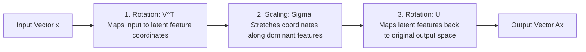

# Deep Dive: Singular Value Decomposition (SVD) and Low-Rank Approximations in AI

## 1. THE CORE THEORY

### The Analogy: The High-Resolution Photo Compression
Imagine you take a ultra-high-resolution digital photo of a **brick wall**. The image file is massive because it records the exact pixel values for millions of points. However, if you look closely, the image is incredibly repetitive: it is just rows of red bricks separated by grey mortar lines. 

Instead of storing every single pixel independently, you could extract the core patterns: the horizontal spacing of rows, the vertical gaps between bricks, and the base colors. By keeping only these fundamental rules and a few variations, you can reconstruct an almost indistinguishable version of the photo using a fraction of the data. 

**Singular Value Decomposition (SVD)** is the mathematical engine that discovers these hidden, repetitive rules. **Low-rank approximation** is the process of deliberately deleting the least important rules to compress the data while retaining the core information.

### Technical Definition in Plain Language
**Singular Value Decomposition (SVD)** states that *any* real matrix can be broken down into three simpler, distinct components: a rotation matrix, a scaling matrix, and another rotation matrix. It generalizes matrix factorization to rectangular matrices of any shape.

A **Low-Rank Approximation** takes this decomposition and keeps only the top $k$ largest scaling values (called singular values), setting the rest to zero. This yields the closest possible matrix to the original data structure within a constrained budget of parameters.

### Why This Concept is Essential for AI
* **Large Language Model (LLM) Compression:** Modern frontier networks are too large to fit efficiently on standard hardware. Techniques like Low-Rank Adaptation ([LoRA](https://arxiv.org/abs/2106.09685 "LoRA Paper")) compress the weight update matrices by factorizing them into two low-rank matrices, slashing trainable parameters by up to 99% during fine-tuning.
* **Dimensionality Reduction (PCA):** SVD is the mathematical engine behind Principal Component Analysis ([PCA](https://scikit-learn.org/stable/modules/generated/sklearn.decomposition.PCA.html "Scikit-Learn PCA")). It transforms multi-million feature spaces into a tiny set of uncorrelated principal components, preventing the curse of dimensionality.
* **Recommendation Systems:** Platforms like [Netflix](https://www.netflix.com/ "Netflix Official Site") or Amazon use matrix factorization (rooted in SVD) to discover hidden user preferences and item characteristics from massive, sparse user-rating grids.

---

## 2. THE MATHEMATICAL FORMULA

The full SVD of an $m 	imes n$ matrix $A$ is expressed as:

$$A = U \Sigma V^T$$

For a **Low-Rank Approximation** ($A_k$), we truncate the factorization to the top $k$ components:

$$A_k = U_k \Sigma_k V_k^T$$

### Variable and Symbol Definitions
* **$A$**: The original data matrix of size $m 	imes n$ (e.g., $m$ images with $n$ pixel features).
* **$U$**: An $m 	imes m$ orthogonal matrix. Its columns are the *left-singular vectors*, representing the row-space features.
* **$\Sigma$ (Sigma)**: An $m 	imes n$ diagonal matrix containing the *singular values* ($\sigma_i$) sorted in descending order ($\sigma_1 \ge \sigma_2 \ge \dots \ge \sigma_r > 0$). These represent the strength or variance of each discovered pattern.
* **$V^T$**: The transpose of an $n 	imes n$ orthogonal matrix $V$. Its rows are the *right-singular vectors*, representing the column-space features.
* **$k$**: The chosen target rank ($k \ll \min(m,n)$) used to compress the space.

### The Logical Intuition & Mermaid Flowchart
The structure acts as a transformation conveyor belt that deconstructs data into pure independent components, weights those components by importance, and projects them back into the original space.



---

## 3. CAUSATION & BEHAVIOR

### Cause-and-Effect Relationships
* **Increasing Singular Values ($\sigma_i$) (Input A):** If a specific singular value is highly pronounced, the corresponding geometric axis in $U$ and $V^T$ captures a massive portion of the dataset's total variance. The mathematical output becomes intensely sensitive to variations along this component.
* **Singular Values Approaching Zero (Input B):** As $\sigma_i 	o 0$, the information along that axis transitions into trivial background noise or minor detail. Setting these values to exactly zero during low-rank truncation strips out noise without disrupting the primary global structure.

### Edge Cases, Constraints, and Limitations
* **The Eckart-Young-Mirsky Theorem:** This theorem guarantees that the truncated matrix $A_k$ is the absolute *best* low-rank approximation possible as measured by the Frobenius or spectral norm. No other matrix of rank $k$ can be closer to $A$.
* **Information Loss Bottleneck:** If the singular values decay slowly (meaning data is evenly spread out without dominant patterns), a low-rank approximation will destroy critical information, severely degrading downstream AI model performance.

---

## 4. TEXT-BASED INTERACTIVE PLOT DIAGRAM

When you compress a matrix using a rank-1 approximation ($k=1$), you are projecting a multi-dimensional cloud of data points onto a single dominant line vector.

```text
       Y-Axis (Feature 2)
             ^
             |          o (Original Point 2)
             |         /
             |        /  <- Orthogonal Projection
             |       /
   ----------|------x-------------------------> Line of Rank-1 Approximation (v1)
             |     /
             |    /
             |   o (Original Point 1)
             |
             +----------------------------------------> X-Axis (Feature 1)
```

### What to Visualize in a Python Environment
If you implement this in [Matplotlib](https://matplotlib.org/ "Matplotlib Setup"), look for:
1. **Singular Value Scree Plot:** A line plot of $\sigma_i$ vs. index $i$ typically shows an exponential decay curve. Look for the "elbow" point where the values flatten out; this marks the ideal rank $k$.
2. **Reconstruction Residual Matrix:** Plotting the error matrix $E = A - A_k$ using `imshow` will display random white-noise patterns if your low-rank approximation successfully captured the global structural features.

---

## 5. AI EXAMPLE WITH STEP-BY-STEP CALCULATION

### Use Case: Weight Matrix Compression in a Neural Network Layer
Let's compress a toy weight matrix $W$ representing a fully connected layer with a rank-1 ($k=1$) approximation to save memory footprint.

### The Toy Dataset
Let's define a tiny $2 	imes 2$ matrix $W$:

$$W = egin{pmatrix} 3 & 4 \ 6 & 8 \end{pmatrix}$$

### Step-by-Step Algebraic Calculation

**Step 1: Compute $W^T W$ to find the right-singular vectors ($V$) and singular values ($\Sigma$)**
$$W^T W = egin{pmatrix} 3 & 6 \ 4 & 8 \end{pmatrix} egin{pmatrix} 3 & 4 \ 6 & 8 \end{pmatrix} = egin{pmatrix} (3\cdot3 + 6\cdot6) & (3\cdot4 + 6\cdot8) \ (4\cdot3 + 8\cdot6) & (4\cdot4 + 8\cdot8) \end{pmatrix} = egin{pmatrix} 45 & 60 \ 60 & 80 \end{pmatrix}$$

**Step 2: Find the Eigenvalues ($\lambda$) of $W^T W$**
Set the characteristic equation $\det(W^T W - \lambda I) = 0$:
$$\det egin{pmatrix} 45-\lambda & 60 \ 60 & 80-\lambda \end{pmatrix} = (45-\lambda)(80-\lambda) - 3600 = 0$$
$$\lambda^2 - 125\lambda + 3600 - 3600 = 0 \implies \lambda(\lambda - 125) = 0$$
Our eigenvalues are $\lambda_1 = 125$ and $\lambda_2 = 0$.

**Step 3: Calculate Singular Values ($\sigma = \sqrt{\lambda}$)**
$$\sigma_1 = \sqrt{125} = 5\sqrt{5} pprox 11.18, \quad \sigma_2 = \sqrt{0} = 0$$
Our Singular Value matrix is:
$$\Sigma = egin{pmatrix} 11.18 & 0 \ 0 & 0 \end{pmatrix}$$

*(Note: Because $\sigma_2 = 0$, the matrix $W$ is inherently a rank-1 matrix! A rank-1 approximation will lose exactly zero information.)*

**Step 4: Find the Eigenvector $v_1$ corresponding to $\lambda_1 = 125$**
$$(W^T W - 125I)v_1 = 0 \implies egin{pmatrix} 45-125 & 60 \ 60 & 80-125 \end{pmatrix} egin{pmatrix} x_1 \ x_2 \end{pmatrix} = egin{pmatrix} 0 \ 0 \end{pmatrix}$$
$$egin{pmatrix} -80 & 60 \ 60 & -45 \end{pmatrix} egin{pmatrix} x_1 \ x_2 \end{pmatrix} = egin{pmatrix} 0 \ 0 \end{pmatrix} \implies -80x_1 + 60x_2 = 0 \implies 4x_1 = 3x_2$$
Choosing a normalized vector ($||v_1|| = 1$):
$$v_1 = egin{pmatrix} 0.6 \ 0.8 \end{pmatrix} \implies V^T = egin{pmatrix} 0.6 & 0.8 \ -0.8 & 0.6 \end{pmatrix}$$

**Step 5: Compute the left-singular vectors ($U$) using $u_i = rac{1}{\sigma_i} W v_i$**
$$u_1 = rac{1}{5\sqrt{5}} egin{pmatrix} 3 & 4 \ 6 & 8 \end{pmatrix} egin{pmatrix} 0.6 \ 0.8 \end{pmatrix} = rac{1}{11.18} egin{pmatrix} (3\cdot0.6 + 4\cdot0.8) \ (6\cdot0.6 + 8\cdot0.8) \end{pmatrix} = rac{1}{11.18} egin{pmatrix} 5 \ 10 \end{pmatrix} pprox egin{pmatrix} 0.447 \ 0.894 \end{pmatrix}$$

### Verification of Low-Rank Construction ($W_1$)
Let's multiply our rank-1 segments out ($u_1 \cdot \sigma_1 \cdot v_1^T$):
$$W_1 = egin{pmatrix} 0.447 \ 0.894 \end{pmatrix} (11.18) egin{pmatrix} 0.6 & 0.8 \end{pmatrix} = egin{pmatrix} 5 \ 10 \end{pmatrix} egin{pmatrix} 0.6 & 0.8 \end{pmatrix} = egin{pmatrix} 5\cdot0.6 & 5\cdot0.8 \ 10\cdot0.6 & 10\cdot0.8 \end{pmatrix} = egin{pmatrix} 3 & 4 \ 6 & 8 \end{pmatrix}$$

The low-rank matrix matches $W$ perfectly while demonstrating how a large weight configuration can be stored efficiently as simple vector properties.
