# 00 — Mathematical Foundations for AI

> Back to [index](../../README.md) · Next: [01 Python & Data Tooling](01-python-and-data-tooling.md)

You do **not** need a math degree. You need working intuition for six areas. This file is the pragmatic syllabus: what to learn, why it matters in AI, and the minimum you must be able to *do*.

### 📊 Visual guide — 29 figures, one per topic

| § | Topics | Figures |
|---|---|---|
| 1 · Linear algebra | vectors/dot/cosine · matmul shapes · eigen→PCA · SVD/low-rank | [01](../figures/00-math/01_vectors_dot.png) · [02](../figures/00-math/02_matmul_shapes.png) · [03](../figures/00-math/03_eigen_pca.png) · [04](../figures/00-math/04_svd_lowrank.png) |
| 2 · Calculus | derivative · gradient field · chain rule/backprop · partials · Hessian/saddle | [05](../figures/00-math/05_derivative_tangent.png) · [06](../figures/00-math/06_gradient_field.png) · [07](../figures/00-math/07_chain_graph.png) · [08](../figures/00-math/08_partials.png) · [09](../figures/00-math/09_hessian_curvature.png) |
| 3 · Probability | Bayes medical test · 5 distributions · E/Var · joint/marginal · likelihood/MLE · Monte Carlo | [10](../figures/00-math/10_bayes_test.png) · [11](../figures/00-math/11_distributions.png) · [12](../figures/00-math/12_expectation_variance.png) · [13](../figures/00-math/13_joint_marginal.png) · [14](../figures/00-math/14_likelihood.png) · [15](../figures/00-math/15_monte_carlo.png) |
| 4 · Statistics | estimator bias–variance · CI/p-value · correlation≠causation · MLE vs MAP · covariance | [16](../figures/00-math/16_estimator_biasvar.png) · [17](../figures/00-math/17_ci_pvalue.png) · [18](../figures/00-math/18_correlation_causation.png) · [19](../figures/00-math/19_mle_map.png) · [20](../figures/00-math/20_covariance_correlation.png) |
| 5 · Optimization | convexity · learning rate · batch vs SGD · Lagrange · grid/random/Bayesian search | [21](../figures/00-math/21_convex_nonconvex.png) · [22](../figures/00-math/22_learning_rate.png) · [23](../figures/00-math/23_batch_vs_sgd.png) · [24](../figures/00-math/24_lagrange.png) · [25](../figures/00-math/25_grid_random_bayes.png) |
| 6 · Information theory | entropy · cross-entropy loss · KL divergence · mutual information | [26](../figures/00-math/26_entropy.png) · [27](../figures/00-math/27_cross_entropy.png) · [28](../figures/00-math/28_kl_divergence.png) · [29](../figures/00-math/29_mutual_information.png) |

Regenerate all figures: `python3 tools/make_math_figures.py` · Executable versions of these concepts: `make run M=00`

## 1. Linear Algebra — the language of data

**Why AI runs on it:** every dataset is a matrix; every model is matrix operations; GPUs exist to do fast matrix multiplication.

| Concept | AI relevance |
|---|---|
| Vectors, norm (‖x‖) | Data points; embedding similarity (cosine = dot ÷ norms) |
| Matrix multiply | Layers: `Y = WX + b` — one line runs a whole mini-batch |
| Dot product | Similarity, attention scores |
| Eigenvalues/vectors | PCA, covariance structure, Google's original PageRank |
| Positive-definite matrices | Loss surfaces, covariance, Gaussians |
| SVD / low-rank | Compression, embeddings geometry, LoRA in 15 |

**You should be able to:** multiply matrices by hand once, know shapes must align, understand broadcasting, explain what a linear layer computes.

**🖼️ Figures — dot product & cosine similarity · matmul shape flow · eigenvectors = PCA · SVD truncation:**

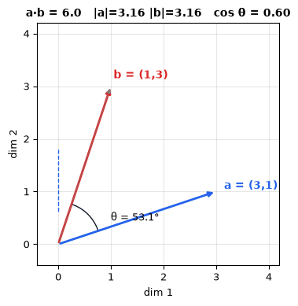

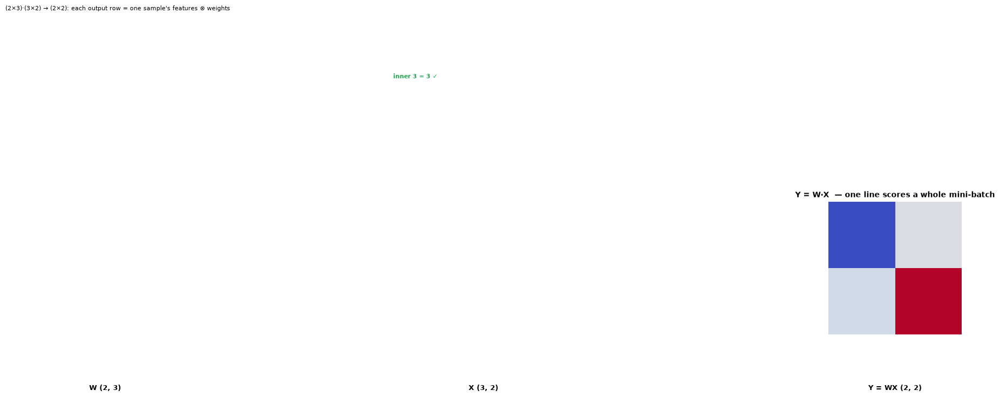

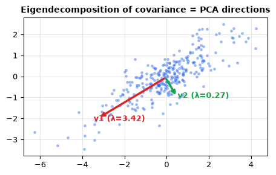

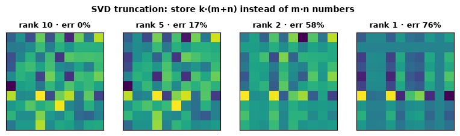

**💡 Simple examples:**
- **Shapes:** `(2×3) · (3×2) → (2×2)` — inner `3 = 3` must match, else error.
- **Multiply by hand:** `[[1,2,3],[4,5,6]] · [[7,8],[9,10],[11,12]] = [[58,64],[139,154]]` — row·column dot products.
- **Cosine similarity:** `a=(3,1), b=(1,3)` → `a·b = 6`, `‖a‖‖b‖ = 10` → `cos θ = 0.6` → θ = 53.1°. Embeddings use this instead of raw distance.
- **Linear layer:** `Y = WX + b` with `W:(out×in)`, `X:(in×batch)` — each column of `Y` is one sample's scores.

## 2. Calculus & Gradients — how models learn

- **Derivative = sensitivity.** ∂L/∂w tells you how the loss changes when weight `w` nudges.
- **Gradient** ∇L = the vector of all partial derivatives → the direction of steepest *increase*; learning subtracts it.
- **Chain rule = backpropagation.** If `L = f(g(x))`, then `dL/dx = f'(g(x))·g'(x)`. Neural nets are just the chain rule applied thousands of times, systematically.
- **Partial derivatives & Jacobians:** outputs w.r.t. vector inputs.
- **Hessian (second order):** curvature — explains why optimization is hard and what "saddle points" are.

**Minimum bar:** compute `d/dx` of polynomials and `exp`, apply the chain rule to a 2-layer toy network by hand.

**🖼️ Figures — derivative as tangent slope · gradient field (red = uphill, green = learning) · chain-rule computation graph · partial derivatives · Hessian curvature:**

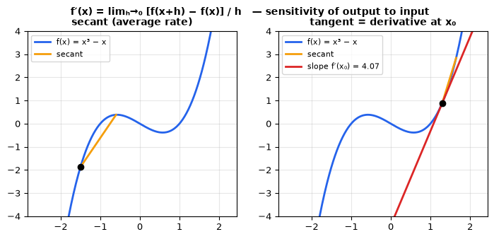

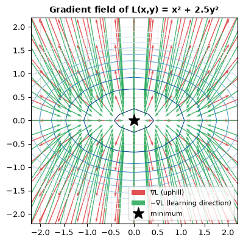

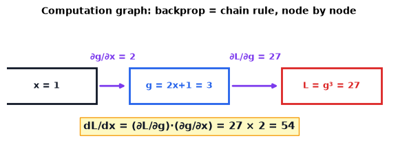

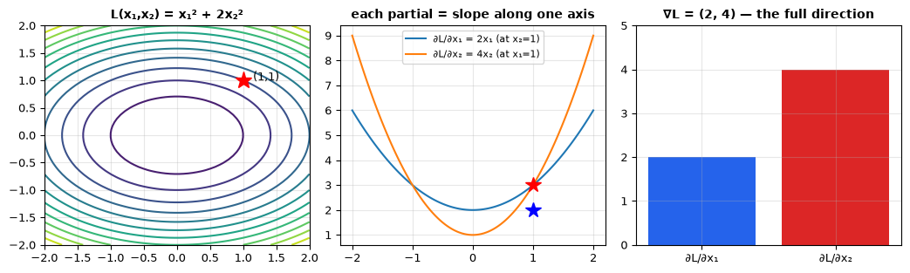

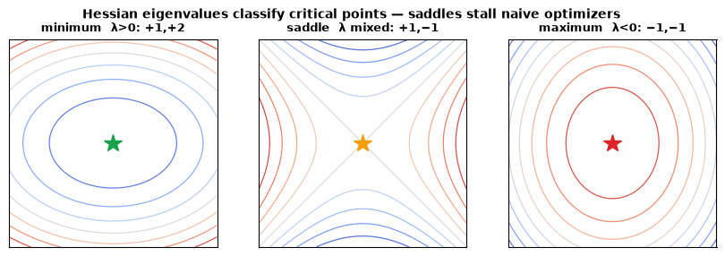

**💡 Simple examples:**
- **Chain rule:** `L = (2x+1)³` at `x=1` → `dL/dx = 3(2x+1)² · 2 = 3·9·2 = 54` (the figure, computed).
- **Gradient:** for `L = x₁² + 2x₂²` at `(1,1)` → `∇L = (2, 4)`; step `w ← w − η·∇L`.
- **Saddle point:** at `(0,0)` of `f = x² − y²` the Hessian eigenvalues are `+1, −1` — mixed signs = neither min nor max; gradients vanish there, which stalls naive optimizers.

## 3. Probability — reasoning under uncertainty

- **Axioms, conditional probability, Bayes' rule:**
  `P(H|D) = P(D|H)·P(H) / P(D)` — the backbone of Bayesian learning, Naive Bayes classifiers, and Bayesian optimization for tuning.
- **Distributions you must know:** Bernoulli, Categorical/Multinomial (classification labels), Gaussian (noise, VAEs, Kalman filters), Poisson (counts), Uniform (initialization, sampling).
- **Expectation & variance:** E[X], Var(X) = E[X²]−(E[X])²; linearity of expectation.
- **Joint / marginal / independence:** P(X,Y), P(X)=ΣY P(X,Y).
- **Likelihood vs probability:** likelihood P(data | model) is what we maximize (MLE) in nearly every training loss.
- **Sampling:** Monte Carlo, importance sampling (used in diffusion/RL estimators).

**🖼️ Figures — Bayes medical test · the five distributions · expectation & variance · joint/marginal tables · likelihood & MLE · Monte Carlo π:**

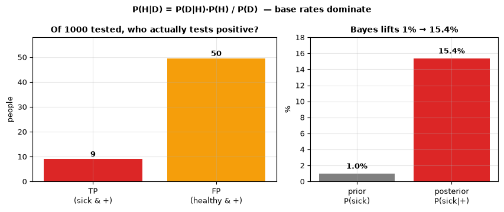

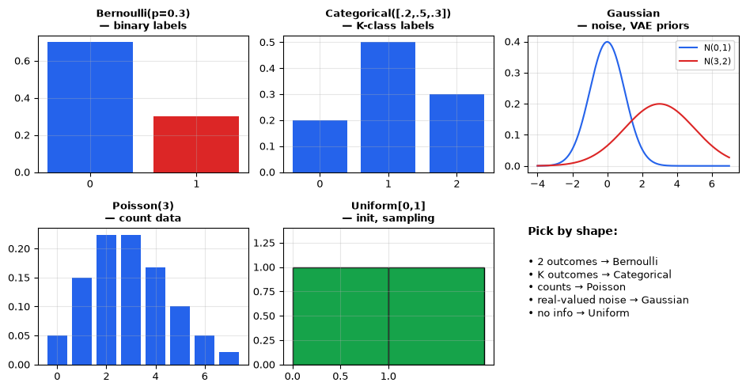

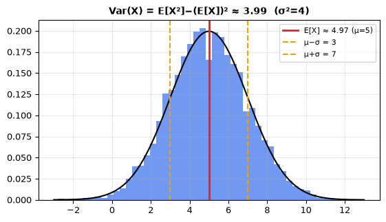

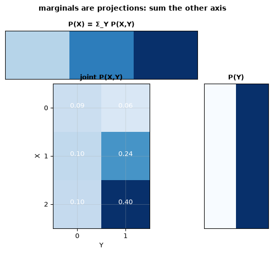

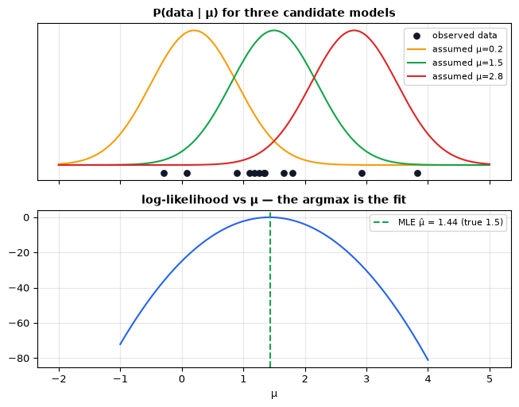

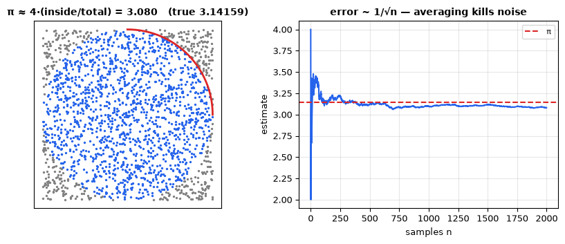

**💡 Simple examples:**
- **Medical test (exercise #3):** prevalence 1%, sensitivity 90%, false-positive 5% → of 1000 people: 9 sick+positive vs 50 healthy+positive → `P(sick|+) = 9/59 = 15.4%`, not 90%.
- **Bayes on a die:** roll once, posterior given “even” → `P(2|even)=1/3` each, `P(odd|even)=0`.
- **Expectation:** fair die `E[X] = 3.5`, `Var(X) = 35/12 ≈ 2.92`; `E[2X+1] = 2E[X]+1 = 8` (linearity).
- **MLE:** fit a Gaussian to data → the maximizing μ̂ is just the sample mean (figure 14's argmax).

## 4. Statistics — from sample to claim

- **Estimators, bias–variance of estimators** (distinct from the model bias–variance tradeoff in 05 — related but not identical).
- **Confidence intervals & hypothesis tests** (p-values) — for A/B testing model changes; know their common misuse.
- **Correlation ≠ causation** — the single most expensive confusion in applied ML.
- **Maximum likelihood estimation (MLE)** and **MAP** — connects probability to training objectives.
- **Covariance & correlation matrices** — input to PCA, portfolio models.

**🖼️ Figures — estimator bias vs variance · confidence intervals & p-values · correlation ≠ causation · MLE vs MAP · covariance/correlation:**

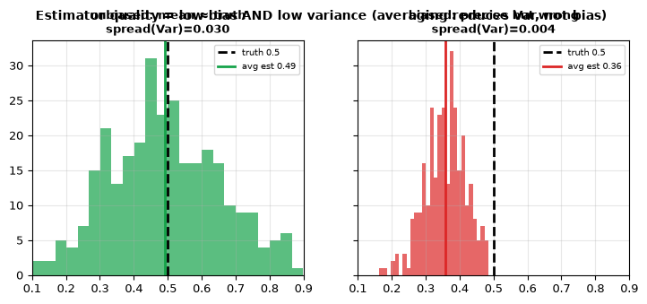

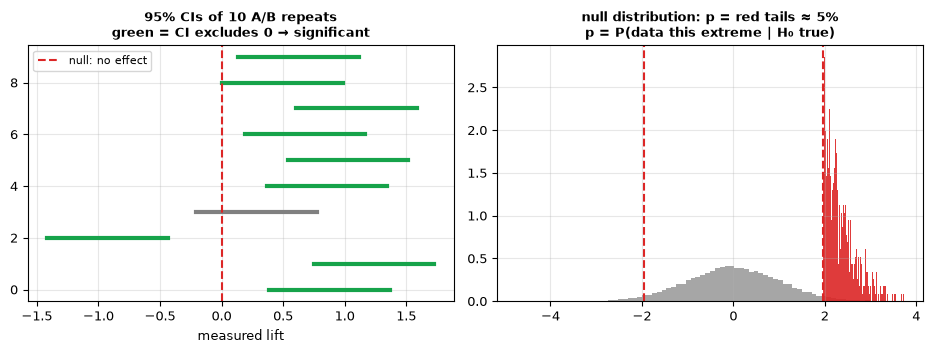

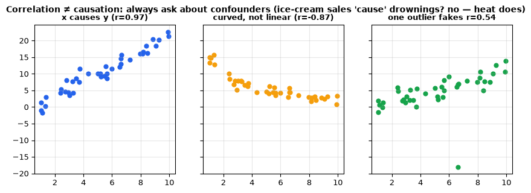

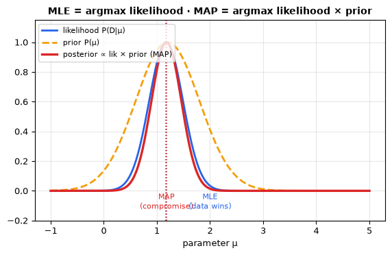

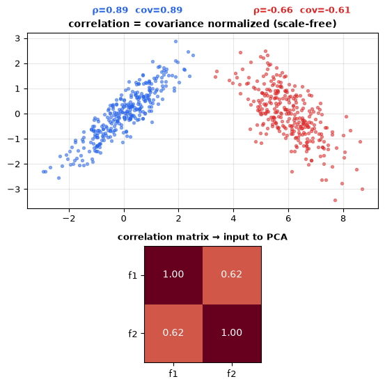

**💡 Simple examples:**
- **Estimator vs model:** the *sample mean* is unbiased (`E[x̄]=μ`) but noisy; averaging n draws shrinks `Var` by `1/n` — and no amount of data fixes a biased estimator (figure 16).
- **95% CI (exercise-adjacent):** `x̄ ± 1.96·s/√n`; if the CI for a model lift excludes 0, ship the change — but a p-value is *not* `P(H₀ true)` (figure 17).
- **Confounder:** summer heat raises *both* ice-cream sales and drownings — correlating the two finds a strong link with zero causation (figure 18).
- **MLE vs MAP:** 8 datapoints averaging 2.0 say μ̂=2.0 (MLE); a prior centered at 1.2 pulls the posterior peak between them (figure 19).

## 5. Optimization — finding good parameters

- **Objective functions** and why non-convexity (loss landscapes of deep nets) means "good enough," not "the best."
- **Gradient descent family:** batch / stochastic / mini-batch; learning rate is the most important hyperparameter.
- **Convergence conditions**, step sizes, convexity basics (convex ⇒ global optimum; deep learning abandons this).
- **Lagrange multipliers / constrained optimization** — at least conceptually (SVMs use them; RLHF optimizes under KL constraints).
- **Search strategies:** grid vs random vs **Bayesian optimization** (05).

**🖼️ Figures — convex vs non-convex landscapes · learning-rate regimes · batch vs mini-batch vs SGD · Lagrange tangency · grid/random/Bayesian search:**

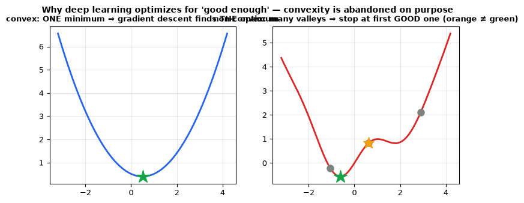

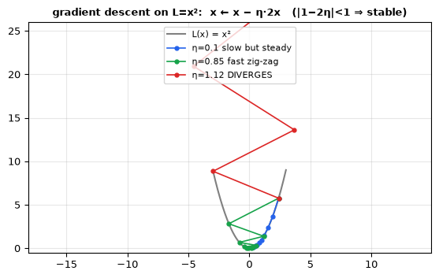

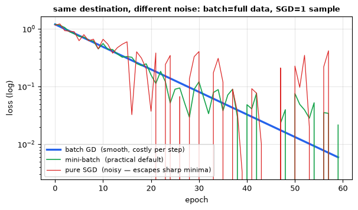

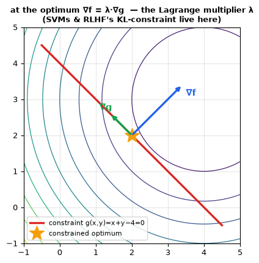

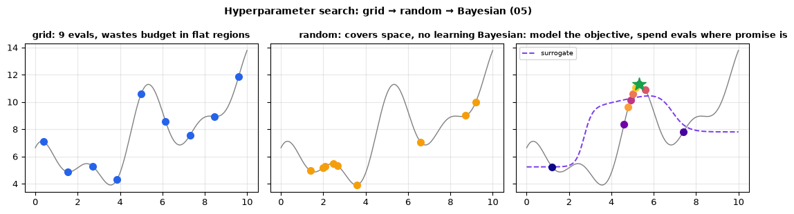

**💡 Simple examples:**
- **Learning rate (exercise #5):** on `L=x²`, update `x ← x − η·2x` is stable iff `|1−2η| < 1` → **η must be < 1**; `η=1.12` explodes (figure 22).
- **Batch math:** full-batch epoch = `n` examples per update; pure SGD = 1 → 100× more updates, noisy path, often better generalization (figure 23).
- **Lagrange:** minimize `(x−4)²+(y−3)²` subject to `x+y=4` → optimum at `(2,2)` where `∇f = λ∇g`; `λ` = price of the constraint (figure 24 — SVMs & RLHF's KL budget use exactly this).
- **Search:** 9 evals — grid misses the peak between ticks, random sometimes hits it, Bayesian clusters its budget around the incumbent (figure 25).

## 6. Information Theory — measuring information

- **Entropy** `H(p) = −Σ p·log p` — surprise/uncertainty; the floor of lossless compression.
- **Cross-entropy** `H(p,q) = −Σ p·log q` — *the* classification loss; why `CrossEntropyLoss = softmax + log + NLL`.
- **KL divergence** — how one distribution differs from another; basis of distillation and RLHF's KL penalty.
- **Mutual information** — feature selection, information bottleneck.

**🖼️ Figures — entropy curve & surprise · cross-entropy loss explosion · asymmetric KL · mutual-information heatmaps:**

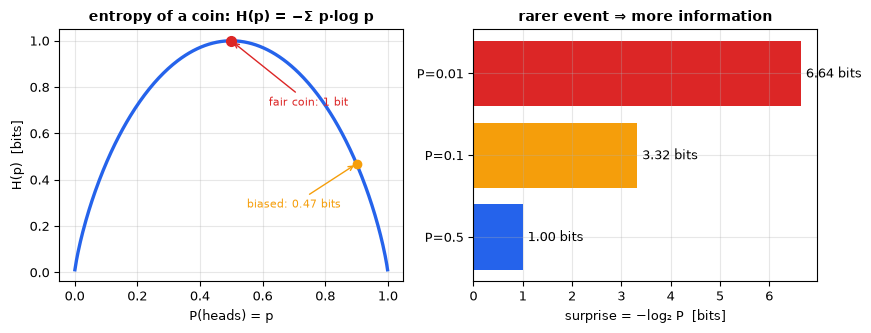

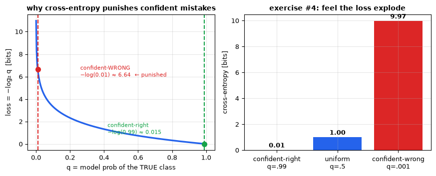

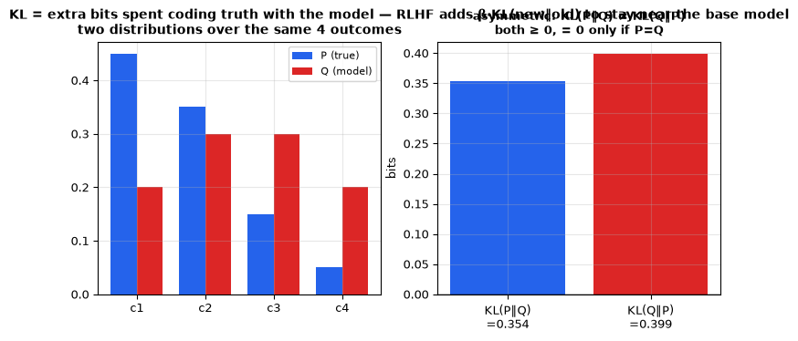

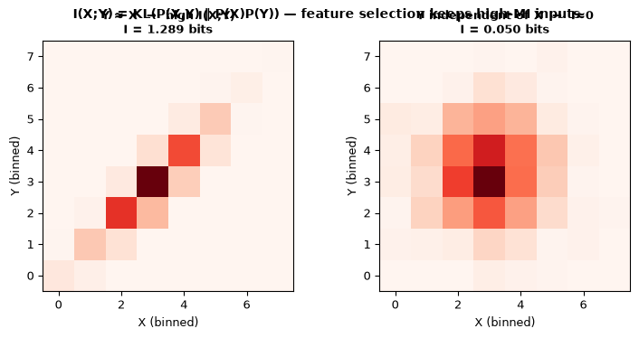

**💡 Simple examples:**
- **Entropy:** fair coin `H = 1 bit`; always-heads coin `H = 0` — zero surprise carries zero information (figure 26).
- **Cross-entropy (exercise #4):** confident-right `q=.99 → −log₂ = 0.015 bits`; confident-wrong `q=.001 → 9.97 bits` — the loss explodes ~660× (figure 27). Why `CrossEntropyLoss = softmax → log → NLL`.
- **KL asymmetry:** `P=(.45,.35,.15,.05)`, `Q=(.20,.30,.30,.20)` → `KL(P‖Q) ≠ KL(Q‖P)` though both ≥ 0 — direction matters, which is why distillation and RLHF pick one deliberately (figure 28).
- **Mutual information:** `I(X;Y) = 0` iff independent — two perfectly separable class clusters have high `I`; white-noise heatmap ≈ 0 bits (figure 29).

Visualize every topic of module 00 with 29 generated figures:

```bash
python3 tools/make_math_figures.py   # writes docs/figures/00-math/*.png (~1.2MB)
```

## Suggested exercises

1. By hand: `(2×3 matrix) · (3×2 matrix)`; verify shapes.
2. Backprop by hand on a 2-input, 1-hidden-unit network.
3. Apply Bayes' rule to a medical-test paradox problem (1% prevalence, 90% accurate test).
4. Compute cross-entropy of a confident-wrong vs confident-right prediction — feel the loss explode.
5. Implement gradient descent on `f(x)=x²` in 10 lines of NumPy.

## Mastery Checklist

- [ ] Can state what a matrix multiplication computes in a neural layer and why shapes matter
- [ ] Can apply the chain rule to a 2-layer network manually
- [ ] Can use Bayes' rule and name 5 common distributions with their use cases
- [ ] Explains MLE and why cross-entropy loss is MLE for categorical data
- [ ] Knows that learning = descending the gradient of a loss, with mini-batch noise
- [ ] Knows what entropy, cross-entropy, and KL divergence each measure

**Checklist → figure map (self-test by explaining each figure aloud):**

| Checklist item | Figures that prove it |
|---|---|
| Matrix multiplication in a layer / shapes | [01](../figures/00-math/01_vectors_dot.png), [02](../figures/00-math/02_matmul_shapes.png) |
| Chain rule on a 2-layer network | [07](../figures/00-math/07_chain_graph.png), [08](../figures/00-math/08_partials.png) |
| Bayes' rule + 5 distributions | [10](../figures/00-math/10_bayes_test.png), [11](../figures/00-math/11_distributions.png) |
| MLE & cross-entropy as MLE | [14](../figures/00-math/14_likelihood.png), [19](../figures/00-math/19_mle_map.png), [27](../figures/00-math/27_cross_entropy.png) |
| Learning = descending the gradient | [06](../figures/00-math/06_gradient_field.png), [22](../figures/00-math/22_learning_rate.png), [23](../figures/00-math/23_batch_vs_sgd.png) |
| Entropy / cross-entropy / KL | [26](../figures/00-math/26_entropy.png), [27](../figures/00-math/27_cross_entropy.png), [28](../figures/00-math/28_kl_divergence.png) |

Figures are generated by [`tools/make_math_figures.py`](../../tools/make_math_figures.py) — rerun it after editing to refresh `docs/figures/00-math/`.
